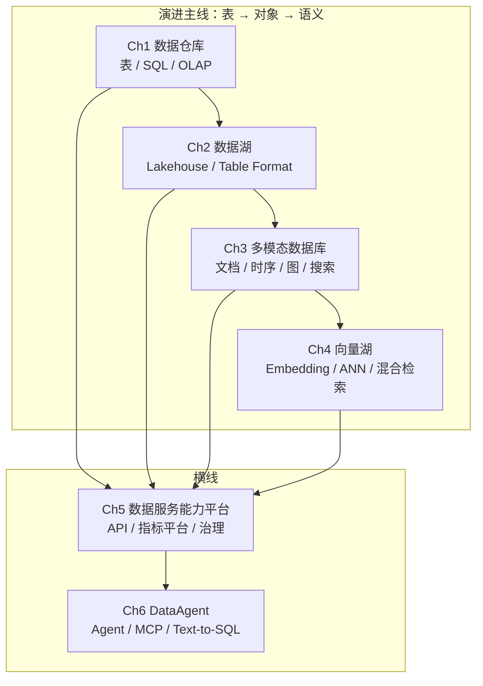

# 序章 · 数据服务的全景图

> **本章定位**：在进入任何技术细节之前，先建立一张「数据服务」的完整地图，并说明本书为何按**技术演进时间线**组织。

## 为什么按这个顺序读

数据存储与处理范式在过去三十年里不断演进：

1. **表（结构化）**：以关系型数仓为代表，强调强一致、维度建模与 SQL 分析
2. **对象（多模态）**：以文档 / 时序 / 图 / 搜索为代表，强调多样数据的原生表达
3. **语义（AI 原生）**：以向量检索 + 大模型为代表，强调「语义级」理解与生成

贯穿在演进之上的，是两条横线：

- **服务化**：把分散的数据能力封装为可治理、可观测、可计量的「数据服务」（Ch5）
- **智能化**：让 AI Agent 安全、可控、可审计地操作数据（Ch6）

按这条主线读下来，每一章既可以独立学习，也可以承接上一章的范式演进。

## 全景图

## 难度梯度表

| 章节 | 难度 | 推荐角色 | 是否需要前序章节 |
| --- | :---: | --- | :---: |
| Ch1 数据仓库 | ★★☆☆☆ | 数据工程师、数仓开发 | 无 |
| Ch2 数据湖 | ★★★☆☆ | 数据工程师、平台架构师 | 建议 Ch1 |
| Ch3 多模态数据库 | ★★★☆☆ | 全栈工程师、架构师 | 建议 Ch1、Ch2 |
| Ch4 向量湖 | ★★★★☆ | AI 应用工程师、平台架构师 | 建议 Ch3 |
| Ch5 数据服务能力平台 | ★★★★☆ | 平台架构师、数据治理 | 建议 Ch1-Ch4 任一 |
| Ch6 DataAgent | ★★★★★ | AI 应用工程师、架构师 | 建议 Ch5 |

## 角色推荐路径

| 角色 | 必读 | 选读 | 可跳读 |
| --- | --- | --- | --- |
| 数据工程师 / 数仓开发 | 00 → 01 → 02 → 03 | 05 | 04（先打基础） |
| 数据架构师 / 资深工程师 | 00 → 02 → 03 → 05 | 01、04 | 06 实现细节 |
| 数据人员 / AI 应用工程师 | 00 → 03 → 04 → 06 | 05 | 01、02 的 OLAP/调度细节 |
| 平台与治理同学 | 00 → 02 → 05 → 06 | 03、04 中的元数据部分 | — |

## 术语表

> 本术语表由各章维护者共同维护。新出现的关键术语以「中文（英文 / 缩写）」格式登记。

| 术语 | 英文 | 简述 | 首次出现章节 |
| --- | --- | --- | --- |
| 数据仓库 | Data Warehouse (DW) | 面向分析的、整合的、相对稳定的数据集合 | Ch1 |
| 数据湖 | Data Lake | 存储原始数据的系统化存储池 | Ch2 |
| Lakehouse | Lakehouse | 兼具数仓的 ACID 与数据湖的灵活性的混合架构 | Ch2 |
| 维度建模 | Dimensional Modeling | Kimball 提出的分析型建模方法 | Ch1 |
| OLAP | Online Analytical Processing | 联机分析处理，区别于 OLTP | Ch1 |
| 多模态数据库 | Multi-Modal Database | 同时支持多种数据模型的数据库 | Ch3 |
| HTAP | Hybrid Transaction/Analytical Processing | 混合事务与分析处理 | Ch3 |
| 向量湖 | Vector Lake | 面向 AI 检索的大规模向量基础设施 | Ch4 |
| ANN | Approximate Nearest Neighbor | 近似最近邻检索 | Ch4 |
| HNSW | Hierarchical Navigable Small World | 一种图索引算法 | Ch4 |
| 指标平台 | Metric Platform / Headless BI | 统一管理业务指标与定义的平台 | Ch5 |
| 数据网格 | Data Mesh | 一种去中心化的数据架构理念 | Ch5 |
| DataAgent | Data Agent | 由 AI Agent 驱动的数据访问与洞察能力 | Ch6 |
| MCP | Model Context Protocol | 标准化 LLM 与外部工具的协议 | Ch6 |
| Text-to-SQL | Text-to-SQL | 将自然语言转换为 SQL 查询 | Ch6 |

> 后续新术语持续在本表追加。

## 本章小结

- 本书按**技术演进时间线**组织（表 → 对象 → 语义），以「服务化」「智能化」为横线
- 难度从 ★★ 到 ★★★★★ 阶梯分布；不同角色有不同推荐路径
- 统一术语表由各章共同维护，方便跨章节跳读

## 下一步

从 [Ch1 · 数据仓库](../01-data-warehouse/) 开始阅读，或回到 [根目录](../README.md) 选择你的角色路径。