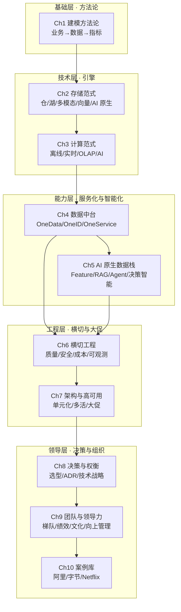

# 序章 · P9 数据架构师的全景图

> **本章定位**：在进入任何技术细节之前，先建立一张「P9 数据架构师」的能力地图，并说明本书为何按**能力分层**而非按**技术时间线**组织。

## 为什么按这个顺序读

P9 数据架构师的能力可以拆成 **6 个层次 + 4 条横线**：

**主轴（能力层次）**：

1. **建模方法论（Ch1）**：业务→数据的映射能力，是 P9 的第一道分水岭
2. **存储范式（Ch2）**：从数仓到 AI 原生数据库，理解每一代存储引擎的设计取舍
3. **计算范式（Ch3）**：离线/实时/OLAP/AI 训练推理的统一视角
4. **服务化与中台（Ch4）**：阿里 OneData / OneID / OneService 的方法论与落地
5. **AI 原生数据栈（Ch5）**：Feature Store、RAG、DataAgent、决策智能
6. **横切工程（Ch6）**：数据质量、安全、成本、可观测、血缘
7. **架构与高可用（Ch7）**：单元化、多活、大促保障、容量规划
8. **决策与权衡（Ch8）**：选型决策、ADR、技术战略
9. **团队管理与领导力（Ch9）**：P9 的硬功夫——带人、做事、影响组织
10. **案例库（Ch10）**：阿里、字节、美团、Netflix 等真实工业级实践

**横线（贯穿全程）**：

- **可治理**：血缘、权限、审计、分类分级
- **可观测**：监控、告警、链路追踪、SLO
- **可计量**：成本、计费、资源利用率
- **可演进**：架构演进、技术债管理、迁移策略

按这条主线读下来，每一章既可以独立学习，也可以承接上一章的能力跃迁。

## P9 能力地图

## 难度梯度表

| 章节 | 难度 | 推荐角色 | 是否需要前序章节 |
| --- | :---: | --- | :---: |
| Ch1 建模方法论 | ★★★☆☆ | 数据架构师、数仓开发 | 无 |
| Ch2 存储范式 | ★★★☆☆ | 数据工程师、平台架构师 | 建议 Ch1 |
| Ch3 计算范式 | ★★★☆☆ | 数据工程师 | 建议 Ch2 |
| Ch4 数据中台 | ★★★★☆ | 平台架构师 | 建议 Ch1-Ch3 |
| Ch5 AI 原生数据栈 | ★★★★☆ | AI 应用工程师、架构师 | 建议 Ch4 |
| Ch6 横切工程 | ★★★★☆ | 平台架构师、治理 | 建议 Ch2-Ch4 |
| Ch7 架构与高可用 | ★★★★★ | 资深架构师 | 建议 Ch2-Ch6 |
| Ch8 决策与权衡 | ★★★★☆ | 资深工程师、架构师 | 建议 Ch1-Ch6 |
| Ch9 团队与领导力 | ★★★★☆ | 团队负责人、架构师 | 建议 Ch7-Ch8 |
| Ch10 案例库 | ★★★☆☆ | 全员 | 无（按需查） |

## 角色推荐路径

| 角色 | 必读 | 选读 | 可跳读 |
| --- | --- | --- | --- |
| 数据工程师 / 数仓开发 | 00 → 01 → 02 → 03 → 04 | 06、08 | 05、07、09 |
| 数据架构师 / 资深工程师 | 00 → 01 → 04 → 06 → 07 → 08 | 02、03、10 | — |
| AI 应用工程师 | 00 → 02 → 04 → 05 | 03、06、10 | 01 的细节 |
| 平台与治理同学 | 00 → 04 → 06 → 09 | 01、07、10 | 03、05 |
| **团队负责人 / 准 P9** | **00 → 01 → 08 → 09** | 02-Ch7、10 | — |

> **特别说明**：标粗的「团队负责人 / 准 P9」路径是本书的核心目标读者。技术深度可由其他章节补齐，但**决策能力**与**团队管理能力**才是 P8 → P9 的真正分水岭。

## 子主题

本章是**总论 / 全景图**，自身没有技术子主题。本章承载的是为后续章节提供「**能力地图**」的作用：

- P9 数据架构师的 6 层次能力模型
- 4 条横线（治理 / 可观测 / 可计量 / 可演进）
- 难度梯度表与角色推荐路径
- 跨章术语表（Glossary）

后续 Ch1-Ch10 会按这张地图分章节展开。

## 前置章节

**无前置要求。** 序章作为全书入口可直接阅读。

但若希望「**带着 P9 视角**」读后续章节，建议先选定你的角色路径，再从对应章节切入。

## 术语表

> 本术语表由各章维护者共同维护。新出现的关键术语以「中文（英文 / 缩写）」格式登记。

| 术语 | 英文 | 简述 | 首次出现章节 |
| --- | --- | --- | --- |
| 维度建模 | Dimensional Modeling | Kimball 提出的分析型建模方法 | Ch1 |
| Data Vault | Data Vault | Hub-Link-Satellite 三件套的建模方法 | Ch1 |
| OneData | OneData | 阿里中台方法论：统一数据标准与模型 | Ch1、Ch4 |
| OneID | OneID | 阿里中台方法论：统一用户/实体标识 | Ch1、Ch4 |
| OneService | OneService | 阿里中台方法论：统一数据服务出口 | Ch4 |
| 数据仓库 | Data Warehouse (DW) | 面向分析的、整合的、相对稳定的数据集合 | Ch2 |
| 数据湖 | Data Lake | 存储原始数据的系统化存储池 | Ch2 |
| Lakehouse | Lakehouse | 兼具数仓 ACID 与数据湖灵活性的混合架构 | Ch2 |
| OLAP | Online Analytical Processing | 联机分析处理，区别于 OLTP | Ch3 |
| HTAP | Hybrid Transaction/Analytical Processing | 混合事务与分析处理 | Ch2 |
| 多模态数据库 | Multi-Modal Database | 同时支持多种数据模型的数据库 | Ch2 |
| 向量湖 | Vector Lake | 面向 AI 检索的大规模向量基础设施 | Ch2、Ch5 |
| AI 原生数据库 | AI-Native Database | 一体支持结构化+向量+全文+LLM 的数据库 | Ch2、Ch5 |
| 指标平台 | Metric Platform / Headless BI | 统一管理业务指标与定义的平台 | Ch4 |
| 数据网格 | Data Mesh | 一种去中心化的数据架构理念 | Ch4 |
| 特征存储 | Feature Store | 集中管理机器学习特征的平台 | Ch5 |
| RAG | Retrieval-Augmented Generation | 检索增强生成 | Ch5 |
| DataAgent | Data Agent | 由 AI Agent 驱动的数据访问与洞察能力 | Ch5 |
| MCP | Model Context Protocol | 标准化 LLM 与外部工具的协议 | Ch5 |
| 决策智能 | Decision Intelligence | 用 AI 辅助或自动化业务决策 | Ch5 |
| 数据血缘 | Data Lineage | 数据从源头到消费的完整链路 | Ch6 |
| 数据分类分级 | Data Classification | 按敏感度对数据分层管理 | Ch6 |
| 单元化架构 | Cell-Based Architecture | 按业务域切分的可独立部署单元 | Ch7 |
| 异地多活 | Multi-Region Active-Active | 多地域同时提供服务的容灾架构 | Ch7 |
| ADR | Architecture Decision Record | 架构决策记录文档 | Ch8 |
| FinOps | FinOps | 云成本治理实践 | Ch6、Ch8 |
| 故障复盘 | Postmortem | 对生产故障进行无指责根因分析 | Ch9 |

> 后续新术语持续在本表追加。

## 本章小结

- 本书按 **P9 能力分层**组织（建模→存储→计算→服务化→AI→工程→架构→决策→团队→案例）
- 4 条横线（可治理 / 可观测 / 可计量 / 可演进）贯穿所有章节
- 难度从 ★★★ 到 ★★★★★ 阶梯分布；不同角色有不同推荐路径
- 统一术语表由各章共同维护，方便跨章节跳读

## 下一步

- [数据工程师 / 数仓开发] → 进入 [Ch1 · 建模方法论](../01-modeling/)
- [架构师] → 进入 [Ch1 · 建模方法论](../01-modeling/) → [Ch7 · 架构与高可用](../07-architecture-and-reliability/)
- [团队负责人 / 准 P9] → 进入 [Ch8 · 决策与权衡](../08-decision-and-tradeoff/) → [Ch9 · 团队与领导力](../09-team-and-leadership/)
- 或回到 [根目录](../README.md) 选择你的角色路径
