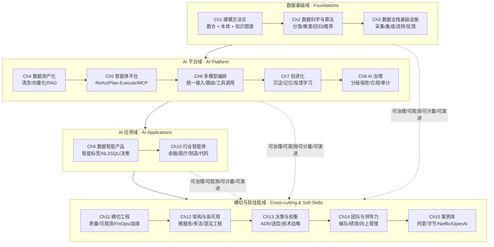

# 序章 · AI 时代数据架构师的全景图

> **本章定位**：在进入任何技术细节之前，先建立一张「AI 时代数据架构师 / 智能体平台架构师」的能力地图，并说明本书为何按 **4 能力域 + 4 横线** 而非按技术时间线组织。

## 为什么按这个顺序读

本书锚定的目标画像是「**AI 智能体平台架构师**」（5 年以上数据/算法/AI 经验，主导私有化 AI 智能体平台 0→1）。围绕这一画像，本书把数据架构师的能力拆成 **4 个能力域 + 4 条横线**：

**主轴（4 个能力域）**：

| 能力域 | 章节 | 主题 |
| --- | --- | --- |
| **数据基础域** | Ch1 / Ch2 / Ch3 | 建模方法论 / 数据科学与算法 / 数据全栈基础设施 |
| **AI 平台域** | Ch4 / Ch5 / Ch6 / Ch7 / Ch8 | 数据资产化 / 智能体平台 / 多模型 / 自进化 / 治理 |
| **AI 应用域** | Ch9 / Ch10 | 数据智能产品 / 行业智能体 |
| **横切与软技能域** | Ch11 / Ch12 / Ch13 / Ch14 / Ch15 | 横切工程 / 架构与高可用 / 决策 / 团队 / 案例 |

**横线（贯穿 Ch1–Ch15）**：

- **可治理**：血缘、权限、审计、分类分级（重点 Ch8 AI 治理与安全）
- **可观测**：监控、告警、链路追踪、SLO（重点 Ch11 横切工程）
- **可计量**：成本、计费、资源利用率（重点 Ch11 横切工程）
- **可演进**：架构演进、技术债管理、迁移策略（重点 Ch13 决策与权衡）

按这条主线读下来，每一章既可以独立学习，也可以承接上一章的能力跃迁。

## 目标画像

本书所有内容都围绕以下画像展开。画像来自「Agent 架构师（高级）」招聘要求（扬州芯算智能科技 · 40-70K · 15 薪）提炼，是每章必须回答的能力清单。完整 6 大职责 + 8 大要求见 [spec §2](../docs/superpowers/specs/2026-10-08-data-architect-restructure.md#2-目标画像核心约束)。序章不堆原始条目，浓缩为以下 5 项最具识别度的能力：

- **能搭建企业级 AI 智能体平台（0→1）**：私有化部署、安全可控、可编排、自进化的 AI 基础设施
- **能让企业私有数据变成 AI 可消费的知识**：多源异构数据（文档/代码/报表/音视频）清洗、结构化、语义化编码，向量索引与 RAG 检索
- **能统一接入并调度多模型 + 工具链**：多模型统一接入层、标准化工具调用框架、按需路由、灵活组合
- **能设计 AI 资产沉淀与自进化闭环**：使用→沉淀→复用→优化，全生命周期管理，组织级长期记忆
- **能守住 AI 资产的安全合规底线**：分级保密、细粒度权限、全链路审计、输出端防泄露、等保 2.0/3.0 合规

> **画像 = 能力约束**：后续每章都会在「画像映射」小节明确「本章对应画像里的哪项能力」。这是本书的强约束（见 [spec §6](../docs/superpowers/specs/2026-10-08-data-architect-restructure.md#6-readme-提纲)）。

## 能力地图

> **横线视角**：4 条横线（可治理 / 可观测 / 可计量 / 可演进）不属于任何一章，而是以「横切关注点」的形式贯穿 4 个能力域。本书 Ch8（治理）、Ch11（横切工程）、Ch13（决策）会展开论述。

## 难度梯度表

| 章节 | 难度 | 推荐角色 | 是否需要前序章节 |
| --- | :---: | --- | :---: |
| Ch1 建模方法论 | ★★★☆☆ | 数据架构师 / 数据科学家 | 无（建议先读序章） |
| Ch2 数据科学与算法 | ★★★☆☆ | 数据科学家 / 算法工程师 | 建议 Ch1 |
| Ch3 数据全栈基础设施 | ★★★☆☆ | 数据工程师 / 平台架构师 | 建议 Ch1–Ch2 |
| Ch4 数据资产化与智能检索 | ★★★★☆ | AI 应用工程师 / 智能体架构师 | 建议 Ch1、Ch3 |
| Ch5 AI 智能体平台架构 | ★★★★★ | 智能体架构师 / 平台架构师 | 建议 Ch4 |
| Ch6 多模型编排与工具调用 | ★★★★☆ | 智能体架构师 / 平台架构师 | 建议 Ch5 |
| Ch7 AI 资产沉淀与自进化 | ★★★★☆ | 智能体架构师 / 算法工程师 | 建议 Ch5、Ch6 |
| Ch8 AI 治理与安全 | ★★★★☆ | 平台架构师 / 安全合规负责人 | 建议 Ch5 |
| Ch9 数据智能产品 | ★★★★☆ | 数据产品经理 / 智能体架构师 | 建议 Ch1、Ch4、Ch5 |
| Ch10 行业智能体 | ★★★★☆ | 行业 AI 工程师 / 智能体架构师 | 建议 Ch5、Ch9 |
| Ch11 横切工程 | ★★★★☆ | 平台架构师 / 治理 | 建议 Ch3、Ch4 |
| Ch12 架构与高可用 | ★★★★★ | 资深架构师 | 建议 Ch3、Ch11 |
| Ch13 决策与权衡 | ★★★★☆ | 资深工程师 / 架构师 | 建议 Ch1–Ch11 |
| Ch14 团队与领导力 | ★★★★☆ | 团队负责人 / 架构师 | 建议 Ch12、Ch13 |
| Ch15 案例库 | ★★★☆☆ | 全员 | 无（按需查） |

> **难度说明**：★ 数综合反映「领域宽度 × 工程深度 × 经验要求」三维度。Ch5 / Ch12 是公认的高难度分水岭。

## 阅读路径

本书为以下 4 类读者分别设计了推荐路径。**核心目标读者是「AI 智能体平台架构师」**。

### 路径 A：AI 智能体平台架构师（核心目标读者）

> 你正在或即将主导企业级私有化 AI 智能体平台 0→1，需要补齐从数据基础到 AI 应用的全栈能力。

- **必读**：序章 → Ch1 → Ch4 → Ch5 → Ch6 → Ch7 → Ch8 → Ch11 → Ch13 → Ch15
- **选读**：Ch2（按需补算法）、Ch9（数据智能产品形态）、Ch10（行业落地）、Ch12（大促稳定性）、Ch14（团队管理）
- **可跳读**：Ch3 内部实现细节（关注 API 边界即可）

### 路径 B：数据科学家 / 算法工程师

> 你擅长模型与算法，但希望理解数据资产化、智能体平台与 AI 治理如何让算法落地为业务价值。

- **必读**：序章 → Ch1 → Ch2 → Ch4 → Ch5 → Ch7 → Ch9 → Ch10
- **选读**：Ch6（多模型路由策略）、Ch8（算法上线合规）、Ch11（数据漂移 / 特征穿越治理）
- **可跳读**：Ch3 采集层细节、Ch12 高可用细节、Ch13 选型决策细节、Ch14 团队管理

### 路径 C：数据全栈架构师

> 你已有数仓/数据平台经验，希望横向扩展到 AI 平台与 AI 应用领域。

- **必读**：序章 → Ch1 → Ch3 → Ch4 → Ch5 → Ch6 → Ch11 → Ch12
- **选读**：Ch2（算法原理）、Ch8（AI 治理与等保）、Ch13（决策）、Ch15（工业级案例）
- **可跳读**：Ch7 自进化实现细节、Ch10 行业知识细节、Ch14 团队管理

### 路径 D：团队负责人 / 准资深架构师

> 你正从资深工程师/架构师向准资深架构师跃迁，技术深度已具备，亟需补决策、组织与战略能力。

- **必读**：序章 → Ch1 → Ch13 → Ch14 → Ch15
- **选读**：Ch3（数据全栈心智）、Ch8（AI 合规）、Ch11（横切工程）、Ch12（架构与高可用）
- **可跳读**：Ch2 算法实现、Ch4-Ch7 的内部实现细节（关注架构图与决策点即可）

> **特别说明**：标粗的「AI 智能体平台架构师」是本书的核心目标读者。技术深度可由其他章节补齐，但**「让企业私有数据变成 AI 可消费的知识 + 多模型编排 + 智能体平台 0→1 + AI 资产自进化 + AI 治理」**这五项能力才是 AI 时代数据架构师的真正分水岭。

## 子主题

本章是**总论 / 全景图**，自身没有技术子主题。本章承载的是为后续章节提供「**能力地图**」的作用：

- AI 时代数据架构师的目标画像（5 项浓缩能力）
- 4 能力域 + 4 横线的全景图
- 难度梯度表与 4 类读者路径
- 跨章术语表（Glossary，重点扩充 AI 时代术语）

后续 Ch1–Ch15 会按这张地图分章节展开。

## 前置章节

**无前置要求。** 序章作为全书入口可直接阅读。

但若希望「**带着目标画像视角**」读后续章节，建议先选定你的角色路径（路径 A / B / C / D），再从对应章节切入。

## 术语表

> 本术语表由各章维护者共同维护。新出现的关键术语以「中文（英文 / 缩写）」格式登记。
> AI 时代术语集中放在表前部，方便读者按主题查阅。

### AI 平台与应用（Ch4–Ch10）

| 术语 | 英文 | 简述 | 首次出现章节 |
| --- | --- | --- | --- |
| 智能体 | Agent | 能感知环境、自主决策并执行动作的 AI 实体 | Ch5 |
| 大语言模型 | Large Language Model (LLM) | 大规模预训练语言模型（GPT-4 / Claude / 文心 / 通义等） | Ch4、Ch6 |
| 检索增强生成 | Retrieval-Augmented Generation (RAG) | 通过外部知识检索增强 LLM 生成质量的架构 | Ch4 |
| 向量数据库 | Vector Database | 面向高维向量相似度检索的专用数据库（Milvus / Pinecone / Weaviate） | Ch4 |
| Embedding 嵌入 | Embedding | 将文本/图像/音频映射为稠密向量的表示学习方法 | Ch4 |
| 语义检索 | Semantic Search | 基于语义相似度而非关键词匹配的检索方式 | Ch4 |
| 混合检索 | Hybrid Retrieval | BM25 关键词检索 + 向量语义检索的融合策略 | Ch4 |
| 提示词工程 | Prompt Engineering | 通过设计系统提示、Few-shot、CoT 等提升 LLM 表现 | Ch5、Ch6 |
| Function Calling | Function Calling / Tool Use | LLM 按结构化 schema 调用外部工具的能力 | Ch5、Ch6 |
| 多模型编排 | Multi-Model Orchestration | 统一接入多模型，按成本/延迟/能力路由与组合 | Ch6 |
| 智能体框架 | Agent Framework | 提供 ReAct / Plan-Execute 等智能体范式的开发框架（LangChain / AutoGPT） | Ch5 |
| MCP 协议 | Model Context Protocol | 标准化 LLM 与外部工具/数据源之间的协议 | Ch5 |
| ReAct | Reasoning + Acting | 推理-行动交替的智能体范式 | Ch5 |
| Plan-Execute | Plan-Execute | 先规划再执行的智能体范式 | Ch5 |
| 长期记忆 | Long-Term Memory | 跨会话持久化的智能体记忆机制 | Ch7 |
| AI 资产沉淀 | AI Asset Accumulation | 将 AI 使用过程产生的价值（会话/技能/反馈）结构化沉淀 | Ch7 |
| 自进化 | Self-Evolution | AI 系统通过反馈持续优化能力的闭环 | Ch7 |
| 反馈学习 | RLHF / RLAIF | 基于人类反馈 / AI 反馈的强化学习 | Ch7 |
| 数据智能产品 | Data Intelligence Product | 智能标签 / 智能 BI / 精细化运营 / 预测决策类产品 | Ch9 |
| 智能标签 | Smart Tag | 事实标签 + 模型标签 + 预测标签的统一标签体系 | Ch9 |
| 自然语言查询 | NL2SQL | 自然语言转 SQL 的智能 BI 能力 | Ch9 |
| 行业智能体 | Industry Agent | 针对特定行业（金融/医疗/制造/代码）定制的智能体 | Ch10 |
| 等保 2.0 / 3.0 | MLPS 2.0 / 3.0 | 中国信息系统安全等级保护标准（网络安全法配套） | Ch8 |
| 数据脱敏 | Data Masking | 对敏感字段进行变形 / 替换 / 加密以保护隐私 | Ch8 |
| 防泄露 | Data Loss Prevention (DLP) | 防止敏感数据外泄的体系（含输出端） | Ch8 |
| 提示词注入 | Prompt Injection | 通过恶意输入劫持 LLM 行为的攻击方式 | Ch8 |

### 建模与数据科学（Ch1–Ch3）

| 术语 | 英文 | 简述 | 首次出现章节 |
| --- | --- | --- | --- |
| 维度建模 | Dimensional Modeling | Kimball 提出的分析型建模方法 | Ch1 |
| Data Vault | Data Vault | Hub-Link-Satellite 三件套的建模方法 | Ch1 |
| 本体建模 | Ontology Modeling | 用 RDF / OWL 定义概念、属性、约束的形式化建模 | Ch1 |
| 知识图谱 | Knowledge Graph (KG) | 以实体-关系-属性三元组组织的语义网络 | Ch1 |
| 图数据推理 | Graph Reasoning | 基于图结构的推理（图神经网络、路径推理、子图匹配） | Ch1 |
| OneData | OneData | 阿里中台方法论：统一数据标准与模型 | Ch1、Ch3 |
| OneID | OneID | 阿里中台方法论：统一用户/实体标识 | Ch1、Ch3 |
| OneService | OneService | 阿里中台方法论：统一数据服务出口 | Ch3 |
| 特征存储 | Feature Store | 集中管理机器学习特征的平台（Feast / Tecton） | Ch2、Ch3 |
| CDC | Change Data Capture | 变更数据捕获（Debezium / Flink CDC） | Ch3 |
| Lakehouse | Lakehouse | 兼具数仓 ACID 与数据湖灵活性的混合架构 | Ch3 |
| A/B 实验 | A/B Testing | 通过对照实验评估策略效果的方法 | Ch3 |

### 平台工程与架构（Ch11–Ch14）

| 术语 | 英文 | 简述 | 首次出现章节 |
| --- | --- | --- | --- |
| 数据血缘 | Data Lineage | 数据从源头到消费的完整链路 | Ch11 |
| 数据分类分级 | Data Classification | 按敏感度对数据分层管理 | Ch8、Ch11 |
| 可观测性 | Observability | 通过 Metrics / Logs / Traces 理解系统内部状态 | Ch11 |
| FinOps | FinOps | 云成本治理实践 | Ch11、Ch13 |
| 单元化架构 | Cell-Based Architecture | 按业务域切分的可独立部署单元 | Ch12 |
| 异地多活 | Multi-Region Active-Active | 多地域同时提供服务的容灾架构 | Ch12 |
| 混沌工程 | Chaos Engineering | 通过主动注入故障验证系统韧性的工程实践 | Ch12 |
| ADR | Architecture Decision Record | 架构决策记录文档 | Ch13 |
| 故障复盘 | Postmortem | 对生产故障进行无指责根因分析 | Ch13、Ch14 |
| 团队拓扑 | Team Topologies | 团队结构与互动的设计模式 | Ch14 |
| IDP | Individual Development Plan | 个人发展计划 | Ch14 |
| OKR | Objectives and Key Results | 目标与关键成果管理法 | Ch14 |

> 后续新术语持续在本表追加。

## 本章小结

- 本书按 **AI 时代数据架构师画像** 组织（建模→算法→全栈→资产化→智能体→多模型→自进化→治理→智能产品→行业智能体→横切→架构→决策→团队→案例）
- 4 个能力域（数据基础 / AI 平台 / AI 应用 / 横切与软技能）+ 4 条横线（可治理 / 可观测 / 可计量 / 可演进）贯穿所有章节
- 难度从 ★★★ 到 ★★★★★ 阶梯分布；4 类读者各有推荐路径
- 核心目标读者是「**AI 智能体平台架构师**」——其余 3 类读者各有侧重
- 统一术语表由各章共同维护，重点扩充 AI 时代术语（智能体 / RAG / 向量数据库 / MCP / 等保 等）

## 下一步

- [AI 智能体平台架构师 / 路径 A] → 进入 [Ch1 · 建模方法论](../01-modeling/) → [Ch4 · 数据资产化与智能检索](../04-data-assetization/) → [Ch5 · AI 智能体平台架构](../05-agent-platform/)
- [数据科学家 / 路径 B] → 进入 [Ch2 · 数据科学与算法](../02-data-science/) → [Ch4 · 数据资产化与智能检索](../04-data-assetization/)
- [数据全栈架构师 / 路径 C] → 进入 [Ch3 · 数据全栈基础设施](../03-data-stack/) → [Ch5 · AI 智能体平台架构](../05-agent-platform/)
- [团队负责人 / 准资深架构师 / 路径 D] → 进入 [Ch13 · 决策与权衡](../13-decision/) → [Ch14 · 团队管理与领导力](../14-leadership/)
- 或回到 [根目录](../README.md) 选择你的角色路径
