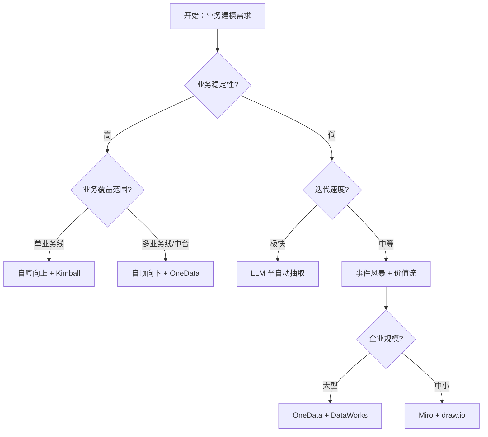

# 业务过程建模（Business Process Modeling）

> **一句话定位**：业务架构→数据架构的桥梁，把"业务怎么干活"翻译成"数据怎么落表"。

> 本文是 data-travel 项目 [Ch1 · 建模方法论](../../README.md) 的子章节（01-business-process-modeling），覆盖 **R3 数据建模** 能力领域中「数仓建模」的入口环节——把业务架构映射为可建模的数据架构。

---

## 1. 概念与定位

### 1.1 是什么

**业务过程建模（Business Process Modeling, BPM）** 在数据架构语境下，特指**用结构化方法识别企业核心业务过程，并将之映射为数据资产（事件、事实、维度）的方法论**。它不等同于纯 BPMN 流程图建模，而是要回答三个核心问题：

- **学术定义**：源自工作流管理联盟（WfMC）与 OMG 的 BPM 体系，关注"业务活动 + 触发条件 + 输入输出 + 角色责任"的四元组结构。
- **工程定义**：在 Kimball 维度建模体系中，**业务过程 = 数据仓库的"原子颗粒"**——一个业务过程对应一组业务过程度量（process metric），进而对应一张事实表（fact table）。
- **核心问题**：在企业数百个业务动作中，识别出"哪些动作会产生分析价值"，并把它们抽象为稳定的、可复用的数据模型。

### 1.2 为什么需要

- **业务驱动力**：当企业从"靠 Excel 决策"走向"靠数据中台决策"时，必须有一套方法把业务动作翻译成数据模型，否则每个业务团队都会"自建模型"，最终形成数据沼泽（data swamp）。
- **痛点**：缺少业务过程建模时，常见的失败模式包括——指标同名不同义（"GMV" 在 5 个部门 5 个定义）、事实表大爆炸（每出一个新报表就建一张宽表）、维度混乱（同一用户在不同表里 7 个 ID）。
- **AI 时代新诉求**：LLM 消费的是"语义化的业务过程"——`customer.churned.after_30_days_idle` 比 `user_status=3 AND last_login<today-30` 对 Agent 更友好。Agent 平台要求业务过程具备**可推理（reasoning）、可检索（retrieval）、可解释（traceability）** 三性。

### 1.3 在 AI 时代数据架构中的位置

业务过程建模是建模方法论的**入口**，处于"业务架构 → 数据架构"的金字塔顶：

```
       业务架构层（业务能力地图 / 价值流）
                ↓ 业务过程建模（本文）
       数据架构层（事件 → 事实 → 维度）
                ↓ 建模方法选型
       物理模型层（ER / 维度 / Data Vault / 本体）
                ↓ 工程实现
       物理存储层（Lakehouse / 图库 / 向量库）
```

与其他建模方法的关系：

| 方法 | 与业务过程建模的关系 |
| --- | --- |
| ER 建模 | 业务过程建模的"上游"——ER 描述静态实体关系，业务过程建模描述动态事件 |
| 维度建模（Kimball） | 业务过程建模的**直接下游**——一个业务过程 = 一张事实表 |
| Data Vault | 业务过程建模的**敏捷版本**——Hub 承载业务实体，Satellite 承载业务过程历史 |
| Anchor Modeling | 业务过程建模的**时序版本**——把过程建模成锚点（anchor）+ 属性的时间序列 |
| 本体建模（Ontology） | 业务过程建模的**语义升级**——把过程抽象为可推理的语义关系 |

**一句话判断**：本章是"建表 / 建模型 / 建体系"中的**建表的前置**——不识别业务过程，建表就是无源之水。

### 1.4 演进历程

- **传统阶段（1990s–2010s）**：以 Inmon 3NF 范式为代表，强调"自顶向下"从企业数据模型（EDW）出发；过程建模被弱化为 ER 图中的"关联关系"。
- **大数据阶段（2010s–2020）**：Kimball 维度建模占据数据仓库 70% 市场份额，业务过程识别（Bill of Process）成为数仓项目第 7 步标准动作；阿里 OneData 在此基础上提出"业务过程→指标体系→数据模型"三段式映射。
- **AI 原生阶段（2020+，LLM + Agent 驱动）**：业务过程建模从"人工梳理"走向"半自动抽取"——LLM 阅读 PRD / 用户故事 / 埋点文档，自动生成候选业务过程清单；Agent 平台要求过程模型支持**自然语言查询**与**多模态语义对齐**。
- **每阶段的核心矛盾**：传统阶段是"模型 vs 性能"、大数据阶段是"敏捷 vs 一致"、AI 原生阶段是"语义 vs 结构"。

---

## 2. 核心原理

### 2.1 关键概念定义

| 概念 | 定义 | 一句话解释 |
| --- | --- | --- |
| **业务过程（Business Process）** | 企业为产生价值而执行的一系列活动 | "用户注册 → 下单 → 支付 → 履约"是一个过程 |
| **业务事件（Business Event）** | 业务过程中发生的、可观测的离散动作 | "用户点击支付按钮"是一个事件 |
| **事实（Fact）** | 业务事件的量化度量结果 | 支付金额、支付时间、支付渠道 |
| **维度（Dimension）** | 描述业务事件"何时 / 何地 / 何人 / 何物"的上下文 | 用户维、商品维、时间维、地理维 |
| **业务能力（Business Capability）** | 企业能稳定提供的、与组织结构解耦的能力单元 | "营销能力"、"风控能力"、"履约能力" |
| **价值流（Value Stream）** | 从客户需求到价值交付的端到端业务流 | "线索 → 商机 → 订单 → 回款" |
| **5W1H** | 业务过程识别的经典框架 | Who/What/When/Where/Why/How |
| **事件风暴（Event Storming）** | Alberto Brandolini 提出的工作坊方法 | 通过"领域事件"贴纸识别业务过程 |
| **过程度量（Process Metric）** | 业务过程产生的可量化指标 | "下单转化率"、"履约时效"、"退款率" |
| **业务过程地图（Process Map）** | 业务过程的可视化资产，连接业务与数据 | 一张图说清"业务怎么干 → 数据怎么落" |

### 2.2 数学/形式化基础

业务过程可被形式化为**偏序事件序列**：

```
P = ⟨E, ≺, C, M⟩

P       = 业务过程
E       = 事件集合 {e1, e2, ..., en}
≺       = 事件间的时序偏序关系（e1 ≺ e2 表示 e1 先于 e2 发生）
C       = 上下文映射（事件 → 维度属性）
M       = 度量函数（事件 → 事实度量）
```

示例：

```
订单过程 P_order = ⟨{下单, 支付, 履约, 收货, 退款}, ≺, C, M⟩

M(下单)   = {订单金额, 下单时间}
C(下单)   = {用户维, 商品维, 渠道维}
≺         = {下单 ≺ 支付 ≺ 履约 ≺ 收货, 收货 ≺ 退款(可选)}
```

业务过程建模的核心目标，就是为每个业务过程 P 生成稳定的 `(E, ≺, C, M)` 四元组，进而映射为事实表 + 维度表。

### 2.3 关键算法/方法

| 方法 | 原理 | 适用边界 |
| --- | --- | --- |
| **5W1H 访谈法** | 通过结构化问题识别业务过程 | 业务访谈、需求调研 |
| **事件风暴（Event Storming）** | 跨角色工作坊，用橙黄贴纸识别领域事件 | 新业务 0→1、跨团队对齐 |
| **价值流图（Value Stream Mapping, VSM）** | 从客户视角识别端到端价值流 | 精益运营、流程优化 |
| **业务能力地图（Business Capability Map）** | 自顶向下分解企业能力 | 战略对齐、组织变革 |
| **BPMN 流程建模** | OMG 标准，用图形化符号建模流程 | 复杂流程编排、SOP 文档化 |
| **LLM 辅助抽取（2024+）** | 用 GPT/Claude 阅读 PRD 自动生成候选事件 | 海量文档、敏捷迭代 |

### 2.4 与相邻概念的关系

业务过程建模 vs 业务流程建模（BPMN）：前者关注"过程→数据"的映射，后者关注"过程本身的执行"。数据架构师关心前者，业务分析师关心后者。

业务过程建模 vs 数据建模：业务过程建模是数据建模的**前置环节**。如果跳过过程建模直接做 ER / 维度建模，会出现"模型能落表，但表说不清业务含义"的尴尬。

什么时候该用业务过程建模：永远要先做一遍；什么时候可以简化：业务稳定、过程清晰、团队已对齐时，可以把过程建模沉淀为模板复用。

---

## 3. 设计模式与范式

### 3.1 主要模式

| 模式 | 场景 | 结构 | 优点 | 缺点 |
| --- | --- | --- | --- | --- |
| **自顶向下（Top-Down）** | 企业级数据中台建设 | 业务能力 → 价值流 → 业务过程 → 事件 | 全局一致、避免重复 | 周期长、对组织能力要求高 |
| **自底向上（Bottom-Up）** | 单业务线敏捷数仓 | 从报表需求反推过程 → 抽事件 | 快速交付、立竿见影 | 全局失真、后期重构成本高 |
| **事件风暴（Event Storming）** | 复杂业务 0→1 | 跨角色工作坊 + 贴纸 + 时间线 | 全员对齐、发现隐藏过程 | 主持人要求高、容易跑题 |
| **OneData 业务过程切片（阿里）** | 中大型企业 | 业务过程 → 原子指标 → 派生指标 → 模型 | 指标口径统一 | 治理重、需配套组织 |
| **价值流驱动（VSM）** | 精益运营、零售电商 | 端到端价值流 → 关键节点 → 事件 | 客户视角、可优化 | 难以涵盖后台职能 |
| **LLM 半自动抽取（2024+）** | 文档丰富、迭代快 | PRD + LLM → 候选事件 → 人工校验 | 效率高、覆盖全 | 需校验、需 Prompt 工程 |

### 3.2 适用场景决策表

| 业务特征 | 推荐模式 | 理由 |
| --- | --- | --- |
| 0→1 创业公司 / 新业务 | 事件风暴 + 自底向上 | 快速对齐、容忍重构 |
| 单业务线数仓（电商交易线） | 自底向上 + Kimball | 报表驱动、迭代快 |
| 企业级数据中台 | 自顶向下 + OneData | 全局一致、避免重复 |
| 跨组织复杂业务（金融、制造） | 事件风暴 + 价值流 | 跨角色对齐、客户视角 |
| 文档丰富、迭代极快（互联网） | LLM 半自动抽取 | 效率优先 |
| 已有中台、做新业务扩展 | 模板复用 + OneData | 避免重复造轮子 |
| 监管严格行业（金融、医疗） | 自顶向下 + BPMN | 可审计、可追溯 |

### 3.3 反模式与陷阱

| 反模式 | 表现 | 后果 | 如何避免 |
| --- | --- | --- | --- |
| **过程爆炸** | 一个业务被拆成 200+ 业务过程 | 事实表碎片化、ETL 复杂度爆炸 | 用"业务过程粒度四问"过滤（是否产生度量、是否跨部门、是否稳定、是否有独立分析需求） |
| **过程遗漏** | 关键业务无对应事实表 | 报表数据"找不到源头" | 用价值流图反向校验 |
| **过程混淆** | 一个事件被错误归到两个过程 | 双计数、口径冲突 | 强制"事件归属唯一"原则 |
| **过程漂移** | 业务变更后过程模型未更新 | 数据与业务脱节 | 业务变更需触发模型评审 |
| **跳过过程建模直接建表** | 数据团队直接画 ER 图 | 模型无法回答"为什么要有这张表" | 强制建模评审前必须有过程地图 |
| **过程命名不统一** | 同义不同名（"下单"/"创建订单"） | 后续消费方认知负担 | 命名规范化 + 词根词典 |

---

## 4. 工程实现

### 4.1 落地步骤

业务过程建模的标准落地流程（8 步）：

1. **业务战略对齐** → 产出物：业务能力地图（Capability Map）
2. **价值流识别** → 产出物：端到端价值流图（1-5 条主线）
3. **业务过程切片** → 产出物：业务过程清单（通常 30-80 个）
4. **事件与度量抽取** → 产出物：业务事件 + 过程度量清单
5. **维度识别** → 产出物：维度清单 + 维度属性
6. **过程地图评审** → 产出物：跨部门签字的过程地图
7. **物理模型映射** → 产出物：事实表/维度表 DDL
8. **持续演进与治理** → 产出物：过程模型版本管理 + Owner 制度

### 4.2 关键技术点

- **命名规范**：业务过程用"动宾短语"（"创建订单"），事件用"过去时"（"订单已创建"），度量用"业务术语"（"订单金额"）。
- **版本管理**：过程模型纳入 Git/DataOps，每次变更留痕。
- **血缘追踪**：从业务过程 → 事实表 → 指标 → 报表，链路必须可追踪。
- **Owner 制度**：每个业务过程必须有 1 个业务 Owner + 1 个数据 Owner 双签。
- **变更控制**：业务侧需求变更必须经过"过程模型影响评估"，否则不允许直接改表。
- **统一术语**：建立企业级业务术语词典（Glossary），避免同名不同义。
- **过程粒度校验**：业务过程数量通常控制在 30-80 个，过细/过粗都有问题。
- **文档化资产**：业务过程地图是数据团队最重要的"对外文档"，需可视化、可检索。

### 4.3 工具链与平台

| 类别 | 工具 | 推荐组合 |
| --- | --- | --- |
| **流程建模** | BPMN.io、bpmn-js、Camunda Modeler、Enterprise Architect | BPMN.io（开源）+ Camunda（执行） |
| **事件风暴** | Miro、FigJam、Whimsical、Excalidraw | Miro（远程协作） |
| **数据建模** | ER/Studio、PowerDesigner、dbdiagram.io、draw.io、dbt | dbt（云原生）+ draw.io（轻量绘图） |
| **数据资产目录** | DataHub、Apache Atlas、阿里 DataWorks、DataHub Cloud | DataHub（开源元数据）+ DataWorks（阿里云） |
| **AI 辅助** | Cursor、Claude、GPT-4o、Qwen、Codia | Cursor（IDE）+ Claude/GPT-4o（文档解析） |
| **AI 原生数据建模（2024+）** | Unity Catalog + AI Generate、Databricks Assistant、Snowflake Cortex | Databricks Assistant + Snowflake Cortex |
| **企业架构** | ARIS、BiZZdesign、LeanIX、Mega Hopex | ARIS（重型） + LeanIX（云原生） |

### 4.4 代码 / SQL 示例

业务过程 → 事实表 DDL 映射（电商下单过程）：

```sql
-- 维度表
CREATE TABLE dim_user (
    user_key        BIGINT PRIMARY KEY,
    user_id         VARCHAR(64),
    user_name       VARCHAR(128),
    register_date   DATE,
    -- SCD Type 2 字段
    effective_date  DATE,
    expiry_date     DATE,
    is_current      BOOLEAN
);

-- 事实表（事务事实：订单创建过程）
CREATE TABLE fact_order_created (
    order_key        BIGINT PRIMARY KEY,
    user_key         BIGINT REFERENCES dim_user(user_key),
    product_key      BIGINT REFERENCES dim_product(product_key),
    channel_key      BIGINT REFERENCES dim_channel(channel_key),
    order_date_key   INT,         -- 退化维度：日期
    -- 度量
    order_amount    DECIMAL(18,2),
    item_count       INT,
    -- V1
    created_at       TIMESTAMP,
    source_event_id  VARCHAR(64)  -- 业务事件 ID（用于血缘）
);
```

---

## 5. 前沿演进（AI 时代）

### 5.1 LLM/Agent 时代的演进方向

**自动业务过程抽取**：用 LLM 阅读 PRD、用户故事、埋点文档，自动生成候选业务过程清单。代表性 prompt：

```
你是一名资深数据架构师。请阅读以下 PRD，识别其中描述的所有业务过程，
每个过程给出：过程 ID、过程名称、关键事件、过程度量、相关维度。
```

**自然语言建模（NL2Model）**：用自然语言描述业务过程，直接生成 ER 图 / 维度模型。Databricks Assistant（2024）、Snowflake Cortex（2024）均已上线类似能力。

**Agent 驱动的过程发现**：让 Agent 主动观察业务系统的日志/事件流，自动反向发现业务过程——这是 2024-2025 学术界与工业界的热点方向。

**语义化业务过程**：传统业务过程是"结构化的"，AI 时代要求"语义化的"——`order.canceled.within_24h` 这种语义化标签，能让 Agent 直接消费并推理。

### 5.2 与 RAG / 向量库 / GraphRAG 的结合

- **业务过程作为 RAG 索引维度**：检索时不仅检索"事实"，还要检索"业务过程"——例如用户问"上周有多少订单被取消"，需要先定位"取消订单"过程，再检索过程度量。
- **GraphRAG 与传统过程的差异**：GraphRAG（微软 2024）将业务过程建模为"实体-关系图"，相比传统过程列表，能更好地支持多跳推理（如"找出与流失客户相似的支付链路"）。
- **过程本体化**：把业务过程建模为本体（Ontology）中的 class，事件建模为 property，过程间关系建模为 objectProperty，使过程可被推理引擎消费。

### 5.3 学术与工业最新进展（2024-2025）

| 进展 | 时间 | 来源 | 要点 |
| --- | --- | --- | --- |
| **Microsoft GraphRAG** | 2024-07 | 微软研究院 | 用 LLM 构建实体关系图，替代传统 RAG 的 chunk 检索 |
| **Databricks Assistant / AI Generate** | 2024-2025 | Databricks | Unity Catalog 内置 NL2Model 能力 |
| **Snowflake Cortex** | 2024-2025 | Snowflake | 文档→SQL 自动生成 + 业务过程抽取 |
| **dbt + LLM 集成** | 2024 | dbt Labs | dbt-codegen + LLM 自动生成模型代码 |
| **Atlan Data Context Platform** | 2024 | Atlan | AI 自动识别业务过程与血缘 |
| **NL2SQL Benchmark** | 持续 | 学术界（BIRD-SQL、Spider 2.0） | 自然语言→数据模型的标准基准 |

### 5.4 未来 3-5 年趋势

- **从"人工梳理"到"Agent 驱动"**：业务过程建模的 80% 工作由 Agent 完成，人类只负责审核与异常处理。
- **从"过程模型"到"过程本体"**：业务过程不再是表格清单，而是可推理的语义网络，与本体建模、知识图谱深度融合。
- **从"静态模型"到"自进化模型"**：业务过程模型随业务变化自动演化（agent-driven schema evolution）。
- **风险点**：LLM 抽取的"幻觉"可能导致过程漂移；过度自动化可能丢失业务深度理解；本体建模的复杂度可能让中小团队望而却步。

---

## 6. 落地实践

### 6.1 真实案例

**案例 1：阿里 OneData 业务过程切片**

- **背景**：阿里中台覆盖 30+ 业务线、数千个指标口径。
- **做法**：自顶向下识别 6 大业务过程（流量、交易、营销、履约、售后、财务），每条线建立"业务过程→原子指标→派生指标"三级映射。
- **收益**：指标口径统一率从 40% 提升到 95%，新业务接入周期从 6 个月缩短到 6 周。

**案例 2：字节跳动 DataFinder 业务过程发现**

- **背景**：字节业务迭代极快（每周数十个新功能），靠人工梳理业务过程不可持续。
- **做法**：用 LLM 阅读 PRD + 埋点文档，自动生成候选业务过程；Agent 监控埋点变更，自动更新过程地图。
- **收益**：业务过程识别覆盖率从 60% 提升到 90%，新功能数据接入周期从 2 周缩短到 2 天。

### 6.2 踩坑与经验

| 场景 | 错在哪 | 怎么改 |
| --- | --- | --- |
| **过程爆炸** | 把"登录"和"退出"拆成两个过程 | 同一原子活动合并为一个过程，用事件区分 |
| **过程遗漏** | 售后流程只建了"退款"过程，遗漏"补发" | 用价值流图反向校验，穷举所有客户触点 |
| **过程命名不统一** | "下单" / "创建订单" / "订单生成" 三个名字 | 建立企业级词根词典 + 强制命名评审 |
| **过程漂移** | 业务新增"预售"模式后，过程模型未更新 | 业务变更必须触发模型评审 |
| **跳过过程建模** | 数据团队直接建事实表 | 强制"先有过程地图，后有事实表" |

### 6.3 落地路径

- **0→1 阶段**：用事件风暴工作坊识别核心业务过程（5-15 个），建立最小过程地图。工具：Miro + draw.io。
- **1→10 阶段**：补齐过程地图到 30-80 个，落地 OneData 思想，配套数据资产目录。工具：DataHub + DataWorks。
- **10→100 阶段**：过程模型进入元数据平台，与指标体系、血缘系统深度集成；引入 LLM 半自动抽取与 Agent 自进化。工具：Databricks Assistant + Atlan + GraphRAG。

### 6.4 ROI 评估

- **开发效率**：业务过程建模标准化后，新报表开发周期缩短 40-60%（避免重复设计）。
- **数据一致性**：指标口径冲突减少 80-90%。
- **新业务接入**：接入周期从 6 个月缩短到 6 周（阿里案例）。
- **投入成本**：初期投入约 3-6 个月人力（业务访谈 + 过程梳理 + 评审）；长期维护成本约 0.5 人/季度。

---

## 7. 与其他方法对比

### 7.1 对比维度

| 维度 | 业务过程建模 | BPMN 流程建模 | ER 建模 | 维度建模（Kimball） | Data Vault |
| --- | :---: | :---: | :---: | :---: | :---: |
| 抽象层次 | 业务层 | 业务层 | 数据层 | 数据层 | 数据层 |
| 关注点 | 过程→数据 | 过程执行 | 实体关系 | 事实/维度 | Hub/Link/Sat |
| 灵活度 | 4 | 2 | 2 | 3 | 5 |
| 学习成本 | 3 | 4 | 4 | 3 | 4 |
| 可演进性 | 4 | 2 | 2 | 3 | 5 |
| AI 友好度 | 5 | 2 | 2 | 3 | 4 |
| 生态成熟度 | 4 | 5 | 5 | 5 | 4 |

### 7.2 决策树



### 7.3 组合使用

**实战组合 1：业务过程建模 + 维度建模**（最经典）
- 业务过程建模识别过程 → 维度建模落到事实表
- 适用：90% 的企业数仓场景

**实战组合 2：业务过程建模 + Data Vault + 维度建模**
- 业务过程建模识别过程 → Data Vault 落 ODS/DWD → 维度建模落 DWS/ADS
- 适用：敏捷数仓、监管行业

**实战组合 3：业务过程建模 + 本体建模 + GraphRAG**
- 业务过程建模识别过程 → 本体建模抽象为语义 → GraphRAG 提供推理能力
- 适用：AI 智能体平台、知识密集型企业

---

## 8. 面试真题集

# business-process-modeling 面试真题集

> **一句话定位**：业务架构→数据架构的映射方法（事件→事实→维度）。

> 本文整合自题库《大数据平台架构师》（创脉思 cms365.cn，版本 2025-11-25）的真实面试题。
> 题号沿用原题库编号（PDF §X.Y 第 K 题），便于读者回溯原题与答案详解。

## 1 全景视图

> 本节整合 1 个原 PDF 子章节、共 5 道真题。下表按原 PDF 主题汇总。

| 原 PDF §N.M | 主题 | 题号范围 | 收录题数 | 主/辅 |
| --- | --- | --- | :---: | :---: |
| §4.2 | 数据仓库分层与建模理论 | 4.2.1, 4.2.2, 4.2.3, 4.2.4, 4.2.5 | 5 | 辅 |

## 2 分主题展开

> 按原 PDF 主题（N）逐章展开。每个主题先给主题背景与核心概念，然后按子章节列出全部题目。

> 题干保持原题库表述（含部分 CJK 兼容性汉字），便于在原 PDF 中检索。

### 2.1 §4 基于Hive/Spark SQL的数据仓库建设 > 本主题涵盖 1 个子节、5 道题。

#### 2.1.2 数据仓库分层与建模理论

> 来源：原 PDF §4.2，收录 5 道题。（辅）

| 题号 | 难度 |
| --- | :---: |
| §4.2.1 | ★★★☆☆ |
| §4.2.2 | ★★★☆☆ |
| §4.2.3 | ★★★☆☆ |
| §4.2.4 | ★★★☆☆ |
| §4.2.5 | ★★★★☆ |

- **§4.2.1**：在构建数据仓库时，如何处理缓慢变化维？请⾄少描述两种常⻅的处理⽅式及其适
- **§4.2.2**：随着数据湖概念的普及，请阐述在Lambda架构中，如何协调数据仓库（批处理
- **§4.2.3**：在万节点级别的Hadoop/Spark集群上，如何设计和优化数据仓库的ETL流程，以
- **§4.2.4**：请解释维度建模中的星型模型和雪花模型，并⽐较它们在查询性能和模型复杂度上
- **§4.2.5**：请简要说明数据仓库中常⻅的分层结构（例如ODS、DWD、DWS、ADS）及其各

## 3 横向小结

> 本节题目的横切主题分布——按跨章节反复考察的能力维度回顾：

- **数据建模与仓库建设**

## 4 本章小结

> 本面试真题集收录 5 道题，覆盖 1 个原 PDF 主题、1 个子章节。
> 题号沿用原题库编号，便于跨文章交叉检索。读者可按需查阅。

### 4.1 推荐学习路径

1. 先看「[§1 全景视图](#1-全景视图)」了解题目分布
2. 按「[§2 分主题展开](#2-分主题展开)」逐主题学习
3. 最后用「[§3 横向小结](#3-横向小结)」回顾横切主题

### 4.2 返回

- 返回 [01-modeling 章节目录](../README.md)
- 返回 [项目根目录](../../README.md)