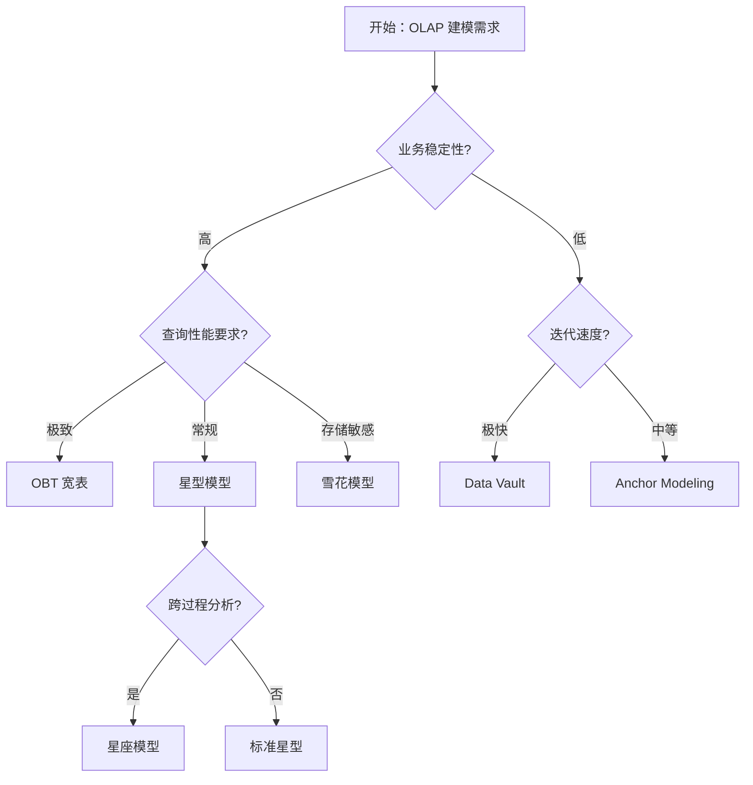

# 维度建模（Dimensional Modeling）

> **一句话定位**：Kimball 提出的、面向分析查询的数据建模方法论——用事实表装"数"，用维度表装"上下文"。

> 本文是 data-travel 项目 [Ch1 · 建模方法论](../../README.md) 的子章节（02-dimensional-modeling），覆盖 **R3 数据建模** 能力领域中「数仓建模」的核心方法——Kimball 维度建模及其在 AI 时代的演进。

---

## 1. 概念与定位

### 1.1 是什么

**维度建模（Dimensional Modeling, DM）** 是 Ralph Kimball 在 1996 年《The Data Warehouse Toolkit》中提出的数据建模方法论，核心思想是**为查询性能和分析易用性而设计，刻意违反 3NF 范式**。

- **学术定义**：以"事实"与"维度"二元结构为骨架，将业务事件建模为事实表（fact table）、将描述性上下文建模为维度表（dimension table）。
- **工程定义**：维度建模 = 1 个业务过程 → 1 张事实表（装度量）+ N 张维度表（装上下文），通过星型/雪花/星座结构支撑 OLAP 查询。
- **核心问题**：在 PB 级数据上，把"业务事件"高效组织起来，使 BI 工具、SQL 查询、AI Agent 都能以可预测的延迟拿到答案。

### 1.2 为什么需要

- **业务驱动力**：3NF 范式适合 OLTP（事务处理），但 OLAP（分析查询）需要"宽表 + 反范式"——复杂 JOIN 严重影响查询性能与可读性。
- **痛点**：没有维度建模时，常见失败——事实表把维度属性塞进来导致"巨型大宽表"；维度表过度范式化导致 7 层 JOIN；缓慢变化维处理不一致导致"今天的口径对不上昨天的报表"。
- **AI 时代新诉求**：Agent 平台要求事实表具备**可推理（度量可解释）、可语义化（维度可被自然语言查询）、可向量化（维度可被嵌入到向量空间）** 三性。

### 1.3 在 AI 时代数据架构中的位置

维度建模处于建模方法论的"承上启下"位置：

```
       业务过程建模（1.1 章）        ← 识别业务过程
                ↓
       维度建模（本章）              ← 把过程翻译成事实/维度
                ↓
       物理模型（Data Vault / Anchor）← 多范式可替代
                ↓
       物理存储（Lakehouse / Iceberg / Delta）
```

维度建模与其他方法的关系：

| 方法 | 关系 |
| --- | --- |
| ER 建模（3NF） | 维度建模**违反** 3NF；OLTP 用 ER，OLAP 用 DM |
| Data Vault | DM 的**敏捷替代品**——Hub/Link/Sat 替代事实/维度 |
| Anchor Modeling | DM 的**第 6 范式版本**——支持时序属性演化 |
| One Big Table（OBT） | DM 的**极致反范式**——单表宽表，湖仓常见 |
| 本体建模 | DM 的**语义升级**——维度表升级为本体 class |

**一句话判断**：本章是"建表 / 建模型 / 建体系"中的**建表**——告诉你一张分析表应该长什么样。

### 1.4 演进历程

- **传统阶段（1996–2015）**：Kimball 维度建模占据数据仓库 70%+ 市场份额；缓慢变化维（SCD Type 1-7）成为业界标准；星型/雪花/星座三种基本结构定型。
- **大数据阶段（2015–2020）**：维度建模与 Hadoop/Spark 生态结合，事实表进入 PB 级；维度建模方法论被搬上 Lakehouse（Iceberg/Delta/Hudi）。
- **AI 原生阶段（2020+，LLM + Agent 驱动）**：维度建模进入"语义化"——维度被向量化嵌入（vector embedding），事实表被自然语言查询；Agent 自动生成 DDL 与数据血缘。
- **每阶段核心矛盾**：传统阶段是"范式 vs 性能"、大数据阶段是"一致性 vs 扩展性"、AI 原生阶段是"结构化 vs 语义化"。

---

## 2. 核心原理

### 2.1 关键概念定义

| 概念 | 定义 | 一句话解释 |
| --- | --- | --- |
| **事实表（Fact Table）** | 存储业务度量与外键的事实数据 | "订单金额、订单时间"在一张表 |
| **维度表（Dimension Table）** | 存储描述性上下文的表 | "用户叫什么、商品叫什么"在一张表 |
| **度量（Measure）** | 事实表中的可聚合数值列 | "金额、数量、时长" |
| **外键（Foreign Key）** | 事实表指向维度表的连接键 | "user_key、product_key" |
| **退化维度（Degenerate Dimension）** | 没有对应维度表的维度值（如订单号） | "order_id 直接存在事实表" |
| **缓慢变化维（Slowly Changing Dimension, SCD）** | 维度属性随时间变化的处理方式 | "用户地址变了怎么办" |
| **角色扮演维度（Role-Playing Dimension）** | 同一维度表在事实表中扮演多种角色 | "日期维既是下单日期也是支付日期" |
| **维度层次（Hierarchy）** | 维度的层级结构（年-月-日） | "时间维度的层级" |
| **代理键（Surrogate Key）** | 维度表的整数型主键，与业务键解耦 | "user_key=12345 对应 user_id='U001'" |
| **星型模型（Star Schema）** | 1 张事实表 + N 张扁平维度表 | 像星星一样发散 |
| **雪花模型（Snowflake Schema）** | 维度表进一步范式化 | 像雪花一样分叉 |
| **星座模型（Fact Constellation）** | 多个事实表共享维度表 | 多张事实表共享维度 |

### 2.2 数学/形式化基础

维度建模可被形式化为**星型连接结构**：

```
DM = ⟨F, D, FK, K⟩

F       = 事实表集合 {f1, f2, ..., fn}
D       = 维度表集合 {d1, d2, ..., dm}
FK      = 外键映射 f_i → {d_j}（每个事实表关联多个维度表）
K       = 维度层次（每个维度可有层级结构）
```

度量形式化（Kimball）：

```
measure(p, g, t) = AGG(measure_facts WHERE dim_attrs ∈ p AND time ∈ g)
                ↑                                    ↑
              过滤条件                              分组维度
```

事实表的"事实性"：

- 可加性事实（additive）：SUM 有效，如订单金额
- 半可加性事实（semi-additive）：仅特定维度 SUM 有效，如账户余额
- 不可加性事实（non-additive）：如比率、单价，需用 AVG 或预计算

### 2.3 关键算法/方法

| 方法 | 原理 | 适用边界 |
| --- | --- | --- |
| **星型模型设计** | 1 事实 + N 扁平维度 | 90% OLAP 场景；查询性能优先 |
| **雪花模型设计** | 维度范式化（年/月/日拆表） | 存储优化场景；查询复杂度高 |
| **星座模型设计** | 多事实共享维度 | 跨业务过程分析（如销售+库存） |
| **SCD Type 1-7** | 维度属性变化的 7 种处理方式 | 维度属性随时间变化的场景 |
| **事实表分类选择** | 事务/周期快照/累计快照 三选一 | 不同业务过程类型 |
| **维度层次建模** | 时间/地理/产品 维度层级 | 多粒度分析场景 |
| **LLM 辅助建模（2024+）** | 自然语言→星型模型自动生成 | 敏捷迭代、文档丰富场景 |

### 2.4 与相邻概念的关系

- **维度建模 vs ER 建模**：ER 适合 OLTP（写多读少），DM 适合 OLAP（读多写少）。**判断口诀：写多用 ER，读多用 DM。**
- **维度建模 vs Data Vault**：DM 一次性建模，DV 持续建模。**判断口诀：业务稳用 DM，业务多变用 DV。**
- **维度建模 vs OBT（One Big Table）**：DM 结构化但需 JOIN，OBT 反范式到极致但难治理。**判断口诀：治理优先用 DM，性能极致用 OBT。**
- **什么时候用星型、雪花、星座**：90% 用星型；存储紧张用雪花；跨过程分析用星座。

---

## 3. 设计模式与范式

### 3.1 主要模式

| 模式 | 场景 | 结构 | 优点 | 缺点 |
| --- | --- | --- | --- | --- |
| **星型模型** | 标准 OLAP 报表 | 1 事实 + N 扁平维度 | 查询性能最优、易理解 | 维度冗余、存储浪费 |
| **雪花模型** | 维度属性有自然层次 | 维度表进一步拆分 | 存储节省、范式严谨 | JOIN 多、查询慢 |
| **星座模型** | 多个业务过程共享维度 | 多事实共享维度 | 跨过程分析友好 | 模型复杂度高 |
| **事务事实表（Transaction）** | 离散事件 | 一行一事件 | 粒度最细、灵活 | 数据量大 |
| **周期快照事实表（Periodic Snapshot）** | 定期状态快照 | 一行一周期一状态 | 历史可追溯 | 存储膨胀 |
| **累计快照事实表（Accumulating Snapshot）** | 过程多步骤 | 一行一业务全生命周期 | 漏斗分析友好 | 业务变更敏感 |
| **OBT 宽表（One Big Table）** | 湖仓查询 | 单表百列以上 | 无 JOIN、极致性能 | 难治理、更新成本高 |
| **语义化维度（2024+）** | AI 消费 | 维度带 embedding 列 | Agent 可直接查询 | 存储与计算成本高 |

### 3.2 适用场景决策表

| 业务特征 | 推荐模式 | 理由 |
| --- | --- | --- |
| 标准 BI 报表 | 星型 + 事务事实 | 查询性能最优 |
| 维度属性有自然层次（如地理） | 雪花 | 存储节省 |
| 跨业务过程分析（销售+库存） | 星座 | 共享维度 |
| 定期状态监控（账户余额） | 周期快照 | 历史可追溯 |
| 漏斗/转化分析（订单全流程） | 累计快照 | 一步一列 |
| 湖仓 Ad-hoc 查询 | OBT 宽表 | 无 JOIN 性能 |
| AI/Agent 自然语言查询 | 语义化维度 | 可被 LLM 理解 |
| 维度属性频繁变化 | SCD Type 2 | 保留历史 |
| 维度属性不变 | SCD Type 1 | 简洁 |
| 维度属性偶尔变化 | SCD Type 3 | 列存新旧值 |

### 3.3 反模式与陷阱

| 反模式 | 表现 | 后果 | 如何避免 |
| --- | --- | --- | --- |
| **巨型大宽表** | 一张事实表塞 500 列 | 更新慢、索引失效、维护噩梦 | 强制星型，事实表只装度量+外键 |
| **维度范式化过度** | 把"用户"拆成 7 张表 | JOIN 爆炸、查询性能崩溃 | 维度表尽量扁平，最多二级 |
| **维度属性混入事实表** | 事实表存"用户姓名" | 违反维度建模原则、SCD 失效 | 强制"事实只装度量" |
| **代理键与业务键混用** | 事实表用业务键做外键 | 业务键变更导致关联断裂 | 统一用代理键（surrogate key） |
| **SCD Type 滥用** | 所有维度都开 Type 2 | 事实表膨胀、查询复杂度上升 | 按业务需求选择 SCD Type |
| **事实表粒度混乱** | 一张事实表混粒度 | 同一指标两种结果 | 强制"一行一事件/一周期/一生命周期" |
| **维度共享不当** | 多个业务过程强行共用同一维度 | 语义冲突、口径混乱 | 维度按"通用维度"与"专属维度"分类 |
| **忽略退化维度** | 把"订单号"抽成维度表 | 无意义的 JOIN | 退化维度直接存事实表 |

---

## 4. 工程实现

### 4.1 落地步骤

维度建模的标准落地流程（8 步）：

1. **业务过程识别**（来自业务过程建模章）→ 产出物：业务过程清单
2. **声明粒度** → 产出物：每张事实表的一行代表什么（如"一行一订单创建事件"）
3. **识别维度** → 产出物：维度清单（通常 5-15 个）
4. **识别度量** → 产出物：度量清单（每个事实表 3-10 个度量）
5. **选择事实表类型** → 产出物：事务/周期快照/累计快照 三选一
6. **设计维度表** → 产出物：维度表 DDL（含 SCD Type、代理键、层次结构）
7. **设计事实表** → 产出物：事实表 DDL（含度量、外键、分区键）
8. **评审与发布** → 产出物：模型评审记录 + 上线 DDL

### 4.2 关键技术点

- **代理键体系**：所有维度表必须用整数型代理键，与业务键解耦；雪花集成常用 `HASH(business_key)` 生成。
- **SCD 策略选择**：根据业务对历史的诉求选择 Type 1/2/3/4/6；Type 2 是最常见的（保留历史）。
- **事实表粒度声明**：每个事实表必须有"一行代表什么"的明文声明，纳入模型文档。
- **分区与分桶**：大数据场景下，事实表按时间分区、按主键分桶是标配。
- **索引策略**：维度表常用 Bloom Filter、Zone Map；事实表常用 Min/Max、Clustering。
- **命名规范**：事实表前缀 `fact_`，维度表前缀 `dim_`，退化维度直接放事实表。
- **血缘与元数据**：每个事实/维度表必须有 Owner、血缘、上下游依赖、刷新策略。
- **度量命名**：度量名要带单位或业务含义（如 `order_amount_rmb`、`order_count_30d`）。

### 4.3 工具链与平台

| 类别 | 工具 | 推荐组合 |
| --- | --- | --- |
| **数据建模** | ER/Studio、PowerDesigner、dbdiagram.io、dbt | dbt（云原生）+ dbdiagram.io（轻量） |
| **ETL/ELT** | dbt、Airflow、DataWorks、Informatica | dbt + Airflow（开源组合） |
| **Lakehouse** | Databricks、Snowflake、Apache Iceberg、Delta Lake | Databricks + Iceberg |
| **查询引擎** | StarRocks、Doris、ClickHouse、Trino | StarRocks（国产）/ Trino（联邦查询） |
| **BI 工具** | Tableau、Power BI、Superset、FineBI | Superset（开源）/ FineBI（国产） |
| **元数据/血缘** | DataHub、Apache Atlas、OpenMetadata、阿里 DataWorks | DataHub（开源）+ DataWorks |
| **AI 辅助（2024+）** | Databricks Assistant、Snowflake Cortex、dbt + LLM、Cursor | Databricks Assistant + Cursor |
| **自动化建模** | WhereScape、Dataform、Coalesce | dbt + Dataform |

### 4.4 代码 / SQL 示例

经典星型模型（电商订单）：

```sql
-- 维度表：用户（含 SCD Type 2）
CREATE TABLE dim_user (
    user_key        BIGINT PRIMARY KEY,      -- 代理键
    user_id         VARCHAR(64),             -- 业务键
    user_name       VARCHAR(128),
    city            VARCHAR(64),
    effective_date  DATE,
    expiry_date     DATE,
    is_current      BOOLEAN
);

-- 维度表：日期（带层次）
CREATE TABLE dim_date (
    date_key      INT PRIMARY KEY,            -- YYYYMMDD
    date_value    DATE,
    year          INT,
    quarter       INT,
    month         INT,
    day           INT,
    week_of_year  INT,
    is_weekend    BOOLEAN
);

-- 事实表：订单（事务事实）
CREATE TABLE fact_order (
    order_key        BIGINT PRIMARY KEY,
    user_key         BIGINT REFERENCES dim_user(user_key),
    product_key      BIGINT REFERENCES dim_product(product_key),
    channel_key      BIGINT REFERENCES dim_channel(channel_key),
    order_date_key   INT REFERENCES dim_date(date_key),
    -- 度量
    order_amount_rmb DECIMAL(18,2),
    item_count       INT,
    discount_rmb     DECIMAL(18,2),
    -- 退化维度
    order_id         VARCHAR(64),
    -- V2
    created_at       TIMESTAMP
) PARTITIONED BY (dt DATE);
```

---

## 5. 前沿演进（AI 时代）

### 5.1 LLM/Agent 时代的演进方向

**NL2Model（自然语言→维度模型）**：用自然语言描述业务，自动生成星型模型 DDL。代表性 prompt：

```
你是一名资深数据架构师。请阅读以下需求：
"我想分析每个用户每个月的消费金额和订单数量"
请输出：
1. 事实表（含粒度、度量、分区键）
2. 需要的维度表
3. 每个维度表的 SCD Type 选择
```

**Agent 驱动的模型演化**：当业务变更时，Agent 自动识别影响的事实/维度表，生成 schema migration 脚本。代表性工具：dbt + LLM、Atlan、DataHub AI。

**语义化维度（Semantic Dimensions）**：维度表增加 `embedding` 列，把维度属性向量化，使自然语言查询可直接命中（如"30-40 岁女性用户" → embedding match）。

**度量语义化（Metric Semantic Layer）**：Headless BI（Cube.js、dbt Semantic Layer、LookML）让度量成为"一等公民"，AI Agent 可直接调用。

### 5.2 与 RAG / 向量库 / GraphRAG 的结合

- **维度作为 RAG 元数据**：RAG 检索时不仅检索"事实"，还要检索"维度"——例如问"上月 iPhone 用户的复购率"，需先定位"iPhone"维度，再检索事实。
- **事实向量嵌入**：把事实行向量化，支持相似检索（如"找出与这笔订单相似的订单"）。
- **GraphRAG 与维度建模**：GraphRAG 将维度建模为图中的节点（实体），事实建模为节点间的关系（边），适合复杂推理场景（如"找出与流失客户相似的支付链路"）。

### 5.3 学术与工业最新进展（2024-2025）

| 进展 | 时间 | 来源 | 要点 |
| --- | --- | --- | --- |
| **Semantic Layer（指标语义层）** | 2023-2025 | dbt Labs、Cube.js、Looker | 度量集中定义，AI Agent 可消费 |
| **Databricks Assistant NL2SQL** | 2024 | Databricks | Unity Catalog 内置 NL2Model |
| **Snowflake Cortex Analyst** | 2024 | Snowflake | 自然语言→SQL/模型自动生成 |
| **dbt + LLM 集成** | 2024 | dbt Labs | dbt-codegen + LLM 自动生成 DDL |
| **Atlan AI Metadata** | 2024 | Atlan | AI 自动识别事实/维度与血缘 |
| **Microsoft Fabric / OneLake** | 2024 | Microsoft | 湖仓一体的维度建模 |
| **StarRocks 4.0 向量化执行** | 2024 | StarRocks | 向量化引擎 + 主键模型 |
| **Iceberg V3（2025）** | 2025 | Apache | 主键约束、Delete Vector、Schema Evolution |

### 5.4 未来 3-5 年趋势

- **从"结构化维度"到"语义化维度"**：每个维度都有 embedding 列，AI Agent 可直接语义检索。
- **从"事实表 + 维度表"到"语义层（Semantic Layer）"**：度量和维度集中定义，成为 AI 时代的数据接口标准。
- **从"人工建模"到"Agent 自建模"**：80% 的维度建模工作由 Agent 完成，人类只审核。
- **风险点**：过度向量化增加存储成本；语义层的标准尚未统一（Cube vs dbt Semantic vs LookML）；LLM 抽取的"幻觉"可能导致 schema 错误。

---

## 6. 落地实践

### 6.1 真实案例

**案例 1：Databricks Lakehouse 维度建模**

- **背景**：Databricks 用 Delta Lake + Iceberg + Unity Catalog 支撑全球 PB 级数据仓库。
- **做法**：基于 Kimball 维度建模 + Data Vault 混合架构；引入 Metric Store（度量语义层）；用 AI Assistant 自动生成 DDL 与血缘。
- **收益**：新模型上线周期从 2 周缩短到 2 天；查询性能提升 3-5 倍（向量化执行）；跨团队指标口径冲突减少 80%。

**案例 2：阿里 OneData 维度建模**

- **背景**：阿里中台覆盖电商、金融、物流等多业务线，每个业务线都有独立数仓。
- **做法**：统一维度建模规范（星型为主）+ OneData 公共层（ODS/DWD/DWS/ADS）；建立企业级维度（如"商品维"、"渠道维"）跨业务线共享。
- **收益**：指标口径统一率从 40% 提升到 95%；跨业务线分析效率提升 5 倍；新业务接入周期从 6 个月缩短到 6 周。

**案例 3：Snowflake Cortex + 自然语言建模**

- **背景**：Snowflake 用户希望降低建模门槛，让业务分析师也能自助建模。
- **做法**：用 Cortex Analyst（基于 LLM）支持自然语言→SQL/模型生成；内置维度建模推荐。
- **收益**：建模效率提升 50%+；业务分析师自助建模覆盖率从 20% 提升到 60%。

### 6.2 踩坑与经验

| 场景 | 错在哪 | 怎么改 |
| --- | --- | --- |
| **事实表粒度混乱** | 订单事实表混"下单"和"支付"两种事件 | 强制一行一事件，拆成两张事实表 |
| **SCD Type 2 全开** | 所有维度都开 SCD Type 2 | 按业务诉求选：地址→Type 2，姓名→Type 1 |
| **维度过度范式化** | 把"地区→省→市"拆成 3 张维度表 | 维度扁平，雪花最多二级 |
| **代理键与业务键混用** | 事实表用 user_id 做外键 | 统一代理键（user_key） |
| **OBT 滥用** | 所有事实表都建 OBT 宽表 | OBT 用于特定场景（如湖仓 Ad-hoc），标准场景用星型 |
| **忽略一致性退化** | 把订单号当维度表 | 退化维度直接存事实表 |
| **事实表分区不当** | 订单事实表不分区 | 必须按时间分区（dt/created_at） |
| **度量单位混乱** | "金额"列无单位 | 度量名带单位（order_amount_rmb） |

### 6.3 落地路径

- **0→1 阶段**：识别核心业务过程（5-10 个），建立最小星型模型集；用 dbt + Postgres/Snowflake 落地。工具：dbt + draw.io。
- **1→10 阶段**：补齐事实/维度表到 50-100 张；引入 SCD Type 2 治理历史；建立指标语义层。工具：dbt + Airflow + DataHub。
- **10→100 阶段**：维度建模进入 Lakehouse（Iceberg/Delta）；引入语义化维度 + AI Assistant；建立指标中台。工具：Databricks/Snowflake + Atlan + Cube.js。

### 6.4 ROI 评估

- **开发效率**：标准化后，新报表开发周期缩短 50-70%（避免重复建模）。
- **查询性能**：星型模型相对 3NF 范式，复杂报表性能提升 5-10 倍。
- **数据一致性**：指标口径冲突减少 80%+。
- **投入成本**：初期 3-6 个月人力；长期 0.5 人/季度维护；语义层增量 1-2 人月。

---

## 7. 与其他方法对比

### 7.1 对比维度

| 维度 | 维度建模 | ER 建模 | Data Vault | Anchor Modeling | OBT 宽表 |
| --- | :---: | :---: | :---: | :---: | :---: |
| 范式 | 反 3NF | 3NF | 混合 | 6NF | 反 3NF 极致 |
| 查询性能 | 4 | 2 | 3 | 3 | 5 |
| 灵活度 | 3 | 2 | 5 | 5 | 2 |
| 学习成本 | 3 | 4 | 4 | 5 | 2 |
| 可演进性 | 3 | 2 | 5 | 5 | 2 |
| AI 友好度 | 4 | 2 | 4 | 3 | 4 |
| 生态成熟度 | 5 | 5 | 4 | 2 | 3 |

### 7.2 决策树



### 7.3 组合使用

**实战组合 1：维度建模 + Data Vault**
- ODS/DWD 层用 Data Vault 保留全量历史
- DWS/ADS 层用维度建模面向分析
- 适用：监管行业 + 敏捷数仓

**实战组合 2：维度建模 + 语义层**
- 维度建模落表 + 语义层（dbt Semantic/Cube.js）定义度量
- 适用：BI + AI 双消费场景

**实战组合 3：维度建模 + OBT**
- ODS/DWD 用维度建模保持结构化
- ADS 层用 OBT 宽表做 Ad-hoc 查询
- 适用：湖仓场景

**实战组合 4：维度建模 + 语义化维度**
- 维度表增加 embedding 列 + 事实向量嵌入
- 适用：AI 智能体平台

---

## 8. 面试真题集

# dimensional-modeling 面试真题集

> **一句话定位**：事实表、维度表、星型 / 雪花 / 星座模型。

> 本文整合自题库《大数据平台架构师》（创脉思 cms365.cn，版本 2025-11-25）的真实面试题。
> 题号沿用原题库编号（PDF §X.Y 第 K 题），便于读者回溯原题与答案详解。

## 1 全景视图

> 本节整合 3 个原 PDF 子章节、共 15 道真题。下表按原 PDF 主题汇总。

| 原 PDF §N.M | 主题 | 题号范围 | 收录题数 | 主/辅 |
| --- | --- | --- | :---: | :---: |
| §4.1 | SQL 基础与数据定义 | 4.1.1, 4.1.2, 4.1.3, 4.1.4, 4.1.5 | 5 | 主 |
| §4.2 | 数据仓库分层与建模理论 | 4.2.1, 4.2.2, 4.2.3, 4.2.4, 4.2.5 | 5 | 主 |
| §13.3 | 实时数仓分层架构设计与数据建模 | 13.3.1, 13.3.2, 13.3.3, 13.3.4, 13.3.5 | 5 | 辅 |

## 2 分主题展开

> 按原 PDF 主题（N）逐章展开。每个主题先给主题背景与核心概念，然后按子章节列出全部题目。

> 题干保持原题库表述（含部分 CJK 兼容性汉字），便于在原 PDF 中检索。

### 2.1 §4 基于Hive/Spark SQL的数据仓库建设 > 本主题涵盖 2 个子节、10 道题。

#### 2.1.1 SQL 基础与数据定义

> 来源：原 PDF §4.1，收录 5 道题。

| 题号 | 难度 |
| --- | :---: |
| §4.1.1 | ★★★☆☆ |
| §4.1.2 | ★★★☆☆ |
| §4.1.3 | ★★★☆☆ |
| §4.1.4 | ★★★☆☆ |
| §4.1.5 | ★★★★☆ |

- **§4.1.1**：请解释 Hive 的数据存储格式（如 TextFile、ORC、Parquet）之间的主要差异，并
- **§4.1.2**：请说明 Hive 中动态分区和静态分区的适⽤场景及它们各⾃的优缺点。
- **§4.1.3**：请阐述在构建⼤规模数据仓库时，如何利⽤ Hive 或 Spark SQL 的分桶技术来优化
- **§4.1.4**：请解释 Hive 中内部表和外部表的区别，并说明在实际项⽬中应如何选择使⽤它
- **§4.1.5**：请描述在 Hive 或 Spark SQL 中创建分区表的主要步骤，并阐述分区对⼤数据查询

#### 2.1.2 数据仓库分层与建模理论

> 来源：原 PDF §4.2，收录 5 道题。

| 题号 | 难度 |
| --- | :---: |
| §4.2.1 | ★★★☆☆ |
| §4.2.2 | ★★★☆☆ |
| §4.2.3 | ★★★☆☆ |
| §4.2.4 | ★★★☆☆ |
| §4.2.5 | ★★★★☆ |

- **§4.2.1**：在构建数据仓库时，如何处理缓慢变化维？请⾄少描述两种常⻅的处理⽅式及其适
- **§4.2.2**：随着数据湖概念的普及，请阐述在Lambda架构中，如何协调数据仓库（批处理
- **§4.2.3**：在万节点级别的Hadoop/Spark集群上，如何设计和优化数据仓库的ETL流程，以
- **§4.2.4**：请解释维度建模中的星型模型和雪花模型，并⽐较它们在查询性能和模型复杂度上
- **§4.2.5**：请简要说明数据仓库中常⻅的分层结构（例如ODS、DWD、DWS、ADS）及其各

### 2.2 §13 Flink、Kafka、ClickHouse在实时场景的应⽤

> 本主题涵盖 1 个子节、5 道题。

#### 2.2.3 实时数仓分层架构设计与数据建模

> 来源：原 PDF §13.3，收录 5 道题。（辅）

| 题号 | 难度 |
| --- | :---: |
| §13.3.1 | ★★★☆☆ |
| §13.3.2 | ★★★☆☆ |
| §13.3.3 | ★★★☆☆ |
| §13.3.4 | ★★★☆☆ |
| §13.3.5 | ★★★★☆ |

- **§13.3.1**：假设业务要求对万亿级别的实时数据在任意维度和指标上进⾏亚秒级查询，同时
- **§13.3.2**：请简要说明实时数仓中常⻅的ODS、DWD、DWS、ADS分层分别代表什么，以及
- **§13.3.3**：在基于Flink和ClickHouse构建实时数仓时，为什么通常会将DWD层明细数据存⼊
- **§13.3.4**：请描述在实时数仓的ODS到DWD层数据处理过程中，如何使⽤Flink处理Kafka中
- **§13.3.5**：当实时数仓中某个核⼼DWS层宽表的数据来源涉及多个不同刷新频率的流（如⼀

## 3 横向小结

> 本节题目的横切主题分布——按跨章节反复考察的能力维度回顾：

- **实时与流处理架构**
- **数据建模与仓库建设**
- **架构演进与未来趋势**

## 4 本章小结

> 本面试真题集收录 15 道题，覆盖 2 个原 PDF 主题、3 个子章节。
> 题号沿用原题库编号，便于跨文章交叉检索。读者可按需查阅。

### 4.1 推荐学习路径

1. 先看「[§1 全景视图](#1-全景视图)」了解题目分布
2. 按「[§2 分主题展开](#2-分主题展开)」逐主题学习
3. 最后用「[§3 横向小结](#3-横向小结)」回顾横切主题

### 4.2 返回

- 返回 [01-modeling 章节目录](../README.md)
- 返回 [项目根目录](../../README.md)