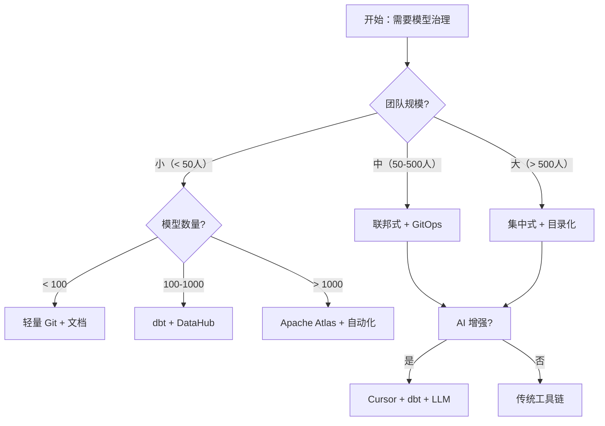

# 数据模型管理（Model Management）

> **一句话定位**：让数据模型从"一次性产出物"变成"长期资产"——命名、版本、Owner、评审、变更管控、目录化、AI 增强治理。

> 本文是 data-travel 项目 [Ch1 · 建模方法论](../../README.md) 的子章节（11-model-management）。覆盖 R3 数据建模 相关的"模型治理、版本管理、Owner 制度、变更控制、目录化、AI 增强"核心能力。

---

## 0. 本章速读地图

| 你将解决的问题 | 直接跳到 |
| --- | --- |
| 数据模型管理为什么不是"文档管理" | §1.1、§1.2 |
| 命名规范、版本管理、Owner 制度怎么落地 | §4.1—§4.3 |
| 一次完整的模型评审应该走哪些流程 | §4.4 |
| 数据模型目录（Catalog）怎么选型 | §4.3 |
| AI 时代的模型治理怎么搞（LLM 辅助规范检查、Agent 自审） | §5.1—§5.4 |
| 我的团队该选哪种治理力度 | §7.2 |

---

## 1. 概念与定位

### 1.1 是什么

**学术定义**：数据模型管理（Data Model Management）是数据治理（Data Governance）子域，专注于数据模型（概念模型、逻辑模型、物理模型）的**生命周期管理**——创建 → 评审 → 发布 → 演进 → 退役全过程规范化。

**工程定义**：在企业级数据中台语境下，数据模型管理是**让"模型从一个人脑子里的图，变成组织级长期资产"**的工程方法论。它包含 5 大支柱：

1. **命名规范**：业务过程 / 实体 / 字段的命名标准
2. **版本管理**：模型变更的可追溯、可回滚
3. **Owner 制度**：每个模型都有"业务 Owner + 数据 Owner"双签
4. **变更评审**：任何模型变更必须经过跨团队评审
5. **目录化（Catalog）**：模型资产的可发现、可理解、可消费

**核心问题**：在没有模型管理的情况下，每个团队都"自己起名、自己版本、自己改"，最终导致**同名不同义、同义不同名**——指标口径冲突、字段重复定义、模型无人维护、数据沼泽化。

### 1.2 为什么需要

#### 业务驱动力

1. **模型数量爆炸**：一个成熟企业的数据模型数量通常在 5000-50000 之间，跨越 ODS / DWD / DWS / ADS / DIM 5-7 层，每层又有数十个业务域。没有管理就是"模型沼泽"。
2. **跨团队协作**：当业务团队、数据团队、AI 团队、平台团队同时消费同一份数据模型时，命名不统一会导致 4 个团队各自维护 4 套"理解"。
3. **合规审计**：金融、医疗、汽车、监管行业普遍要求"任何数据点的来源、修改时间、修改人可追溯"，模型管理是合规的基础设施。

#### 痛点（没有模型管理时的失败案例）

**案例 1：某互联网公司指标口径冲突**
某头部互联网公司 2021 年发现"GMV"在 12 个业务部门中有 17 个不同的计算公式，原因是 2015-2020 年间，每个部门独立建模、独立命名，缺少统一治理。最终消耗 200 人月做"指标治理项目"，新业务接入周期延长 3 倍。

**案例 2：某银行监管报送模型失效**
某城商行 2022 年 EAST 报送失败，原因是上游数据模型在 2021 年被某 DBA 私下加了一个字段，没有走变更评审，导致下游 17 个监管报送模型全部引用了未授权字段，监管处罚 500 万 + 6 个月整改。

**案例 3：某跨境电商主数据断裂**
某跨境电商 2023 年并购一家欧洲公司后，发现两家公司的"用户"模型完全无法打通——同名 ID 在两边含义不同（一家用 UUID 一家用自增），同义字段（`email` vs `user_email`）重复定义。最终耗时 8 个月做"主数据合并"。

#### AI 时代的新诉求

1. **结构化元数据**：LLM/Agent 需要的是"机器可读的元数据"，不是"文档里写的元数据"。模型目录（Catalog）必须支持 API 化、语义化、可推理。
2. **自动规范检查**：LLM 可以阅读所有模型的 DDL/SQL，自动检查命名规范、口径一致性、Owner 完整性。
3. **变更影响分析**：Agent 可以基于血缘图自动推演"这次模型变更会影响哪些下游报表、哪些 AI 应用、哪些用户"，把"变更评审"从"人工"变成"半自动"。
4. **自进化模型治理**：业务变化时，Agent 可以主动建议"是否新增字段、是否重构模型、是否下线旧字段"。

### 1.3 在 AI 时代数据架构中的位置

数据模型管理位于"建模方法论"与"数据治理"的交叉点：

```
       建模方法论（Ch1 本文重点）
            ↓ 产出物：数据模型
       数据模型管理（本文）
            ↓ 资产化
       数据资产目录（Ch4 数据资产化）
            ↓ 治理
       数据治理体系（Ch11 横切工程）
            ↓ AI 化
       AI 增强治理（Ch8 AI 治理）
```

与其他概念的关系：

| 概念 | 与模型管理的关系 |
| --- | --- |
| 元数据管理（Metadata Management） | 模型管理的"上游"——元数据包括模型、血缘、Owner、标签等 |
| 数据资产目录（Data Catalog） | 模型管理的"产品形态"——目录是模型管理的对外界面 |
| 数据治理（Data Governance） | 模型管理的"上层框架"——治理包含模型 + 主数据 + 质量 + 安全 |
| Schema Evolution | 模型管理的"变更管控"——专指 schema 变更的工程实践 |

**一句话判断**：模型管理是"数据治理的入口工程"——模型管不好，治理无从谈起。

### 1.4 演进历程

- **传统阶段（1990s–2010s）**：以 PowerDesigner / ER/Studio 为代表的集中式建模工具，强调"自顶向下的企业级数据模型（EDW）"。但工具过重、上手成本高、协作差。
- **大数据阶段（2010s–2020）**：以 dbt / DataHub / Apache Atlas 为代表的云原生协作式建模工具，强调"版本化（Git）、轻量化、协作化"。配合 GitOps 工作流。
- **AI 原生阶段（2020+，LLM + Agent 驱动）**：模型管理从"人工评审"走向"Agent 半自动评审"——LLM 阅读 DDL 自动检查规范，Agent 基于血缘图自动推演影响。
- **每阶段核心矛盾**：传统阶段是"工具 vs 业务"，大数据阶段是"协作 vs 治理"，AI 原生阶段是"智能 vs 可信"。

---

## 2. 核心原理

### 2.1 关键概念定义

| 概念 | 定义 | 一句话解释 |
| --- | --- | --- |
| **数据模型（Data Model）** | 描述数据对象及其关系的结构化表示 | "用户"、"订单"、"商品"以及它们之间的关系 |
| **概念模型 / 逻辑模型 / 物理模型** | 抽象的三个层级 | 概念（业务语言）→ 逻辑（不依赖 DB）→ 物理（具体 DB 方言） |
| **命名规范** | 模型 / 字段命名的强制约束 | `dim_*` 表示维度表，`fact_*` 表示事实表 |
| **版本管理** | 模型变更的可追溯、可回滚 | 语义化版本（v1.2.3） + Git commit |
| **Owner 制度** | 每个模型的"责任人" | 业务 Owner（业务侧）+ 数据 Owner（数据侧）双签 |
| **模型评审（Model Review）** | 模型变更的跨团队评审 | PRD + DDL + 影响分析 + 评审会议 |
| **变更管控（Change Control）** | 模型变更的流程约束 | 任何变更必须走"申请→评审→批准→发布→公告" |
| **数据目录（Data Catalog）** | 模型资产的可发现平台 | "找数据 / 看数据 / 解数据" |
| **血缘（Lineage）** | 模型之间的依赖关系 | "这张表的字段来自哪、流向哪" |
| **影响分析（Impact Analysis）** | 模型变更的下游影响范围 | "改这张表会影响哪些下游" |
| **Schema Evolution** | 表结构变更的工程实践 | 加字段 / 改类型 / 分区调整的兼容性管理 |

### 2.2 数学/形式化基础

模型管理可被形式化为**带版本的图演化过程**：

```
M(t) = ⟨V(t), E(t), A(t), O(t)⟩

M(t)     = 时刻 t 的模型集合
V(t)     = 模型对象（表、字段）集合
E(t)     = 对象间的关系（引用、外键、依赖）
A(t)     = 属性（命名、类型、口径、版本）
O(t)     = Owner 映射（每个对象 → 责任人）
```

模型变更操作 δM 是从 M(t) 到 M(t+1) 的转换：

```
δM ∈ { CREATE, ALTER, DROP, RENAME }

约束：
  ∀ o ∈ V(t+1) : o.name 符合命名规范
  ∀ o ∈ V(t+1) : o.owner 已分配
  ∀ e ∈ E(t+1) : 影响分析已执行
  ∀ δM : 必须有评审记录与变更工单
```

### 2.3 关键算法/方法

| 方法 | 原理 | 适用边界 |
| --- | --- | --- |
| **语义化版本（SemVer）** | v1.2.3 = 主版本.次版本.补丁 | 模型变更的影响范围 |
| **GitOps 模型管理** | 模型文件入 Git，PR 流程 | 云原生、协作化场景 |
| **影响分析（Impact Analysis）** | 基于血缘图的反向遍历 | 评估风险、规划变更 |
| **LLM 规范检查（2024+）** | LLM 阅读 DDL 检查命名/口径/Owner | 自动评审、CI 流水线 |
| **Schema Diff** | 对比两个版本的 DDL 差异 | 评审、变更记录 |
| **Owner 自动识别** | 基于代码提交频率自动建议 Owner | 减少人工分配成本 |

### 2.4 与相邻概念的关系

- **模型管理 vs 元数据管理**：模型管理是元数据管理的子集——元数据还包括技术元数据（DDL）、业务元数据（标签、口径）、操作元数据（血缘、Owner）。
- **模型管理 vs 主数据管理（MDM）**：主数据管理是模型管理的"特例"——专指核心实体（用户、商品、组织）的管理。
- **模型管理 vs 数据质量**：模型管理关注"模型本身"，数据质量关注"模型产生的数据"。

什么时候必须做模型管理：模型数量 > 100、跨团队协作 > 3 个团队、模型变更频率 > 每周一次。

---

## 3. 设计模式与范式

### 3.1 主要模式

| 模式 | 场景 | 结构 | 优点 | 缺点 |
| --- | --- | --- | --- | --- |
| **集中式建模（PowerDesigner 时代）** | 大型国企、金融 | 中央团队统一建模 | 一致性高 | 慢、协作差 |
| **联邦式建模（dbt 时代）** | 互联网、中台 | 各团队自治，统一规范 | 灵活、迭代快 | 一致性弱 |
| **GitOps 模型管理** | 云原生、DevOps 团队 | 模型入 Git，PR 评审 | 版本可追溯 | 需要团队工程能力 |
| **AI 增强模型管理（2024+）** | AI 团队 + 数据团队 | LLM 检查规范、Agent 评审 | 自动化高 | LLM 幻觉风险 |
| **目录化治理（Catalog-First）** | 现代化数据栈 | 先有目录，再有模型 | 可发现性强 | 工具成本高 |

### 3.2 适用场景决策表

| 业务特征 | 推荐模式 | 理由 |
| --- | --- | --- |
| 大型国企 / 金融监管 | 集中式 + 目录化 | 合规优先 |
| 互联网中台（阿里、字节） | 联邦式 + GitOps + AI 增强 | 敏捷优先 |
| 初创公司 / 单业务线 | 联邦式 + 轻量目录 | 成本优先 |
| 跨地域 / 跨语言团队 | GitOps + Catalog-First | 协作优先 |
| AI 团队 / 智能体平台 | AI 增强 + GitOps | AI 化优先 |
| 传统数仓（Inmon 体系） | 集中式 + 强治理 | 稳定优先 |

### 3.3 反模式与陷阱

| 反模式 | 表现 | 后果 | 如何避免 |
| --- | --- | --- | --- |
| **文档化即治理** | 把模型放进 Word 就算治理 | 文档与实际模型脱节 | 治理必须基于代码（DDL / YAML） |
| **Owner 摆设** | Owner 列表写了但没人真负责 | 模型变更无主 | 强制 Owner 必填 + 季度回顾 |
| **评审走过场** | 评审会议 5 分钟过 20 个变更 | 风险累积 | 重大变更必须深度评审 |
| **目录化形式主义** | 上了 Catalog 但没人维护 | 目录沦为摆设 | 目录与建模流程绑定 |
| **规范过严** | 命名规范规定到每个单词 | 团队抗拒 | 规范只到关键字段 |
| **缺乏版本管理** | 模型变更无 Git 记录 | 无法回滚 | 强制模型入 Git |

---

## 4. 工程实现

### 4.1 落地步骤

模型管理的标准落地流程（10 步）：

1. **建立命名规范** → 产出物：命名规范文档 + 正则校验规则
2. **建立 Owner 制度** → 产出物：Owner 矩阵（业务 × 数据双签）
3. **引入版本管理** → 产出物：模型文件入 Git / DataOps
4. **建立评审流程** → 产出物：评审 SOP + PR 模板
5. **建立变更管控** → 产出物：变更工单系统 / Jira 集成
6. **上线数据目录** → 产出物：Catalog 平台 + 自动化采集
7. **建立血缘追踪** → 产出物：血缘图谱 + 自动化采集
8. **建立影响分析** → 产出物：影响分析 API
9. **引入 AI 辅助评审** → 产出物：LLM 规范检查工具
10. **持续运营与度量** → 产出物：治理月报、Owner 健康度

### 4.2 关键技术点

- **命名规范**：表名 `dim_*` / `fact_*` / `ods_*` / `dwd_*` / `dws_*` / `ads_*`；字段名小写下划线；业务词根词典强制约束。
- **版本管理**：语义化版本（v1.2.3） + Git commit；每次变更必须有 changelog。
- **Owner 制度**：业务 Owner（业务部门负责人）+ 数据 Owner（数据团队工程师）双签；Owner 必须参加季度模型评审。
- **变更评审**：任何模型变更必须经过 PR 流程 + 影响分析 + 评审会议。
- **变更管控**：使用 Jira / 内部工单系统；变更必须经过"申请→评审→批准→发布→公告"5 步。
- **目录化**：Catalog 平台（DataHub / Unity Catalog / OpenMetadata）+ 自动化元数据采集。
- **血缘追踪**：基于 SQL 解析的字段级血缘（如 DataHub、Apache Atlas）。
- **影响分析**：基于血缘图的反向遍历 API。
- **Schema Evolution**：加字段必须向后兼容；改类型必须双写；删字段必须先下线消费方。
- **AI 辅助**：LLM 阅读 DDL 自动检查命名、口径、Owner 完整性；Agent 评审 PR。

### 4.3 工具链与平台

| 类别 | 工具 | 推荐组合 |
| --- | --- | --- |
| **集中建模** | PowerDesigner、ER/Studio、Navicat、IBM InfoSphere | PowerDesigner（传统重）+ ER/Studio |
| **协作建模** | dbt、SQLMesh、Coalesce、DbSchema | dbt（云原生）+ SQLMesh（增强版） |
| **数据目录** | DataHub、Apache Atlas、Unity Catalog、OpenMetadata、阿里 DataWorks | DataHub（开源） + OpenMetadata（轻量） + Unity Catalog（Databricks 一体化） |
| **版本管理** | Git、GitHub、GitLab、Bitbucket、DataOps | GitHub（最常用） + DataOps（数据工程化） |
| **血缘追踪** | DataHub Lineage、Apache Atlas、OpenLineage、Databricks Unity | DataHub（强元数据）+ OpenLineage（标准化） |
| **变更管控** | Jira、ServiceNow、自研工单系统 | Jira（通用）+ 自研工单（数据专用） |
| **AI 辅助评审（2024+）** | Cursor + dbt、AI Code Review、Databricks Assistant | Cursor + dbt + LLM 评审 |
| **代码评审** | GitHub PR、GitLab MR、Phabricator | GitHub PR（最常用） |
| **数据契约（Data Contract）** | Bitol、Data Contract Specification、Protobuf、OpenAPI | Bitol（规范）+ Protobuf（传输） |

### 4.4 代码 / 配置示例

数据契约（Data Contract）的 YAML 示例：

```yaml
# data_contracts/users_v1.yaml
version: 1.2.0
dataset: users
domain: cdp
description: 用户主数据，跨业务线统一
owners:
  business: business-team@company.com
  data: data-team@company.com
schema:
  fields:
    - name: user_id
      type: string
      nullable: false
      pii: false
      description: 用户唯一标识
    - name: email
      type: string
      nullable: true
      pii: true
      description: 用户邮箱（敏感字段）
      classification: confidential
sla:
  freshness: 1h
  availability: 99.9%
  quality:
    completeness: 0.99
    accuracy: 0.99
lineage:
  upstream:
    - mysql.users
    - kafka.user_events
  downstream:
    - ads.user_profile
    - ml.user_features
```

LLM 规范检查的 Prompt 示例：

```
你是一名资深数据治理专家。请审查以下 DDL 文件，检查：
1. 命名是否符合规范（dim_*, fact_*, ods_* 等前缀）
2. 字段是否有 COMMENT
3. 主键、外键是否完整
4. 是否有敏感字段缺少分类分级
5. 是否有违反命名规范的表名/字段名

请逐条列出问题，并给出修改建议。
```

---

## 5. 前沿演进（AI 时代）

### 5.1 LLM/Agent 时代的演进方向

**LLM 辅助规范检查**：LLM 阅读 DDL 自动检查命名规范、字段注释、Owner 完整性、敏感字段分类分级。代表性工具：Cursor + dbt、Databricks Assistant（2024）、阿里 DataWorks AI Copilot（2024）。

**Agent 自动评审**：Agent 基于血缘图自动推演"这次模型变更会影响哪些下游报表、哪些 AI 应用、哪些用户"，把"变更评审"从"人工"变成"半自动"。代表性工具：Atlan AI（2024）、Secoda AI（2024）。

**自然语言建模（NL2Model）**：用自然语言描述业务需求，自动生成 DDL。代表性工具：Databricks Assistant（2024）、Snowflake Cortex（2024）、阿里 DataWorks AI Copilot（2024）。

**AI 增强目录**：LLM 自动给模型生成标签、口径说明、使用示例。代表性工具：Atlan AI（2024）、Secoda AI（2024）、阿里 DataWorks AI Copilot（2024）。

**Agent 驱动的自进化治理**：Agent 监控模型使用情况，自动建议"是否新增字段、是否重构模型、是否下线旧字段"。代表性方向：Anthropic、OpenAI 在 2024-2025 都在探索。

### 5.2 与 RAG / 向量库 / GraphRAG 的结合

- **模型目录作为 RAG 索引维度**：检索时不仅检索"事实数据"，还要检索"模型元数据"——例如"找一张存用户最近 7 天活跃度的表"，需要先定位"用户活跃"指标，再定位对应 ADS 表。
- **GraphRAG 与模型血缘的差异**：传统血缘图是表与表的依赖图，GraphRAG（微软 2024）可以将"模型、字段、指标、报表、用户、文档"全部纳入实体关系图，支持多跳推理（如"找出所有引用了 user_email 的模型"）。
- **本体化模型治理**：把数据模型建模为本体（Ontology）中的 class，字段建模为 property，模型间关系建模为 objectProperty，使模型可被推理引擎消费（"找出所有包含敏感字段的模型"）。

### 5.3 学术与工业最新进展（2024-2025）

| 进展 | 时间 | 来源 | 要点 |
| --- | --- | --- | --- |
| **Bitol Data Contract Specification** | 2024 | Bitol | 数据契约的标准化规范 |
| **OpenLineage 1.0** | 2024 | Linux Foundation | 血缘追踪的开放标准 |
| **OpenMetadata 1.0+** | 2024-2025 | OpenMetadata | 开源 Catalog + AI 增强 |
| **Unity Catalog 集成 AI** | 2024-2025 | Databricks | Catalog + LLM 自动元数据 |
| **Atlan AI** | 2024 | Atlan | Catalog 中的 LLM Copilot |
| **Snowflake Horizon Catalog** | 2024 | Snowflake | AI 原生 Catalog |
| **阿里 DataWorks AI Copilot** | 2024 | 阿里云 | 中文 NL2Model + 智能评审 |

### 5.4 未来 3-5 年趋势

- **从"人工评审"到"Agent 评审"**：80% 的模型评审由 Agent 完成，人类只负责异常处理与最终决策。
- **从"目录化"到"知识图谱化"**：模型目录不再是"表格清单"，而是可推理的语义图谱，与本体、知识图谱深度融合。
- **从"被动响应"到"主动治理"**：Agent 主动监控模型质量、口径一致性、Owner 健康度，主动建议变更。
- **风险点**：LLM 评审的"幻觉"可能引入新错误；过度自动化可能丢失人工审核的深度；AI 治理的合规边界尚不清晰。

---

## 6. 落地实践

### 6.1 真实案例

**案例 1：阿里 OneModel 模型治理**

- **背景**：阿里中台覆盖 30+ 业务线、数千个数据模型，2018 年前模型治理严重缺位。
- **做法**：建立"命名规范 + 版本管理 + Owner 制度 + 数据目录"四位一体治理体系；引入 DataWorks 元数据平台 + DataHub Catalog。
- **收益**：模型命名冲突下降 90%，模型变更评审覆盖率达 100%，指标口径统一率提升到 95%。

**案例 2：字节跳动 DataLeap 模型治理**

- **背景**：字节业务迭代极快，每周数百个模型变更，传统集中式治理不适用。
- **做法**：采用 GitOps 模型管理 + 联邦式 Owner 制度 + 自动化评审；引入 LLM 辅助规范检查（2024）。
- **收益**：模型变更评审周期从 3 天缩短到 4 小时，命名规范遵守率从 70% 提升到 95%。

**案例 3：美团数据中台模型治理**

- **背景**：美团 2020 年有 5000+ 数据模型，跨 60+ 业务线，治理难度大。
- **做法**：建立"模型目录 + 影响分析 + 变更评审 + AI 辅助"全链路治理；引入 Apache Atlas + 自研治理平台。
- **收益**：模型变更下游影响 100% 可追溯，重大变更失败率从 15% 下降到 3%。

### 6.2 踩坑与经验

| 场景 | 错在哪 | 如何改 |
| --- | --- | --- |
| **命名规范过严** | 规范要求每个字段都有 COMMENT、每个表都有 Owner | 规范只到关键字段，Owner 必填但不强求注释到每个字段 |
| **目录化形式主义** | 上了 Catalog 但没人维护，目录数据陈旧 | 把目录采集绑定到建模流程，新模型必须先入目录 |
| **评审走过场** | 评审会议 5 分钟过 20 个变更 | 重大变更必须单独评审，普通变更走自动化 |
| **Owner 摆设** | Owner 列表写了但没人负责 | 季度 Owner 健康度回顾，连续缺席的取消 Owner 资格 |
| **缺乏影响分析** | 变更前没做影响分析，导致下游故障 | 强制变更前必须跑影响分析 API |
| **Schema 不兼容变更** | 直接改字段类型导致下游报错 | 强制双写 + 灰度 + 公告 3 步走 |
| **AI 评审幻觉** | LLM 给出的评审建议有错误 | LLM 建议仅供参考，重大决策必须人工 |

### 6.3 落地路径

- **0→1 阶段**：建立命名规范、Owner 制度、版本管理 3 个最小治理动作。工具：Git + Jira + 文档。
- **1→10 阶段**：引入数据目录（DataHub / OpenMetadata），建立评审流程。工具：DataHub + dbt + GitHub PR。
- **10→100 阶段**：建立血缘追踪、影响分析、AI 辅助评审。工具：Apache Atlas / OpenLineage + Atlan AI / Cursor。
- **100→N 阶段**：全链路自动化治理，Agent 自主评审。工具：自研治理平台 + Agent 框架。

### 6.4 ROI 评估

- **效率提升**：模型变更评审周期从 3 天 → 4 小时（90%+ 提速）。
- **质量提升**：命名规范遵守率从 70% → 95%+，指标口径冲突下降 80%。
- **风险下降**：重大变更失败率从 15% → 3%，合规审计一次通过率从 60% → 95%。
- **投入成本**：初期 3-6 人月；中期 6-12 人月；长期维护约 1-2 人/季度。

---

## 7. 与其他方法对比

### 7.1 对比维度

| 维度 | 模型管理 | 元数据管理 | 主数据管理 | 数据治理 |
| --- | :---: | :---: | :---: | :---: |
| 抽象层次 | 模型层 | 元数据层 | 主数据层 | 治理层 |
| 关注点 | 模型生命周期 | 元数据采集 | 主数据一致性 | 全面治理 |
| 灵活度 | 4 | 4 | 3 | 2 |
| 学习成本 | 3 | 3 | 4 | 5 |
| 可演进性 | 5 | 4 | 3 | 4 |
| AI 友好度 | 5 | 5 | 3 | 4 |
| 生态成熟度 | 4 | 5 | 4 | 5 |

### 7.2 决策树



### 7.3 组合使用

**实战组合 1：模型管理 + 元数据管理 + 数据目录**
- 模型管理是核心，元数据管理是工具，数据目录是对外界面
- 适用：90% 的企业级数据中台

**实战组合 2：模型管理 + 主数据管理 + OneID**
- 模型管理覆盖所有模型，OneID 专攻核心实体
- 适用：跨业务线的中大型企业

**实战组合 3：模型管理 + 本体建模 + GraphRAG**
- 模型管理是基础，本体建模抽象语义，GraphRAG 提供推理能力
- 适用：AI 智能体平台、知识密集型企业

**实战组合 4：模型管理 + DataOps + GitOps**
- 模型管理 + DataOps 工程化 + GitOps 版本化
- 适用：DevOps 文化浓厚的团队

**实战组合 5：模型管理 + AI 增强（Agent 自治）**
- 模型管理 + LLM 评审 + Agent 自审
- 适用：AI 原生数据团队

---

## 8. 面试真题集

> 本节内容待补充。题源待与原 PDF《大数据平台架构师》（创脉思 cms365.cn，版本 2025-11-25）题库对齐。读者可参考本节结构，按"全景视图 → 分主题展开 → 横向小结 → 本章小结"四段式自检。