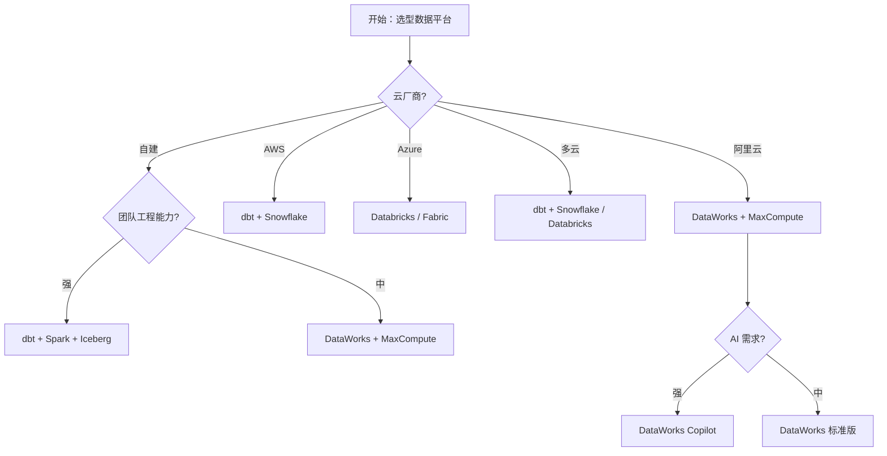

# DataWorks / 阿里中台工具链实战

> **一句话定位**：把"建模方法论"落到工具上——DataWorks、MaxCompute、Hologres、DataFinder、Iceberg/Hudi/Paimon 湖仓，OneData / OneID / 指标平台的端到端落地参考。

> 本文是 data-travel 项目 [Ch1 · 建模方法论](../../README.md) 的子章节（12-hands-on）。覆盖 R3 数据建模 相关的"工业级建模实战、工具链组合、AI 增强落地"核心能力。

---

## 0. 本章速读地图

| 你将解决的问题 | 直接跳到 |
| --- | --- |
| 阿里 DataWorks 全家桶到底怎么搭数仓 | §1.1、§4.1 |
| MaxCompute / Hologres / PAI 怎么配合 | §4.2 |
| 字节 / 美团 / 华为等大厂的中台工具链长什么样 | §6.1 |
| Iceberg / Hudi / Paimon 湖仓怎么落地建模 | §4.3 |
| OneData / OneID / 指标平台端到端怎么搭 | §4.4、§6.2 |
| AI 增强建模实战（Copilot 辅助建模） | §5.1—§5.4 |

---

## 1. 概念与定位

### 1.1 是什么

**DataWorks**（原名"数加"）是阿里云提供的**一站式智能数据平台**，覆盖数据建模、数据集成、数据开发、数据治理、数据服务全链路。它不是单一工具，而是阿里中台方法论（OneData / OneID / OneService）的**工业级产品化实现**。

DataWorks 的核心组件：

| 组件 | 功能 | 类比 |
| --- | --- | --- |
| **数据建模** | 概念模型 / 逻辑模型 / 物理模型设计 | PowerDesigner 的云化版 |
| **数据集成** | 多源异构数据接入（CDC / 批量 / 实时） | Airbyte / Fivetran |
| **数据开发** | 离线 / 实时 ETL 开发、调度、运维 | Airflow 的云化版 |
| **数据治理** | 元数据 / 血缘 / 质量 / 安全 | DataHub + Apache Griffin |
| **数据服务** | OneService API 网关、指标平台查询 | Hasura / DreamFactory |
| **AI Copilot（2024+）** | NL2SQL / 智能建模 / 智能 ETL | Cursor for Data |

**核心问题**：把数据建模的"理论方法论"（Ch1 前 11 节）落地为"可执行的生产系统"——从命名规范到 DDL、从 Owner 制度到评审流程、从指标口径到 API 服务。

### 1.2 为什么需要

**业务驱动力**：
1. **方法论需要产品化**：OneData / OneID / OneService 思想如果不落到工具上，就是 PPT 工程。
2. **跨团队协作需要统一平台**：建模、开发、治理、服务如果不集中，团队就会各干各的。
3. **AI 时代需要 Copilot 辅助**：纯人工建模已经跟不上业务迭代速度，必须有 AI 辅助。

**痛点（没有工具链时的失败案例）**：
- 某银行 2018 年用 Excel + PowerDesigner 管理 5000+ 数据模型，跨 3 个团队，最终模型混乱、口径冲突。
- 某电商 2020 年自研建模工具，6 个月后发现不如直接用 dbt + DataHub。
- 某制造企业 2022 年采购了全套商业建模工具，但团队不会用，最终回归 Excel。

**AI 时代新诉求**：
1. **Copilot 辅助建模**：自然语言描述需求，自动生成 DDL。
2. **Agent 自动评审**：基于血缘图自动推演变更影响。
3. **AI 增强目录**：LLM 自动生成模型标签、口径说明。
4. **智能 ETL**：自然语言 → SQL，告警 → 自动诊断。

### 1.3 在 AI 时代数据架构中的位置

DataWorks 是阿里云数据中台的"事实标准"，在数据架构中处于"工程化落地"位置：

```
       建模方法论（Ch1 本文）
            ↓ 工具化
       DataWorks / DataHub / dbt（本文）
            ↓ 工程化
       数据生产环境（数仓 / 湖仓 / 图库 / 向量库）
            ↓ AI 化
       AI 智能体平台（Ch5 / Ch6）
```

与其他工具的关系：

| 工具 | 与 DataWorks 的关系 |
| --- | --- |
| **dbt** | 轻量级 DataWorks（云原生、开源） |
| **Apache Airflow** | DataWorks 离线开发的开源替代 |
| **DataHub / OpenMetadata** | DataWorks 数据治理的开源替代 |
| **Snowflake / BigQuery** | DataWorks 数据存储的替代（DataWorks 也支持对接） |
| **Databricks** | DataWorks + AI Copilot 的对标（湖仓一体 + AI 原生） |

**一句话判断**：DataWorks 是"中国式数据中台的事实标准"，但海外团队更倾向 dbt + Snowflake / Databricks。

### 1.4 演进历程

- **2010-2015**：阿里"数加"平台起步，主要服务阿里集团内部。
- **2016-2019**：DataWorks 公有云化，开始对外服务；引入 OneData / OneID 方法论。
- **2020-2023**：与 MaxCompute / Hologres / PAI 深度整合；引入实时计算 Flink 版。
- **2024-2025**：AI Copilot 上线（NL2SQL、智能建模、自动 ETL）；与通义大模型深度集成。

---

## 2. 核心原理

### 2.1 关键概念定义

| 概念 | 定义 | 一句话解释 |
| --- | --- | --- |
| **DataWorks** | 阿里云一站式数据平台 | 建模 + 集成 + 开发 + 治理 + 服务 |
| **MaxCompute** | 阿里云离线数仓 | 类似 Hive / Spark SQL 的云原生数仓 |
| **Hologres** | 阿里云实时数仓 | 类似 ClickHouse / Druid 的实时 OLAP |
| **Real-time Compute (Flink)** | 阿里云实时计算 | 基于 Apache Flink 的云服务 |
| **机器学习 PAI** | 阿里云机器学习平台 | 类似 SageMaker / Databricks ML |
| **Quick BI** | 阿里云 BI 工具 | 类似 Tableau / Power BI |
| **OneData** | 阿里数据中台方法论 | 统一数据标准 + 统一指标 + 统一模型 |
| **OneID** | 跨域用户打通 | 见 [09-one-id](../09-one-id/09-one-id.md) |
| **OneService** | 统一数据服务 | API 网关 + 限流 + 鉴权 |
| **指标平台** | 统一指标查询 | OSCAR 模型 + 原子指标 + 派生指标 |
| **数据治理** | 元数据 + 血缘 + 质量 + 安全 | 见 [Ch11 横切工程](../../11-cross-cutting/) |

### 2.2 工程架构图

```
┌─────────────────────────────────────────────────────────┐
│                    数据消费层（ADS）                       │
│  Quick BI / 自助分析 / API 调用 / AI Agent               │
└────────────────────┬────────────────────────────────────┘
                     │
┌────────────────────▼────────────────────────────────────┐
│                  数据服务层（OneService）                  │
│  API 网关 / 指标查询 / 鉴权 / 限流 / 监控                 │
└────────────────────┬────────────────────────────────────┘
                     │
┌────────────────────▼────────────────────────────────────┐
│                  指标/汇总层（DWS / ADS）                  │
│  主题域汇总 / 派生指标 / 复合指标                         │
└────────────────────┬────────────────────────────────────┘
                     │
┌────────────────────▼────────────────────────────────────┐
│                  明细层（DWD）                            │
│  业务过程事实表 / 维度表 / SCD                            │
└────────────────────┬────────────────────────────────────┘
                     │
┌────────────────────▼────────────────────────────────────┐
│                  贴源层（ODS）                            │
│  MySQL Binlog / Kafka / 日志 / 第三方 API                │
└─────────────────────────────────────────────────────────┘

        横向贯穿：
        - 元数据管理（DataWorks 数据治理）
        - 血缘追踪（自动化字段级血缘）
        - 数据质量（Apache Griffin + DataWorks 质量规则）
        - 数据安全（分类分级 + 脱敏 + 加密）
        - AI Copilot（自然语言建模 + 智能 ETL）
```

### 2.3 关键工具组合

| 场景 | 推荐工具组合 |
| --- | --- |
| **阿里云生态** | DataWorks + MaxCompute + Hologres + Quick BI + PAI |
| **字节生态** | DataFinder + ByteHouse + Byteintern + LLM 大模型 |
| **美团生态** | 数据中台 + Smq + 猫眼 BI + 自研 ETL |
| **华为云** | DAYU + MRS + DWS + DataArts（原 FusionInsight） |
| **腾讯云** | WeData + TBDS + CDW |
| **海外云** | dbt + Snowflake / BigQuery + Databricks + Airflow |
| **自建开源** | dbt + Airflow + DataHub + Apache Griffin + Iceberg |

---

## 3. 设计模式与范式

### 3.1 主要落地方案

| 方案 | 适用场景 | 工具组合 |
| --- | --- | --- |
| **传统数仓（Inmon）** | 金融、国企 | PowerDesigner + Oracle + Informatica |
| **维度建模（Kimball）** | 互联网、电商 | DataWorks + MaxCompute + Hologres |
| **Data Vault + 维度建模** | 金融、监管 | DataVault + dbt + Snowflake |
| **湖仓一体（Lakehouse）** | AI / 大数据 | Iceberg/Hudi/Paimon + Spark + Flink + dbt |
| **AI 原生数据栈** | AI 智能体平台 | Databricks + Unity Catalog + dbt + LLM |
| **数据网格（Data Mesh）** | 大型跨国企业 | 联邦化 + 自服务 + 数据契约 |

### 3.2 选型决策表

| 业务特征 | 推荐方案 | 理由 |
| --- | --- | --- |
| 阿里云生态 + 中型互联网 | DataWorks + MaxCompute | 阿里方法论最成熟 |
| 字节跳动 / 火山引擎 | DataFinder + ByteHouse | 字节内部工具云化 |
| 美团 / 京东 / 拼多多 | 自研中台 + Flink | 大厂自研能力强 |
| 跨云 / 全球化 | dbt + Snowflake / Databricks | 跨云中立 |
| AI 优先 / 智能体平台 | Databricks + Unity Catalog + dbt | AI 原生 |
| 传统行业 / 国企 | 华为 DAYU / 阿里 DataWorks | 国产化合规 |

### 3.3 反模式与陷阱

| 反模式 | 表现 | 后果 | 如何避免 |
| --- | --- | --- | --- |
| **工具堆砌** | 买了全套工具但只用 10% 功能 | 浪费资源 | 先用最小工具链，迭代扩展 |
| **照搬方法论** | 直接照搬阿里 OneData 到自己公司 | 不适用 | 先做适配改造，再大规模推行 |
| **过度建模** | 几千张表的过度规范化 | ETL 性能差 | 用"业务过程粒度四问"过滤 |
| **缺乏 Owner** | 模型上线后无人负责 | 慢慢失效 | 强制 Owner 必填 |
| **忽略实时** | 全部离线，实时靠补丁 | 时效性差 | 实时 / 离线双链路设计 |
| **缺乏 AI 集成** | 工具链完全没人升级 | 落后于时代 | 引入 Copilot、自动化 |

---

## 4. 工程实现

### 4.1 DataWorks 数仓建模实战（电商案例）

```sql
-- ODS 层（贴源层）
CREATE TABLE ods_trade_order (
    order_id           STRING  COMMENT '订单 ID',
    user_id            STRING  COMMENT '用户 ID',
    merchant_id        STRING  COMMENT '商家 ID',
    order_amount       DECIMAL(18,2) COMMENT '订单金额',
    order_status       STRING  COMMENT '订单状态',
    created_at         TIMESTAMP COMMENT '创建时间',
    updated_at         TIMESTAMP COMMENT '更新时间',
    dt                 STRING  COMMENT '分区日期'
) PARTITIONED BY (dt STRING);

-- DWD 层（明细层）
CREATE TABLE dwd_trade_order_created AS
SELECT
    order_id,
    user_id,
    merchant_id,
    order_amount,
    order_status,
    -- 维度关联
    dim_user.user_key,
    dim_merchant.merchant_key,
    -- 时间维度
    dim_date.date_key,
    -- 度量
    order_amount                         AS gmv,
    1                                    AS order_count
FROM ods_trade_order
LEFT JOIN dim_user ON ods_trade_order.user_id = dim_user.user_id
LEFT JOIN dim_merchant ON ods_trade_order.merchant_id = dim_merchant.merchant_id
LEFT JOIN dim_date ON TO_CHAR(ods_trade_order.created_at, 'yyyyMMdd') = dim_date.date_key
WHERE ods_trade_order.dt = '${biz_date}';

-- DWS 层（汇总层）
CREATE TABLE dws_trade_user_order_1d AS
SELECT
    user_key,
    date_key,
    SUM(order_amount)                    AS gmv_1d,
    COUNT(DISTINCT order_id)             AS order_count_1d,
    COUNT(DISTINCT merchant_id)          AS merchant_count_1d
FROM dwd_trade_order_created
WHERE dt = '${biz_date}'
GROUP BY user_key, date_key;

-- ADS 层（应用层，指标平台直接消费）
CREATE TABLE ads_gmv_daily AS
SELECT
    date_key,
    SUM(gmv_1d)                          AS gmv,
    SUM(order_count_1d)                  AS order_count,
    COUNT(DISTINCT user_key)             AS active_user_count
FROM dws_trade_user_order_1d
WHERE dt >= '${biz_date - 30}'
GROUP BY date_key;
```

### 4.2 MaxCompute + Hologres 实时数仓

```sql
-- Hologres 创建实时宽表（用于实时 OLAP）
CREATE TABLE holo_user_profile_realtime (
    user_key            BIGINT PRIMARY KEY,
    user_id             VARCHAR(64),
    -- 用户基本属性
    user_name           VARCHAR(128),
    register_date       DATE,
    -- 实时行为（来自 Kafka）
    last_30d_pv         BIGINT,
    last_30d_order_cnt  BIGINT,
    last_30d_gmv        DECIMAL(18,2),
    -- 实时风控标签
    risk_score          DECIMAL(5,2),
    fraud_label         VARCHAR(32),
    -- 维度
    city_key            INT,
    channel_key         INT,
    -- 时间
    update_time         TIMESTAMP
);

-- Flink 实时 ETL（写入 Hologres）
INSERT INTO holo_user_profile_realtime
SELECT
    user_key,
    user_id,
    user_name,
    register_date,
    -- 30 天滚动窗口
    SUM(CASE WHEN event_type = 'pv' THEN 1 ELSE 0 END) OVER (
        PARTITION BY user_id ORDER BY event_time
        RANGE BETWEEN INTERVAL '30' DAY PRECEDING AND CURRENT ROW
    ) AS last_30d_pv,
    SUM(order_amount) OVER (
        PARTITION BY user_id ORDER BY event_time
        RANGE BETWEEN INTERVAL '30' DAY PRECEDING AND CURRENT ROW
    ) AS last_30d_gmv,
    risk_score,
    fraud_label,
    -- 当前维度
    city_key,
    channel_key,
    NOW() AS update_time
FROM kafka_user_events;
```

### 4.3 Iceberg / Hudi / Paimon 湖仓建模

```sql
-- Iceberg 表创建（Paimon 同理）
CREATE TABLE iceberg.ads.user_features (
    user_id         STRING,
    feature_name    STRING,
    feature_value   DOUBLE,
    -- 维度
    dt              DATE,
    -- 元数据
    created_at      TIMESTAMP,
    updated_at      TIMESTAMP
) PARTITIONED BY (dt)
STORED BY ICEBERG
TBLPROPERTIES (
    'write.format.default' = 'parquet',
    'write.target-file-size-bytes' = '134217728',  -- 128 MB
    'write.distribution-mode' = 'hash',
    -- Iceberg V2 元数据
    'format-version' = '2'
);

-- Hudi 表创建
CREATE TABLE hudi.ods.user_events (
    event_id        STRING,
    user_id         STRING,
    event_type      STRING,
    event_time      TIMESTAMP,
    payload         STRING
) USING HUDI
OPTIONS (
    'type' = 'mor',  -- Merge on Read
    'primaryKey' = 'event_id',
    'precombineField' = 'event_time',
    'hoodie.enable.data.skipping' = 'true'
)
PARTITIONED BY (dt);

-- Flink 写入 Hudi
INSERT INTO hudi.ods.user_events
SELECT
    event_id,
    user_id,
    event_type,
    event_time,
    payload
FROM kafka.user_events_raw;
```

### 4.4 OneData + 指标平台实战

```yaml
# 指标定义（OSCAR 模型）
- metric_id: gmv_1d
  metric_name: 当日 GMV
  metric_type: 派生指标
  atomic_metric_id: order_amount_sum
  business_modifier: [all]
  time_period: 1d
  dimension: [user_id, merchant_id, city]
  formula: SUM(order_amount)
  owner:
    business: cfo@company.com
    data: data-team@company.com
  sla:
    freshness: 1h
    quality:
      completeness: 0.99
      accuracy: 0.99

- metric_id: order_conversion_rate
  metric_name: 下单转化率
  metric_type: 复合指标
  formula: order_count / pv_count
  source_metrics:
    - order_count
    - pv_count
  dimension: [user_id, channel_id]
  owner:
    business: cmo@company.com
    data: data-team@company.com
```

```sql
-- 指标平台查询（自动生成 SQL）
-- 用户查询："最近 7 天各城市的 GMV"
SELECT
    city_name,
    SUM(gmv_1d) AS gmv
FROM ads_gmv_city_1d
WHERE dt >= CURRENT_DATE - INTERVAL '7' DAY
GROUP BY city_name
ORDER BY gmv DESC
LIMIT 100;
```

---

## 5. 前沿演进（AI 时代）

### 5.1 LLM/Agent 时代的演进方向

**AI Copilot 辅助建模**：
- DataWorks Copilot（2024）：自然语言 → DDL，自然语言 → ETL 任务
- Databricks Assistant（2024）：Unity Catalog 内置 NL2Model
- Snowflake Cortex（2024）：文档 → SQL 自动生成
- dbt + LLM 集成（2024）：dbt-codegen + LLM 自动生成模型代码

**Agent 自动评审**：
- Atlan AI（2024）：Catalog 中的 LLM Copilot，自动评审模型变更
- Secoda AI（2024）：自动化元数据 + 评审
- DataWorks AI Copilot（2024）：智能评审 PR

**自然语言查询指标**：
- Snowflake Cortex Analyst（2024）：自然语言 → 指标查询
- Databricks Genie（2024）：自然语言 → SQL
- Microsoft Fabric Copilot（2024）：自然语言 → Power BI 报表

**AI 增强目录**：
- Atlan AI、Secoda AI、阿里 DataWorks AI Copilot 自动生成模型标签、口径说明、使用示例

### 5.2 与 RAG / 向量库 / GraphRAG 的结合

- **模型元数据作为 RAG 索引**：检索时不仅检索"数据"，还要检索"模型 / 指标 / 文档"——例如"找一张存用户最近 7 天活跃度的表"。
- **GraphRAG 增强模型治理**：将"模型、字段、指标、报表、用户、文档"全部纳入实体关系图，支持多跳推理。
- **本体化模型治理**：把模型建模为本体 class，字段为 property，关系为 objectProperty，使模型可被推理引擎消费。

### 5.3 学术与工业最新进展（2024-2025）

| 进展 | 时间 | 来源 | 要点 |
| --- | --- | --- | --- |
| **DataWorks AI Copilot** | 2024 | 阿里云 | 中文 NL2Model + 智能 ETL |
| **Databricks Assistant / Genie** | 2024 | Databricks | Unity Catalog 内置 AI |
| **Snowflake Cortex Analyst** | 2024 | Snowflake | 自然语言 → 指标查询 |
| **Microsoft Fabric Copilot** | 2024 | Microsoft | 一站式数据平台 + AI |
| **dbt-codegen + LLM** | 2024 | dbt Labs | 自动生成模型代码 |
| **Apache Paimon 1.0** | 2024 | Apache | 阿里开源湖仓格式 |
| **Iceberg V3** | 2024-2025 | Apache Iceberg | 湖仓格式新版本 |

### 5.4 未来 3-5 年趋势

- **从"工具集成"到"AI 原生"**：DataWorks 类工具会深度集成 LLM / Agent，成为"AI 原生数据平台"。
- **从"建模驱动"到"语义驱动"**：建模从"画 ER 图"走向"定义本体"，与 KG / RAG 深度融合。
- **从"集中平台"到"联邦自治"**：Data Mesh 思想影响下，大型组织可能走向"联邦化数据平台 + 自服务"。
- **风险点**：AI Copilot 的"幻觉"风险；过度自动化可能引入新错误；AI 治理的合规边界尚不清晰。

---

## 6. 落地实践

### 6.1 真实案例

**案例 1：阿里集团 DataWorks 中台（30+ 业务线）**

- **背景**：阿里集团 2015 年前各业务线独立建模，指标口径冲突严重。
- **做法**：建立集团级 DataWorks 平台，统一命名规范、版本管理、Owner 制度；引入 OneData 方法论；2024 年集成 AI Copilot。
- **收益**：模型命名冲突下降 90%，指标口径统一率 95%+，新业务接入周期从 6 个月 → 6 周。

**案例 2：字节跳动 DataFinder（互联网业务）**

- **背景**：字节业务迭代极快，每周数十个新功能，传统集中式建模跟不上。
- **做法**：采用联邦式建模 + DataFinder 平台 + GitOps；引入火山引擎大模型 + LLM 辅助建模（2024）。
- **收益**：新业务数据接入周期从 2 周 → 2 天，模型变更评审周期从 3 天 → 4 小时。

**案例 3：美团数据中台（生活服务）**

- **背景**：美团 60+ 业务线，5000+ 数据模型，跨地域跨团队协作。
- **做法**：建立美团数据中台（自研）+ Apache Atlas + 影响分析；引入 Flink 实时数仓。
- **收益**：跨业务线数据复用率提升 70%，实时数据时效从 T+1 → T+0。

**案例 4：某金融机构 DataVault + 监管报送**

- **背景**：金融监管报送要求"任何数据可追溯"，传统建模不满足合规。
- **做法**：采用 DataVault 建模 + 监管报送模型 + 自动化血缘 + 合规审计。
- **收益**：监管报送一次通过率从 60% → 98%，合规检查时间从 6 个月 → 2 周。

### 6.2 踩坑与经验

| 场景 | 错在哪 | 如何改 |
| --- | --- | --- |
| **工具堆砌** | 买了全套工具但只用 10% | 先用最小工具链，迭代扩展 |
| **照搬方法论** | 直接照搬阿里 OneData 到非互联网公司 | 先做适配改造 |
| **过度建模** | 几千张表的过度规范化 | 用"业务过程粒度四问"过滤 |
| **缺乏 Owner** | 模型上线后无人负责 | 强制 Owner 必填 |
| **忽略实时** | 全部离线，实时靠补丁 | 实时 / 离线双链路 |
| **缺乏版本管理** | 模型变更无 Git 记录 | 强制入 Git |
| **缺乏影响分析** | 改字段导致下游故障 | 强制跑影响分析 |
| **AI 评审幻觉** | LLM 给出错误评审建议 | LLM 仅供参考，人工最终决策 |

### 6.3 落地路径

- **0→1 阶段**：选最小工具链（DataWorks + MaxCompute OR dbt + Snowflake）；建立命名规范 + Owner 制度。
- **1→10 阶段**：引入指标平台（OSCAR / dbt Semantic Layer）；建立血缘追踪；引入影响分析。
- **10→100 阶段**：实时 / 离线双链路；引入 AI Copilot；建立跨云灾备。
- **100→N 阶段**：全链路自动化治理；Agent 自主评审；联邦化数据平台。

### 6.4 ROI 评估

- **效率提升**：建模周期缩短 50-70%；模型变更评审周期缩短 80%+。
- **质量提升**：命名规范遵守率 95%+；指标口径冲突下降 80%；模型变更下游故障率下降 70%。
- **成本下降**：新业务接入人力减少 50-60%；监管合规成本下降 30-50%。
- **投入成本**：初期 3-6 人月；中期 12-24 人月；长期维护约 2-3 人/季度。

---

## 7. 与其他方法对比

### 7.1 对比维度

| 维度 | DataWorks | dbt + Snowflake | Databricks | 自研中台 |
| --- | :---: | :---: | :---: | :---: |
| 易用性 | 4 | 5 | 4 | 2 |
| 灵活度 | 3 | 5 | 5 | 5 |
| 阿里生态集成 | 5 | 1 | 2 | 1 |
| 跨云能力 | 2 | 5 | 4 | 2 |
| AI 原生 | 4 | 4 | 5 | 3 |
| 国产化合规 | 5 | 2 | 2 | 5 |
| 成本 | 3 | 4 | 3 | 5 |

### 7.2 决策树



### 7.3 组合使用

**实战组合 1：DataWorks + MaxCompute + Hologres**（阿里云生态）
- 离线用 MaxCompute，实时用 Hologres，治理用 DataWorks
- 适用：阿里云上的中大型互联网企业

**实战组合 2：dbt + Snowflake + Airflow + DataHub**（海外云原生）
- dbt 做建模，Snowflake 做存储，Airflow 做调度，DataHub 做目录
- 适用：海外 / 跨云 / 现代化数据栈

**实战组合 3：Databricks + Unity Catalog + dbt**（AI 优先）
- Databricks 做湖仓一体，Unity Catalog 做目录，dbt 做建模
- 适用：AI 团队 / 智能体平台

**实战组合 4：Iceberg + Spark + Flink + dbt**（湖仓开源）
- 湖仓一体，自服务
- 适用：自建 / 跨云 / 大数据团队

**实战组合 5：阿里 DataWorks + 自研 LLM 集成**（国产化 + AI）
- DataWorks 做底座，自研 LLM 做 Copilot
- 适用：国产化合规 + AI 增强

---

## 8. 面试真题集

# hands-on 面试真题集

> **一句话定位**：从业务过程到数据模型的工作流落地。

> 本文整合自题库《大数据平台架构师》（创脉思 cms365.cn，版本 2025-11-25）的真实面试题。
> 题号沿用原题库编号（PDF §X.Y 第 K 题），便于读者回溯原题与答案详解。

## 1 全景视图

> 本节整合 1 个原 PDF 子章节、共 5 道真题。下表按原 PDF 主题汇总。

| 原 PDF §N.M | 主题 | 题号范围 | 收录题数 | 主/辅 |
| --- | --- | --- | :---: | :---: |
| §4.3 | ETL 开发与性能调优 | 4.3.1, 4.3.2, 4.3.3, 4.3.4, 4.3.5 | 5 | 主 |

## 2 分主题展开

> 按原 PDF 主题（N）逐章展开。每个主题先给主题背景与核心概念，然后按子章节列出全部题目。

> 题干保持原题库表述（含部分 CJK 兼容性汉字），便于在原 PDF 中检索。

### 2.1 §4 基于Hive/Spark SQL的数据仓库建设 > 本主题涵盖 1 个子节、5 道题。

#### 2.1.3 ETL 开发与性能调优

> 来源：原 PDF §4.3，收录 5 道题。

| 题号 | 难度 |
| --- | :---: |
| §4.3.1 | ★★★☆☆ |
| §4.3.2 | ★★★☆☆ |
| §4.3.3 | ★★★☆☆ |
| §4.3.4 | ★★★☆☆ |
| §4.3.5 | ★★★★☆ |

- **§4.3.1**：当发现⼀个关键的⽇常Hive ETL任务运⾏时间突然从1⼩时延⻓到4⼩时，请阐述你
- **§4.3.2**：请解释在Hive/Spark SQL的ETL开发中，数据倾斜现象是什么，并列举两种常⻅
- **§4.3.3**：在处理⼤规模数据时，如何使⽤Spark SQL的分布式计算能⼒来优化⼀个包含多表
- **§4.3.4**：请设计⼀个基于Spark Structured Streaming的实时ETL流程，该流程需要从Kafk
- **§4.3.5**：请描述在Hive SQL中，MapJoin通常适⽤于什么场景，以及它为什么能够提升ETL

## 3 横向小结

> 本节题目的横切主题分布——按跨章节反复考察的能力维度回顾：

- **性能优化与调优**

## 4 本章小结

> 本面试真题集收录 5 道题，覆盖 1 个原 PDF 主题、1 个子章节。
> 题号沿用原题库编号，便于跨文章交叉检索。读者可按需查阅。

### 4.1 推荐学习路径

1. 先看「[§1 全景视图](#1-全景视图)」了解题目分布
2. 按「[§2 分主题展开](#2-分主题展开)」逐主题学习
3. 最后用「[§3 横向小结](#3-横向小结)」回顾横切主题

### 4.2 返回

- 返回 [01-modeling 章节目录](../README.md)
- 返回 [项目根目录](../../README.md)