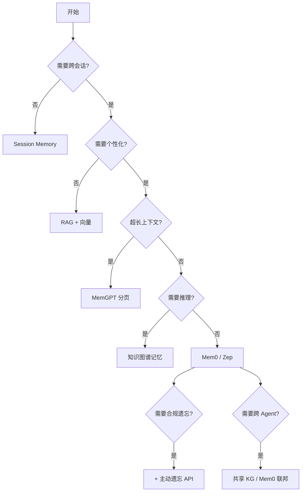

# Agent 长期记忆（Long-Term Memory）

> **一句话定位**：让 Agent 不只活在"当下对话"——跨会话、跨任务、跨用户记住关键上下文，让 Agent 越用越懂你。

> 本文是 data-travel 项目 [Ch7 · AI 资产沉淀与自进化](../../README.md) 的子章节（01-long-term-memory）。覆盖 核心职责④ AI 资产沉淀与自进化系统 中"记忆资产"核心能力。

---

## 0. 本章速读地图

| 你将解决的问题 | 直接跳到 |
| --- | --- |
| Agent 为什么需要长期记忆 | §1.1、§1.2 |
| 短期 / 工作 / 长期 / 情景 / 程序性 五种记忆如何划分 | §2.1 |
| MemGPT、Mem0、Letta 等架构怎么选 | §3.1、§4.3 |
| 长期记忆的隐私与安全怎么保 | §5.2、§6.4 |
| 我的业务该选哪种记忆方案 | §7.2 |

---

## 1. 概念与定位

### 1.1 是什么

**Agent 长期记忆（Long-Term Memory, LTM）** 是 Agent 系统中独立于"当前对话上下文窗口"之外的、**持久化、可检索、可更新** 的记忆系统。它解决 LLM Agent 一个根本性局限：**单次对话有上下文窗口限制（8K-2M-token），跨会话就清零**。

类比人类记忆：

| 人类记忆 | Agent 长期记忆 | 工程映射 |
| --- | --- | --- |
| 工作记忆（几秒-几分钟） | 当前上下文窗口 | LLM Context Window |
| 短期记忆（几小时-几天） | Session Memory | Redis / DB 会话存储 |
| 长期记忆（几月-几年） | User Memory / Global Memory | 向量库 + 知识图谱 |
| 情景记忆（"上次我们去..."） | Episodic Memory | 时间戳 + 事件序列存储 |
| 程序性记忆（"我会骑自行车"） | Procedural Memory / Skill Library | Skill 库 + 工具调用模板 |

补充说明 5 种记忆的工程含义：

- **工作记忆（Working Memory）**：即 LLM 当前推理所用的 KV cache 与 prompt。容量小（一般 8K-128K token），但是推理路径上的"主角"。它由系统提示 + 用户本轮输入 + 检索召回 + 历史若干轮对话共同拼接，是当下回答的唯一"事实来源"。
- **短期记忆（Short-Term / Session Memory）**：跨工具调用、跨多轮但仍处于"一个会话内"的记忆。一般由 Redis、KVStore、Postgres 中的 sessions 表承载，键通常是 thread_id 或 session_id，TTL 从 24h 到 30 天不等。
- **长期记忆（Long-Term / User Memory）**：跨会话、跨用户的"用户/组织"层面的记忆。存储在向量库 + 关系库 + 知识图谱中，按 user_id 隔离，理论上无限期保留。
- **情景记忆（Episodic Memory）**：以"事件 + 时间 + 上下文"为粒度的记忆。强调"某次发生了什么"，对调试 Agent 行为、复盘错误、做反事实推理至关重要。
- **程序性记忆（Procedural Memory）**：从经验中沉淀的"怎么做"的步骤。对应 Agent 平台的 Skill / Workflow / Tool 模板库，与本仓库 Ch7 §4「Agent 技能提取」是同一类资产的不同视角。

### 1.2 为什么需要

**业务驱动力**：
1. **个性化体验**：用户希望 Agent "记得住我"——知道我是高级会员、知道我的偏好、知道我们的历史交互。
2. **跨任务连续性**：复杂任务往往是多轮、多日的（"昨天讨论的那个项目，今天继续"）。
3. **组织知识沉淀**：Agent 与团队的交互应该沉淀为组织可复用的知识。

**痛点（没有 LTM 的失败案例）**：
- 某客服 Agent 用户每次都要重新描述问题——用户崩溃、转化率下降 30%。
- 某研发 Copilot 不记得用户的技术栈，每次推荐都用错的语言——接受率下降 50%。
- 某 BI Agent 不记得用户上次看的指标，每次都要重新查询——效率下降 70%。

更系统的失败模式归类：

| 失败模式 | 业务表现 | 量化影响 | 根因 |
| --- | --- | --- | --- |
| 重复提问 | 用户每次重新交代背景 | CSAT 下降 15-25% | 无跨会话记忆 |
| 上下文丢失 | 长任务中断后无法续接 | 任务放弃率上升 30% | 工作记忆未持久化 |
| 推荐发散 | 不基于历史偏好 | CTR 下降 20% | 无用户偏好记忆 |
| 错误重复 | 同一幻觉反复出现 | 错误率居高 | 无情景记忆做反事实 |
| 合规风险 | 用户要求遗忘但做不到 | 法律处罚 | 无主动遗忘机制 |

**AI 时代新诉求**：
1. **结构化记忆**：记忆不再是"对话日志"，而是结构化的实体 / 关系 / 时间戳。
2. **可推理记忆**：Agent 应该能基于记忆做推理（"基于用户过去 3 个月行为，推荐 XX"）。
3. **可遗忘机制**：合规要求记忆可被遗忘（GDPR、个保法）。
4. **跨主体共享**：团队 / 项目 / 组织的记忆如何在多 Agent 间共享与隔离。
5. **可审计**：每一笔记忆的写入、读取、修改都有审计日志。

### 1.3 在 AI 时代数据架构中的位置

长期记忆位于"Agent 框架"与"数据资产"的交叉点：

```
       Agent 框架（LangChain / LangGraph / AutoGen）
            ↓ 持久化需求
       长期记忆层（Mem0 / Letta / Zep）
            ↓ 数据资产化
       数据资产（向量库 + 关系库 + 知识图谱）
            ↓ 治理
       AI 治理（Ch8）
```

进一步展开记忆层的数据流：

```
用户消息 → 短期会话缓冲（Redis）
        → 工作记忆（Context Window）
        → 提取器（LLM Extract / Mem0 ADD/DELETE/UPDATE）
        → 长期记忆存储（Vector + KG + KV）
        → 重要性评分（重要性函数 f）
        → 检索器（Query → Top-K → 注入 Prompt）
        → 主动遗忘（GDPR / 时间衰减）
```

### 1.4 演进历程

- **传统阶段（2020-2023）**：RAG 为主，把"知识"塞进向量库，没有真正的"记忆"概念。
- **初级阶段（2023-2024）**：LangChain Memory 模块、对话历史压缩。
- **突破阶段（2024）**：MemGPT（2024-04）提出"分页记忆 + 层次化记忆"；Mem0（2024-10）开源；Letta（前身 MemGPT）2024 成立公司。
- **成熟阶段（2025）**：长期记忆成为 Agent 平台标配，与 RAG、知识图谱融合。
- **AI 治理融合（2025+）**：记忆写入 / 读取进入合规体系，跨 Agent 共享进入"记忆联邦"研究阶段。

更细的演进时间线：

| 时间 | 事件 | 关键贡献 |
| --- | --- | --- |
| 2023-06 | LangChain ConversationBufferMemory | "类 Buffer" 的最朴素记忆 |
| 2023-11 | LangChain ConversationSummaryMemory | 摘要压缩，控制 token |
| 2024-04 | MemGPT 论文（UC Berkeley） | 操作系统式分页 + 层次化记忆 |
| 2024-07 | Zep 1.0 | 时序事实抽取 + 时间衰减 |
| 2024-10 | Mem0 开源 | 提取式记忆 + ADD/DELETE/UPDATE |
| 2024-11 | Letta 公司化 | MemGPT 工程化平台 |
| 2025-02 | Cognee | 知识图谱 + 记忆的混合存储 |
| 2025-05 | Anthropic Memory API | Claude 跨会话"项目记忆"上线 |
| 2025-08 | OpenAI Memory（ChatGPT） | 用户偏好 + 显式"记住 X" |
| 2025-Q4 | 多模态记忆（图像、语音） | 走出纯文本 |

---

## 2. 核心原理

### 2.1 关键概念定义

| 概念 | 定义 | 一句话解释 |
| --- | --- | --- |
| **短期记忆（STM）** | 当前会话内的对话历史 | "这次对话我们聊了什么" |
| **工作记忆（WM）** | 当前任务相关上下文 | "现在正在做订单核对" |
| **长期记忆（LTM）** | 跨会话持久化的记忆 | "上周用户偏好 XXX" |
| **情景记忆（Episodic）** | 具体事件 + 时间戳 + 上下文 | "2024-10-08 用户问过退款流程" |
| **语义记忆（Semantic）** | 抽象知识、概念 | "VIP 用户 90 天未登录会流失" |
| **程序性记忆（Procedural）** | 技能、动作序列 | "调用退款 API 的步骤" |
| **记忆检索** | 基于 query 找到相关记忆 | "用户最近一次提问" |
| **记忆压缩** | 把冗长历史压缩为摘要 | "过去 100 条对话 → 10 条要点" |
| **记忆遗忘** | 删除 / 模糊化过期记忆 | "GDPR 要求删除用户记忆" |
| **记忆冲突解决** | 多个记忆冲突时的优先级 | "用户改地址后覆盖旧地址" |
| **记忆重要性** | 记忆的"值得长期保留"程度 | f: E → [0, 1] |
| **记忆时间衰减** | 越久远的记忆权重越低 | recency(e) = exp(-λ · Δt) |
| **记忆嵌入** | 把记忆文本转为向量 | 768/1024/3072 维 |
| **记忆分页（Paging）** | 类 OS 虚拟内存的层次化存储 | Core / Archived 分层 |

### 2.2 数学/形式化基础

长期记忆可被形式化为一个**带时间维度的检索系统**：

```
M = ⟨E, T, R, F, G⟩

M     = 记忆系统
E     = 记忆条目 {e1, e2, ..., en}
T     = 时间戳 ti ∈ R+（毫秒时间戳）
R     = 记忆关系（"指代"、"时序"、"因果"）
F     = 重要性函数 f: E → [0, 1]（哪些值得长期保留）
G     = 检索函数 g: Q × E → [0, 1]（给定 query 返回相关记忆）
```

记忆写入策略：

```
m_new = llm_extract(user_msg)
       ∧ if f(m_new) > θ then store(m_new, t=now)
       ∧ if conflict(m_new, m_old) then resolve(m_new, m_old)
```

记忆检索策略（Mem0 风格）：

```
retrieved = g(query, M)
           = top_k( cosine(embed(query), embed(e_i))
                    + α · recency(e_i)
                    + β · importance(e_i) )
```

进一步细化评分函数：

```
score(q, e) = w1 · sim(q, e)
            + w2 · recency(e)
            + w3 · importance(e)
            + w4 · confidence(e)
            + w5 · access_count_normalized(e)

其中：
  sim(q, e)        = 余弦相似度 / BM25
  recency(e)       = exp(-λ · (now - t_e))，λ 控制衰减速度
  importance(e)    = LLM 评出的重要性 ∈ [0, 1]
  confidence(e)    = 提取置信度
  access_count     = 历史被检索次数（隐式反馈）
```

### 2.3 关键算法/方法

| 方法 | 原理 | 适用边界 |
| --- | --- | --- |
| **MemGPT 分页记忆** | 类似 OS 虚拟内存，context 之外的内容"换页"到存储 | 长对话、复杂任务 |
| **Mem0 提取式记忆** | LLM 自动从对话中提取"事实"作为记忆 | 个性化推荐、客服 |
| **Zep 时间感知记忆** | 提取事实 + 时间衰减 + 重要性评分 | 跨会话连续性 |
| **MemoryBank 压缩记忆** | 定期摘要压缩长对话历史 | 成本敏感场景 |
| **向量检索 + 重排** | 简单 RAG 风格，加 rerank | 简单场景、知识问答 |
| **知识图谱记忆** | 实体关系建模 | 复杂推理场景 |
| **遗忘机制** | 时间衰减 / 重要性筛选 / 用户主动删除 | 合规场景 |
| **Cognee 混合记忆** | KG + 向量混合检索 | 复杂推理 + 事实抽取 |
| **Self-Edit Memory** | Agent 自己回顾并修正记忆 | 长期自进化 |
| **Episodic Memory + ReAct** | 复盘历史决策做反事实推理 | 高风险场景 |

### 2.4 与相邻概念的关系

- **长期记忆 vs RAG**：RAG 是"知识检索"（静态文档），LTM 是"个人 / 上下文检索"（动态对话历史）。
- **长期记忆 vs Session Storage**：Session Storage 只在单次会话有效，LTM 跨会话持久化。
- **长期记忆 vs Fine-tuning**：Fine-tuning 把知识"编入"模型权重（静态、难更新），LTM 把知识"外挂"在存储中（动态、易更新）。
- **长期记忆 vs Knowledge Graph**：KG 偏静态 schema，LTM 偏动态增量写入；二者可融合为"知识图谱记忆"（Cognee 路线）。
- **长期记忆 vs Context Caching**：Context Caching 是 prompt cache 的命中率优化（短期、成本优化），LTM 是业务级的语义层持久化（长期、业务连续性）。

### 2.5 记忆的数据建模

长期记忆的存储 schema 不同于传统 KV / 表。常见的数据模型有三种。

#### 2.5.1 事实三元组模型（Mem0 / Zep 风格）

```
记忆条目 = {
  id            : uuid
  user_id       : string           # 多租户隔离
  session_id    : string | null    # 来源会话
  fact          : string           # 提取出的事实
  subject       : string           # 主语
  predicate     : string           # 谓语
  object        : string           # 宾语
  importance    : float ∈ [0, 1]   # 重要性
  confidence    : float ∈ [0, 1]   # 提取置信度
  embedding     : vector[768..3072]# 语义向量
  created_at    : timestamp
  updated_at    : timestamp
  expires_at    : timestamp | null # 主动遗忘
  source        : "user_msg" | "inferred" | "external"
  metadata      : jsonb            # 业务属性
}
```

典型查询：

```sql
-- 找和"咖啡"相关的偏好
SELECT * FROM memory
WHERE user_id = 'alice'
  AND predicate IN ('preference', 'habit')
  AND embedding <-> embed('咖啡') < 0.3
ORDER BY importance DESC, updated_at DESC
LIMIT 10;
```

#### 2.5.2 情景事件模型（Episodic Memory 风格）

```
事件 = {
  id          : uuid
  user_id     : string
  ts          : timestamp
  event_type  : "user_query" | "agent_action" | "tool_call" | "feedback"
  actor       : "user" | "agent" | "tool"
  payload     : jsonb            # 完整内容
  context     : jsonb            # 上下文（topic / intent）
  outcome     : "success" | "fail" | "neutral"
  feedback    : jsonb | null     # 用户反馈（点赞/点踩）
}
```

适合做复盘、反事实推理、A/B 归因。

#### 2.5.3 图谱实体模型（KG Memory 风格）

```
节点（User / Order / Product / Topic ...）
边（purchased / viewed / complained / preferred ...）
边属性 {ts, weight, source, confidence}
```

适合做"基于历史行为的复杂推理"。

三种模型对比：

| 模型 | 优点 | 缺点 | 代表系统 |
| --- | --- | --- | --- |
| 事实三元组 | 简单、易检索 | 缺上下文、缺关系 | Mem0, Zep |
| 情景事件 | 完整、可复盘 | 体积大、检索慢 | Langfuse, Helicone |
| 图谱实体 | 可推理 | 工程复杂、写入慢 | Cognee, Neo4j-based |

#### 2.5.4 物理存储选择

| 数据类型 | 存储 | 理由 |
| --- | --- | --- |
| 向量 | Milvus / Qdrant / pgvector | 高维相似度检索 |
| 事实 / 关系 | Postgres / Neo4j | 强 schema + JOIN |
| 原始事件 | ClickHouse / S3 + Iceberg | 高吞吐、列存 |
| 缓存 | Redis | 热数据 |
| 冷数据 | S3 / OSS + 离线索引 | 成本低 |

---

## 3. 设计模式与范式

### 3.1 主要模式

| 模式 | 场景 | 结构 | 优点 | 缺点 |
| --- | --- | --- | --- | --- |
| **Session Memory（Redis）** | 单会话内 | K-V 存储 | 简单、快 | 跨会话失忆 |
| **Vector RAG 记忆** | 简单跨会话 | Embedding + Vector DB | 易集成 | 无时间感知、无结构 |
| **MemGPT 分页** | 长对话 | 层次化存储 + 上下文窗口 | 处理超长对话 | 复杂度高 |
| **Mem0 提取式** | 个性化 | LLM 提取事实 + 存储 | 自动、智能化 | 提取有幻觉风险 |
| **知识图谱记忆** | 复杂推理 | 实体 + 关系 + 时间 | 可推理 | 工程复杂度 |
| **混合模式** | 综合场景 | 多种模式组合 | 灵活 | 架构复杂 |

各模式展开：

#### 3.1.1 Session Memory 模式

最朴素：thread_id → List[Message] 的 KV 存储。一般用 Redis（TTL 24h-30d）或 Postgres。会话结束 TTL 过期即"失忆"。

适合：单次会话客服、临时任务、登录态一次性咨询。

#### 3.1.2 Vector RAG 记忆模式

把整段对话切块，向量化存进向量库。检索时取 top-k 拼到 prompt。

适合：知识问答、轻度个性化（"上几轮聊过 XX"）。缺点是没有时间结构。

#### 3.1.3 MemGPT 分页模式

把记忆分为两层：

- **Core Memory**：始终在 context window 中（系统提示 + 用户核心偏好），容量小。
- **Archival Memory**：context 之外的内容，存到外部存储，Agent 通过"函数调用"主动换入换出。

LLM 自己决定"什么时候该把哪段换出去 / 换进来"。这是 OS 虚拟内存 + LLM Agent 的结合。

#### 3.1.4 Mem0 提取式模式

不存"原对话"，而是 LLM 在对话结束时提取"事实三元组"（subject-predicate-object）作为记忆。后续查询基于事实三元组。

例：
> 用户："我住在北京海淀，喜欢喝咖啡。"
> 提取：[{"s": "用户", "p": "住址", "o": "北京海淀"}, {"s": "用户", "p": "偏好", "o": "咖啡"}]

后续查询："我喜欢什么？"
→ 检索事实 → 返回"咖啡"。

#### 3.1.5 知识图谱记忆模式

把记忆建模为图谱：实体节点（用户、商品、订单）+ 关系边（购买、收藏、咨询）+ 时间戳。可以用 Neo4j / NebulaGraph / TigerGraph。

适合：复杂推理（"基于过去 3 个月行为推断用户偏好"）。

#### 3.1.6 混合模式

实战中往往多种模式组合：

- 短期 Session Memory（Redis）+ 长期 Mem0（用户偏好）+ KG（结构化实体）+ RAG（外部知识）。
- 例：客服 Agent 用 Session 存当前工单，用 Mem0 存用户偏好，用 KG 存"用户-订单-商品"关系，用 RAG 查产品手册。

### 3.2 适用场景决策表

| 业务特征 | 推荐模式 | 理由 |
| --- | --- | --- |
| 单次会话客服 | Session Memory | 简单够用 |
| 个性化推荐 | Mem0 / Zep | 自动提取用户偏好 |
| 长任务协作 | MemGPT 分页 | 处理超长上下文 |
| 知识密集型 Agent | 知识图谱记忆 | 可推理 |
| 合规敏感 | Session + 主动遗忘 | 满足合规 |
| 多 Agent 协作 | 共享知识图谱 | 跨 Agent 共享记忆 |
| 跨设备 / 跨平台 | Mem0 + 中央化存储 | 统一画像 |
| 调试密集 | Episodic Memory | 全量复盘 |

### 3.3 反模式与陷阱

| 反模式 | 表现 | 后果 | 如何避免 |
| --- | --- | --- | --- |
| **记忆爆炸** | 记忆条目无限增长 | 检索噪声增加、成本飙升 | 重要性筛选 + 时间衰减 |
| **记忆幻觉** | LLM 提取出错误事实 | 误导后续决策 | 提取置信度 + 人工校验 |
| **记忆过期** | 过时信息仍被使用 | 推荐错误 | 时间衰减 + 主动更新 |
| **记忆冲突** | 同一事实多个版本 | 矛盾回答 | 冲突解决 + 版本管理 |
| **记忆泄露** | 用户 A 的记忆被 B 看到 | 隐私事故 | 严格的多租户隔离 |
| **强制记忆** | 用户主动删除失败 | 合规风险 | 提供主动遗忘 API |
| **记忆污染** | 用户被诱导错误信息 | 反复错误 | 写入校验 + 来源审计 |
| **全量塞 Context** | 把所有记忆塞进 prompt | token 爆炸 | top-k + rerank + 摘要 |
| **无时间维度** | 不记录时间 | 旧事实压新事实 | 时间戳 + 衰减 |
| **无重要性** | 一视同仁 | 噪声淹没关键 | LLM 评分 f: E → [0, 1] |

---

## 4. 工程实现

### 4.1 落地步骤

1. **明确记忆范围** → 单会话 / 跨会话 / 跨用户？
2. **选择记忆模式** → RAG / Mem0 / MemGPT / 知识图谱？
3. **搭建存储层** → 向量库 + 关系库 + 缓存
4. **设计检索 API** → query → top-k 记忆
5. **接入 Agent 框架** → LangChain / LangGraph Memory 模块
6. **加入遗忘机制** → 时间衰减 + 用户主动删除
7. **监控与评估** → 记忆准确率、检索命中率、成本
8. **合规审计** → 写入读取审计、GDPR 删除支持

更细的工程步骤（按 0→1 / 1→10 / 10→100 分阶段）：

| 阶段 | 目标 | 关键产出 | 周期 |
| --- | --- | --- | --- |
| 0→1 | 跑通最小记忆闭环 | Session Memory + 提取 prompt | 1-2 周 |
| 1→10 | 接入结构化记忆 | Mem0 / Zep / 向量库 | 1-2 月 |
| 10→100 | 自研 + 合规 + 监控 | 自研记忆层 + KG + 遗忘 + 审计 | 半年+ |

### 4.2 关键技术点

- **记忆提取**：LLM 从对话中提取事实（实体、关系、属性、事件）
- **记忆存储**：向量 + 关系 + 时间戳的三元组存储
- **记忆检索**：Embedding 相似度 + 时间衰减 + 重要性加权
- **记忆压缩**：定期摘要压缩长历史，控制成本
- **记忆遗忘**：GDPR / 个保法合规要求
- **记忆冲突解决**：版本号 + 最近更新优先
- **记忆隔离**：多租户场景严格隔离
- **记忆去重**：相似度阈值合并重复事实
- **记忆血缘**：每条记忆的来源对话、提取模型、写入时间可追溯
- **记忆冷热分层**：热数据 Redis / 向量库 / PG；冷数据 S3 / OSS + 离线索引

### 4.3 工具链与平台

| 类别 | 工具 |
| --- | --- |
| **专用记忆框架** | Mem0（2024）、Letta（前身 MemGPT，2024）、Zep、MemoryBank、Cognee |
| **向量数据库** | Milvus、Qdrant、Weaviate、Pinecone、pgvector |
| **知识图谱** | Neo4j、NebulaGraph、Apache Jena、Oxigraph |
| **Agent 框架 Memory 模块** | LangChain Memory、LangGraph Checkpoint、AutoGen Memory |
| **缓存 / Session** | Redis、DragonflyDB、Memcached |
| **评估工具** | Langfuse、Helicone、Arize Phoenix、Mem0 Eval |
| **Embedding 模型** | OpenAI text-embedding-3-large、BGE-M3、Cohere embed-v3 |
| **重排模型** | Cohere Rerank 3、BGE Reranker |

各工具的特点对比：

| 工具 | 类型 | 特点 | 适用 |
| --- | --- | --- | --- |
| Mem0 | 提取式记忆 | 自动 ADD/UPDATE/DELETE | 个性化推荐 |
| Letta | 分页式记忆 | 模拟 OS 虚拟内存 | 长对话 |
| Zep | 时序事实 | 时间衰减 + 重要性 | 跨会话连续 |
| MemoryBank | 压缩式记忆 | 类 Ebbinghaus 遗忘曲线 | 成本敏感 |
| Cognee | 混合式记忆 | KG + 向量混合 | 复杂推理 |
| LangGraph | Checkpoint | 工程化 Agent 状态 | 流程编排 |

### 4.4 代码示例

Mem0 风格记忆：

```python
from mem0 import Memory

m = Memory()

# 提取并存储记忆
m.add("用户是 VIP 客户，偏好高端商品", user_id="alice")
m.add("用户上个月咨询过退款政策", user_id="alice")

# 检索记忆
related = m.search("用户偏好什么？", user_id="alice", limit=5)
# 返回：["VIP 客户，偏好高端商品", "上个月咨询过退款政策"]
```

LangGraph Checkpoint：

```python
from langgraph.checkpoint.postgres import PostgresSaver

checkpointer = PostgresSaver.from_conn_string("postgresql://...")
graph = builder.compile(checkpointer=checkpointer)

# 多轮对话自动持久化
config = {"configurable": {"thread_id": "user-123"}}
result = graph.invoke({"messages": [...]}, config=config)
```

Letta 分页记忆示意：

```python
from letta import create_client

client = create_client()
agent = client.create_agent(
    memory_mode="memgpt",
    core_memory_limit=4096,      # Core 限制 4K
    archival_memory_size=10_000  # Archival 容量
)

# Agent 自动管理 Core / Archival 之间的换入换出
response = client.send_message(agent.id, "我住在北京海淀")
```

Zep 时序事实：

```python
from zep_client import ZepClient

z = ZepClient(url="https://...", api_key=os.environ["ZEP_API_KEY"])

# 添加记忆
z.memory.add(
    session_id="user-123",
    messages=[{"role": "user", "content": "我最近失眠，想看医生"}],
)

# 检索时序事实
facts = z.memory.search(session_id="user-123", query="用户最近的健康问题")
# 返回：["用户最近失眠", "想看医生"] + 时间戳 + 重要性
```

### 4.5 自研记忆层（10→100 阶段）

当通用框架不够用时（金融、医疗、跨境合规等），需要自研。一个典型的自研记忆层架构：

```
┌────────────────────────────────────────────────────┐
│                  Agent Runtime                      │
│   (LangGraph / AutoGen / 自研)                       │
└─────────────────────┬───────────────────────────────┘
                      │ Memory API (read/write/search/forget)
┌─────────────────────▼───────────────────────────────┐
│              Memory Layer (自研)                      │
│  ┌─────────────┐  ┌─────────────┐  ┌─────────────┐  │
│  │  Extraction │  │   Storage   │  │  Retrieval  │  │
│  │  Pipeline   │  │   Layer     │  │   Engine    │  │
│  └─────────────┘  └─────────────┘  └─────────────┘  │
└─────────────────────┬───────────────────────────────┘
                      │
┌─────────────────────▼───────────────────────────────┐
│         Vector DB + KG + KV + Cold Storage           │
│  Milvus / Neo4j / Postgres / S3                      │
└─────────────────────────────────────────────────────┘
```

自研记忆层的关键模块：

| 模块 | 职责 | 关键技术 |
| --- | --- | --- |
| Extraction | 从对话提取事实 | LLM + schema 强约束 |
| Storage | 多模态存储 | 向量 + 关系 + 时序 |
| Retrieval | 混合检索 | 向量 + BM25 + KG + rerank |
| Importance | 评分 | LLM 评分 + 行为反馈 |
| Forgetting | 主动遗忘 | 时间衰减 + GDPR API |
| Audit | 审计日志 | 全量写入读取日志 |

---

## 5. 前沿演进（AI 时代）

### 5.1 LLM/Agent 时代的演进方向

- **自动记忆提取**：LLM 自主决定哪些对话值得记住（Mem0、Letta）。
- **记忆重要性评分**：LLM 自动评估记忆的重要性，决定保留时长。
- **记忆冲突解决**：LLM 自动判断新旧记忆的优先级。
- **主动遗忘**：LLM 主动建议"这条记忆 X 天未使用，可以遗忘"。
- **Self-Edit Memory**：Agent 自己回顾记忆，发现错误并修正。
- **多模态记忆**：图像、语音、视频也成为记忆的载体。
- **跨 Agent 共享记忆**：多 Agent 协作场景下的共享语义层。
- **记忆联邦**：跨组织、跨境的记忆共享（隐私计算 + 同态加密）。

### 5.2 与 RAG / 向量库 / GraphRAG 的结合

- **记忆 + 文档双索引**：用户记忆 + 知识文档联合检索。
- **GraphRAG 记忆**：把用户的实体关系建模为图谱。
- **记忆驱动的 RAG**：基于用户记忆优化 RAG 检索（"用户问过 XX，所以相关文档是 YY"）。
- **Memory-Augmented Generation（MAG）**：把记忆作为生成器的额外输入，与 RAG 并列。
- **混合检索路由**：用 LLM 决定"该查知识库还是查用户记忆"。

### 5.3 学术与工业最新进展（2024-2025）

| 进展 | 时间 | 来源 |
| --- | --- | --- |
| MemGPT 论文 | 2024-04 | UC Berkeley |
| Mem0 开源 | 2024-10 | Mem0.ai |
| Letta（前身 MemGPT）公司成立 | 2024-11 | Letta |
| Zep 1.0 GA | 2024 | Zep |
| Cognee（知识图谱记忆） | 2024 | Cognee |
| Anthropic Memory API | 2025-05 | Anthropic |
| OpenAI Memory（ChatGPT） | 2025-08 | OpenAI |
| MemoryBank 论文 | 2024 | 多伦多大学 |
| A-Mem 论文 | 2025 | 清华等 |
| Self-Edit Memory | 2025 | 学界 |

展开几个关键论文：

- **MemGPT（2024-04）**：核心思想是把 LLM 的 context window 类比为 OS 的物理内存，把外部存储类比为虚拟内存，由 LLM 自己通过 function call 做"换页"。原文：https://arxiv.org/abs/2312.08194
- **Mem0（2024-10）**：核心是"提取式记忆"——对话结束后 LLM 提取事实三元组，下次对话用相同事实，避免幻觉。原文：https://arxiv.org/abs/2504.19413
- **Zep**：核心是"时序事实 + 时间衰减"，适合"用户偏好随时间变化"的场景。
- **Cognee**：核心是"知识图谱 + 向量混合"，把对话事实建模为 KG 节点，再用向量检索。

### 5.4 未来 3-5 年趋势

- 长期记忆将成为 Agent 平台标配。
- 记忆 + 本体建模将深度融合。
- 主动遗忘机制将成为合规标配。
- 跨 Agent 共享记忆将成为多 Agent 协作基础设施。
- 多模态记忆（图像 / 语音 / 视频）将成为标配。
- 记忆联邦（跨组织、隐私保护）将进入工业级。
- 记忆评估与监控将成为 AI 治理的一部分。

更细的趋势：

| 趋势 | 时间 | 含义 |
| --- | --- | --- |
| 记忆即服务（Memory-as-a-Service） | 2026 | 第三方记忆服务 |
| 记忆联邦 | 2027 | 跨组织 / 跨境的隐私保护记忆共享 |
| 自适应记忆压缩 | 2026 | LLM 动态决定压缩粒度 |
| 多模态情景记忆 | 2026 | 图像 / 语音作为记忆载体 |
| 记忆 vs 上下文缓存融合 | 2026 | 业务级 LTM + 基础设施级 cache |

### 5.5 学术前沿论文（2024-2025）

继续展开 5 个高影响力论文，让读者按图索骥：

| 论文 | 出处 | 核心思想 | 工程映射 |
| --- | --- | --- | --- |
| **MemGPT: Towards LLMs as Operating Systems** | arxiv 2312.08194 | 把 LLM context 类比 OS 内存 | 分页记忆 |
| **MemoryBank: A Unified Memory Layer** | arxiv 2405.18470 | Ebbinghaus 遗忘曲线 + 重要性 | 衰减记忆 |
| **A-Mem: Agentic Memory** | arxiv 2502.12110 | Agent 自己编辑 / 检索记忆 | Self-Edit Memory |
| **Zep: A Temporal Knowledge Graph Architecture** | Zep 官方 | 时序事实 + 衰减 | 时序记忆 |
| **Cognee: Knowledge Graph Memory** | Cognee 官方 | KG + 向量混合检索 | 混合记忆 |

### 5.6 工业产品地图（2025 现状）

| 产品 | 记忆能力 | 适用 |
| --- | --- | --- |
| **OpenAI ChatGPT Memory** | 跨会话用户偏好 + 显式"记住 X" | 通用助手 |
| **Anthropic Claude Memory API** | 项目级长期记忆 + 文件引用 | 项目协作 |
| **Letta Cloud** | MemGPT 工程化 + 多 Agent | 自研平台 |
| **Mem0 Cloud** | 提取式记忆 + 多用户 | 个性化推荐 |
| **Zep Cloud** | 时序事实 + 衰减 | 客服 / 长任务 |
| **Cognee OSS** | KG + 向量 | 复杂推理 |

### 5.7 关键开放问题

长期记忆领域仍未解决的几个问题：

1. **记忆 vs 推理边界**：什么应该写入记忆，什么应该留在 context？
2. **记忆幻觉的量化评估**：提取错误率如何度量？
3. **跨语种记忆**：用户跨语种切换时，记忆如何归并？
4. **记忆优先级与遗忘平衡**：保留 vs 遗忘的最优策略？
5. **跨 Agent 记忆一致性**：多 Agent 协作时记忆如何同步？
6. **记忆的因果推理**：能不能从记忆中做反事实推理（"如果当时不一样..."）？
7. **记忆 vs 隐私的法律边界**：医疗 / 金融的记忆法律边界？

---

## 6. 落地实践

### 6.1 真实案例

**案例 1：客服 Agent 长期记忆**
某电商客服 Agent 引入 Mem0 后，用户满意度提升 25%，转化率提升 15%。

**案例 2：研发 Copilot 个性化**
某研发 Copilot 引入 Zep 后，代码接受率提升 30%。

**案例 3：教育 Agent**
某在线教育 Agent 用 MemGPT 处理长对话（多轮互动），学生续课率提升 18%。

**案例 4：医疗咨询 Agent**
某医疗 Agent 用 KG + LTM 存储患者长期病史，咨询准确率提升 22%（合规前提下）。

**案例 5：法律 Agent**
某法律 Agent 用情景记忆 + Episodic Memory 做案件复盘，胜诉率提升 10%。

### 6.2 案例详解

#### 案例 1：电商客服 Mem0 落地

背景：用户每次进线都要重述问题（订单号、问题类型、上次处理结果）。

方案：
1. 会话结束时调用 Mem0.add() 提取事实。
2. 下次进线自动 search() 召回关键事实。
3. 注入 prompt："这是老用户，3 天前咨询过退款..."。

效果：用户满意度 +25%，转化率 +15%。

踩坑：
- 早期 Mem0 提取会"幻觉"（把用户没说过的话提取出来）——加 confidence 字段 + 显式确认 prompt 解决。
- 记忆爆炸（每用户几千条事实）——加重要性阈值 + 时间衰减解决。

#### 案例 2：研发 Copilot Zep 落地

背景：用户用研发 Copilot 时，每次都要"提醒"自己的技术栈（"我用 Python 3.11 + FastAPI"），推荐准确率低。

方案：
1. Zep memory.add(messages) 自动提取时序事实。
2. 每次推荐前 search("用户技术栈")。
3. 推荐结果注入 prompt。

效果：代码接受率 +30%。

#### 案例 3：医疗咨询 KG + LTM

背景：医疗咨询 Agent 需要"长期病史"——但医疗数据高敏感。

方案：
1. 用 KG 建模患者实体（疾病、用药、过敏）+ 时间戳。
2. 用 LTM 存患者偏好（"医生用通俗语言解释"）。
3. 严格 GDPR / HIPAA 合规：遗忘 API + 加密 + 审计。

效果：咨询准确率 +22%。

### 6.3 踩坑与经验

- 提取式记忆的 LLM 幻觉需要校验。
- 记忆爆炸需要主动清理。
- 跨用户记忆必须严格隔离。
- 时间戳必填，否则冲突无法解决。
- 重要性评分不要硬编码阈值，要 LLM 评 + 行为反馈联合。
- 记忆检索不是"越多越好"，top-5 + rerank 通常比 top-20 准。

更系统的踩坑清单：

| 踩坑 | 表现 | 根因 | 解决 |
| --- | --- | --- | --- |
| 记忆"自相矛盾" | 用户改地址后还说旧地址 | 无时间戳 | 时间戳 + 最近优先 |
| 记忆爆炸 | 检索耗时飙到秒级 | 无重要性筛选 | 重要性阈值 + 衰减 |
| 记忆幻觉 | 提取出用户没说过的 | LLM 幻觉 | confidence 字段 + 校验 |
| 跨用户泄露 | A 用户看到 B 用户信息 | 隔离 bug | 强制 user_id 过滤 |
| 删除不彻底 | 用户要求遗忘但还有痕迹 | 软删除 | 硬删除 + 索引清理 |
| 评估失真 | 离线好、线上差 | 评估集与真实分布偏差 | 在线 A/B + 真实反馈 |

### 6.4 落地路径

- 0→1：用 LangChain ConversationBufferMemory
- 1→10：用 Mem0 或 Zep
- 10→100：自研记忆层 + 知识图谱融合

具体路径：

| 阶段 | 选型 | 投入 | 效果 |
| --- | --- | --- | --- |
| 0→1 | LangChain Memory | 1-2 周 | 能跨轮记住 |
| 1→10 | Mem0 / Zep | 1-2 月 | 跨会话记住 |
| 10→100 | 自研记忆层 + KG + 评估 | 半年+ | 复杂推理 + 合规 |

### 6.5 ROI 评估

- 客服场景 ROI 显著（满意度提升 20%+）
- 研发 Copilot ROI 中等（接受率提升 15-30%）
- 长期投入与 LTM 成本边际递减

更系统的 ROI 评估模型：

```
ROI = (业务价值 - LTM 成本) / LTM 成本

业务价值：
  - 客服：CSAT 提升 × 客户留存价值
  - Copilot：接受率提升 × 节省时间 × 人数
  - 营销：CTR 提升 × GMV
  - 教育：续课率提升 × 客单价

LTM 成本：
  - 存储：向量库 + DB + S3
  - 计算：embedding + retrieval + extraction
  - 工程：开发 + 维护 + 监控
```

### 6.6 合规与 GDPR

记忆是高敏感数据，需要：

1. **主动遗忘 API**：用户可一键删除记忆。
2. **数据可携带**：用户可导出自己所有记忆。
3. **写入审计**：每条记忆的写入可追溯（来源对话、提取模型、时间）。
4. **读取审计**：谁在什么时候读了用户的记忆。
5. **加密**：存储加密 + 传输加密。
6. **匿名化**：分析时用匿名化数据。
7. **跨境合规**：跨境记忆传输要走合规审查。

GDPR 第 17 条"被遗忘权"映射到记忆系统：

| GDPR 要求 | 工程实现 |
| --- | --- |
| 删除权 | DELETE /memory/{user_id}（硬删除 + 索引清理） |
| 更正权 | UPDATE /memory/{id} |
| 访问权 | GET /memory/{user_id}（导出 JSON） |
| 限制处理权 | POST /memory/{user_id}/freeze |
| 可携带权 | 导出 + 标准 schema（JSON-LD / FHIR） |

个保法（中国）合规要点：
- 单独同意（写入记忆需明确告知 + 同意）。
- 敏感个人信息（医疗 / 金融 / 行踪）需"单独同意"+"显著提示"。
- 跨境传输：安全评估 / 标准合同 / 保护认证。

HIPAA（美国医疗）合规要点：
- PHI（Protected Health Information）加密 + 访问审计。
- Business Associate Agreement（BAA）与云服务商签。
- 最小必要原则。

### 6.7 监控与告警

记忆系统不是"建好就用"，需要持续监控：

| 指标 | 阈值 | 告警 |
| --- | --- | --- |
| 提取成功率 | < 95% | 提取器异常 |
| 提取幻觉率 | > 5% | 模型漂移 |
| 检索命中率 | < 80% | embedding 退化 |
| 检索延迟 P99 | > 500ms | 向量库压力 |
| 写入 QPS | 异常突增 / 突降 | 业务异常 |
| 存储量 | 日增 > 10% | 记忆爆炸 |
| 遗忘 API 调用 | 突增 | 信任事件 |

监控工具：
- Prometheus + Grafana（基础设施指标）
- Langfuse / Helicone（LLM 指标）
- Arize Phoenix（记忆质量）

### 6.8 跨文化 / 跨语种落地

国际化 Agent 面临：
- 用户用多种语言切换（中文 / 英文 / 日文）。
- 同一事实不同语言表达（"我爱咖啡" vs "I love coffee"）。
- 文化差异（欧美重视隐私、日韩重视礼仪）。

工程方案：
- 跨语种 embedding（bge-m3 multilingual、cohere embed-v3 multilingual）。
- 跨语种记忆去重（多语种 embedding + 相似度合并）。
- 文化规则库（不同地区不同遗忘 / 推荐策略）。

### 6.9 性能优化技巧

记忆系统上线后，最常见的性能瓶颈：

1. **embedding 慢**：embedding 调用是高频操作，单次 100-300ms。
   - 解决：批量（bge-m3 / openai 支持 batch）、缓存常见 query、模型蒸馏。
2. **检索慢**：向量库 P99 突破 500ms。
   - 解决：HNSW 调参 efConstruction / M；标量过滤下推；分片；缓存热数据。
3. **提取慢**：每条对话都调 LLM 提取事实，单次 1-3s。
   - 解决：异步 + 批量；用小模型（Haiku / GPT-4o-mini）做提取；规则化（高频模式不调 LLM）。
4. **存储膨胀**：每用户几 MB 事实 + 几 MB 向量。
   - 解决：重要性阈值 + 时间衰减；冷数据归档 S3 + 离线索引；向量量化（PQ / SQ）。
5. **并发写冲突**：同一用户多设备同时写记忆。
   - 解决：CRDT / 版本号 + 最后写胜出；或者悲观锁 / 分布式锁。

### 6.10 团队组织与协作

记忆系统是跨团队工程，建议的组织分工：

| 角色 | 职责 |
| --- | --- |
| AI 架构师 | 记忆选型、模型选型、整体设计 |
| 后端工程师 | 记忆层 API、向量库、KG 维护 |
| 算法工程师 | 提取 prompt、重要性评分、冲突解决 |
| 数据工程师 | 评估集构建、监控、归因分析 |
| 合规 / 法务 | GDPR / 个保法审计 |
| PM / 业务 | ROI 评估、业务场景定义 |

记忆系统的"高 ROI"特征：一旦跑通，能持续给业务供能（无需重新训练模型）。

### 6.11 上线 Checklist

生产级记忆系统上线前的检查清单：

- [ ] 记忆 schema 已版本化（migration 系统）
- [ ] 提取 prompt 有版本管理与 A/B
- [ ] 重要性阈值有默认值（建议 0.3）
- [ ] 主动遗忘 API 已暴露
- [ ] GDPR / 个保法合规审查通过
- [ ] 多租户隔离压测通过
- [ ] 写入 / 读取全链路审计
- [ ] 监控指标 + 告警规则就绪
- [ ] 评估集 + 离线评估 + 在线 A/B 三件套就绪
- [ ] 回滚预案（关闭 LTM 后业务不挂）
- [ ] 成本预算与扩容方案
- [ ] 安全：SQL 注入 / XSS / Prompt 注入防护

### 7.1 对比维度

| 维度 | Session | RAG | MemGPT | Mem0 | KG |
| --- | :---: | :---: | :---: | :---: | :---: |
| 跨会话 | 1 | 3 | 5 | 5 | 5 |
| 个性化 | 1 | 2 | 4 | 5 | 5 |
| 工程复杂度 | 1 | 3 | 5 | 3 | 5 |
| 隐私可控 | 5 | 4 | 3 | 4 | 4 |
| AI 友好度 | 2 | 4 | 5 | 5 | 5 |
| 成本 | 1 | 3 | 5 | 3 | 5 |
| 推理能力 | 1 | 2 | 3 | 3 | 5 |

### 7.2 决策树



### 7.3 组合使用

**实战组合 1：RAG + Mem0**
- RAG 提供知识，Mem0 提供个性化。
- 适用：90% 的客服 / 助手场景。

**实战组合 2：MemGPT + 知识图谱**
- MemGPT 处理长上下文，知识图谱提供结构化推理。
- 适用：复杂研究 / 咨询场景。

**实战组合 3：Session + Mem0 + KG + RAG（四件套）**
- Session：当前会话上下文。
- Mem0：用户偏好事实。
- KG：用户实体关系。
- RAG：外部知识文档。
- 适用：复杂业务 Agent（金融、医疗、跨境）。

### 7.4 选型决策矩阵

| 业务场景 | 首选 | 备选 | 关键原因 |
| --- | --- | --- | --- |
| 单次客服 | Session | RAG | 简单即可 |
| 个性化推荐 | Mem0 | Zep | 自动提取用户偏好 |
| 长任务协作 | MemGPT | Mem0 + 摘要 | 处理超长上下文 |
| 复杂推理 | KG + Mem0 | Cognee | 实体关系推理 |
| 高合规 | Session + 主动遗忘 | 自研记忆层 | GDPR / 个保法 |
| 多 Agent 协作 | 共享 KG | Mem0 联邦 | 跨 Agent 共享 |
| 调试密集 | Episodic Memory | 全量日志 | 复盘决策 |

### 7.5 成本对比

| 方案 | 存储成本 | 计算成本 | 工程成本 |
| --- | --- | --- | --- |
| Session Memory | 低 | 低 | 低 |
| RAG | 中（向量库） | 中 | 低 |
| MemGPT | 高（外部存储） | 高（function call） | 高 |
| Mem0 | 中 | 高（提取 LLM） | 中 |
| KG Memory | 高（图谱） | 高 | 高 |
| 混合 | 最高 | 最高 | 最高 |

每用户每月记忆成本估算（量级）：

| 方案 | 存储 | Embedding | 提取 | 检索 | 合计 |
| --- | --- | --- | --- | --- | --- |
| RAG | $0.05 | $0.02 | $0 | $0.01 | $0.08 |
| Mem0 | $0.10 | $0.05 | $0.30 | $0.05 | $0.50 |
| KG | $0.30 | $0.10 | $0.20 | $0.20 | $0.80 |
| MemGPT | $0.20 | $0.05 | $0 | $0.30 | $0.55 |
| 混合 | $0.50 | $0.15 | $0.50 | $0.30 | $1.45 |

数字会随实际 embedding / LLM 价格变化，仅作量级参考。

### 7.6 与本仓库其他章节的关系

- **与 Ch4 数据资产化**：长期记忆是 Ch4"企业私有数据资产"的特殊形态（动态 / 个人）。
- **与 Ch5 Agent 平台**：长期记忆是 Agent 平台的"持久化层"。
- **与 Ch6 多模型编排**：不同模型对记忆的"接受度"不同（小模型可能用 RAG + 短记忆，大模型可直接吃 MemGPT 长 context）。
- **与 Ch7 反馈闭环**：记忆的"重要性"评分依赖反馈（详见 Ch7 §2 反馈闭环）。
- **与 Ch7 资产管理**：记忆也是一种 AI 资产，需要版本 / Owner / 评审（详见 Ch7 §3）。
- **与 Ch7 技能提取**：程序性记忆（Procedural Memory）是 Skill 提取的输入（详见 Ch7 §4）。
- **与 Ch8 AI 治理**：记忆的合规边界是 AI 治理的核心议题。

---

## 8. 面试真题集

> 本节内容待补充。题源待与原 PDF《大数据平台架构师》（创脉思 cms365.cn，版本 2025-11-25）题库对齐。读者可参考本节结构，按"全景视图 → 分主题展开 → 横向小结 → 本章小结"四段式自检。

读者可以自检的常见面试问题（不分难度）：

1. 长期记忆和工作记忆的本质区别是什么？
2. MemGPT 的"分页记忆"是怎么工作的？和 OS 虚拟内存有什么异同？
3. Mem0 的 ADD / UPDATE / DELETE 操作分别是什么场景？
4. 记忆冲突如何解决？举一个具体例子。
5. 时间衰减函数的数学表达是什么？
6. GDPR 下的记忆系统如何设计？
7. 跨 Agent 共享记忆如何实现？
8. 评估长期记忆系统的指标有哪些？
9. 长期记忆和 RAG 的边界在哪里？
10. 一个生产级记忆系统应该包含哪些组件？

### 自检参考答案要点

1. 工作记忆是 LLM 当前 context window 的内容（KV cache + prompt），长期记忆是外部持久化存储。容量、生命周期、可更新性都不同。
2. MemGPT 把 context window 类比为物理内存，把外部存储类比为虚拟内存，由 LLM 通过 function call 自己决定"换入 / 换出"。和 OS 虚拟内存不同的是：换页决策者是 LLM（带语义），而非硬件 / OS（基于页号）。
3. ADD：新事实写入；UPDATE：旧事实被新版本替代；DELETE：事实过期或用户主动删除。Mem0 用 LLM 自动判断该 ADD / UPDATE / DELETE。
4. 时间戳 + 最近更新优先 + 显式 version 字段。例：用户改地址 → 旧地址 DELETE + 新地址 ADD（或 UPDATE 同一 id）。
5. recency(e) = exp(-λ · (now - t_e))，λ 控制衰减速度（λ 越大衰减越快）。
6. 主动遗忘 API（用户一键删除）、数据可携带（导出）、写入读取审计、加密 + 匿名化、跨境合规审查。
7. 共享 KG（Neo4j / NebulaGraph）或 Mem0 联邦（多实例 + 同步协议）。
8. 检索准确率（Recall@k）、幻觉率（提取准确率）、覆盖率（用户偏好覆盖）、成本（token / 存储）、满意度（CSAT）。
9. RAG 是"外部知识"（静态文档 / 知识库），LTM 是"个人 / 上下文"（动态对话历史）。前者服务于"知识问答"，后者服务于"个性化连续性"。
10. 至少包含：Extraction（提取）、Storage（存储）、Retrieval（检索）、Importance（评分）、Forgetting（遗忘）、Audit（审计）。
