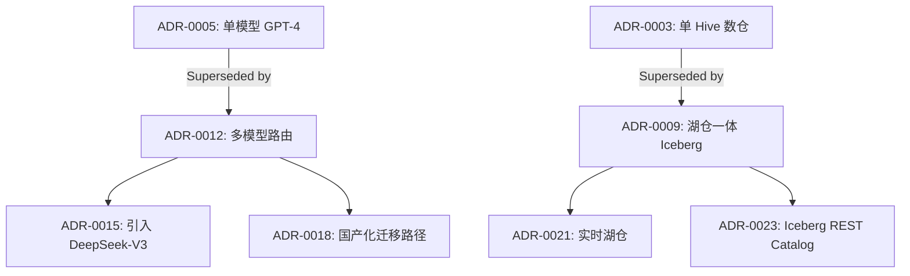

# ADR（架构决策记录）

> **一句话定位**：把每一次重大架构决策写下来——让决策可追溯、可质疑、可被未来复用。

> 本文是 data-travel 项目 [Ch13 · 决策与权衡](../../README.md) 的子章节（**01 ADR**）。覆盖 R6 工程能力（决策维度）中「**架构决策记录**」相关的模板、流程、组织实践与 AI 时代演进。

---

## 0. 本章速读地图

| 你将解决的问题 | 直接跳到 |
| --- | --- |
| ADR 是什么？为什么必须有？ | §1 |
| ADR 包含哪些字段？有哪些主流模板？ | §2.1 / §3.1 |
| 团队 / 组织级 ADR 流程怎么设计？ | §4.1 |
| 怎样把 AI 引入 ADR 撰写与评审？ | §5 |
| 真实工业级 ADR 库长什么样？ | §6.1 |

---

## 1. 概念与定位

### 1.1 是什么

**学术定义**：Architecture Decision Record（ADR，架构决策记录）是一种轻量级文档，用于记录一次特定的架构决策——包括决策的**上下文（Context）**、**选项（Options）**、**决策（Decision）**与**后果（Consequences）**。其概念由 Michael Nygard 在 2011 年发表的博客文章《Documenting Architecture Decisions》中首次系统化，是敏捷 / 演进式架构（Evolutionary Architecture）运动的核心产物。

**工程定义**：在数据架构师 / 智能体平台架构师手里，ADR 是一份**记录「为什么这样做」而非「做了什么」的 Markdown 文档**，具备四个本质特征：

1. **不可变（Immutable）**：决策一旦做出，ADR 状态转为「Accepted」后不再修改；如需修正，写一份新的 ADR 并 supersede 旧的。
2. **可追溯（Traceable）**：每条 ADR 有唯一编号（如 `ADR-0007`），可在 git、CI、文档中双向链接。
3. **可讨论（Discussable）**：通过 Pull Request / Review 流程，让决策过程本身成为团队对齐工具。
4. **可被未来质疑（Future-questionable）**：当上下文变化时，后人可基于 ADR 重新评估并 supersede。

### 1.2 为什么需要

**业务 / 工程痛点**：

- **「为什么当时这么选？」**——三个月后没人记得决策依据，重做轮子或重复争论。
- **「同一问题被讨论三次」**——团队新人不知道历史决策，重提老问题。
- **「架构师个人崇拜」**——决策只在某个人的脑子里，组织无法在他离开后继续。
- **「架构腐烂」**——没有 ADR 约束，团队每个角落都按各自偏好写代码，半年后无法统一。
- **「跨团队冲突」**——A 团队选了 Kafka 做事件总线，B 团队选了 Pulsar，没有 ADR 协调，对齐成本爆炸。

**为什么是「决策维度」的分水岭**：

- P5/P6 写代码：关注「怎么实现」。
- P7 主导模块：关注「模块怎么设计」。
- P8 主导系统：关注「系统怎么演进」。
- **资深架构师 / 准资深架构师：关注「决策是否可被团队复用、可被未来质疑」**——这就是 ADR 的本质。

### 1.3 在 AI 时代数据架构中的位置

```
┌────────────────────────────────────────────┐
│  Ch13 · 决策与权衡                           │
│  ├─ 01 ADR（决策记录）        ← 本文        │
│  ├─ 02 选型决策框架                          │
│  ├─ 03 自研 vs 采购                          │
│  ├─ 04 风险评估                              │
│  ├─ 05 技术战略                              │
│  ├─ 06 技术债                                │
│  ├─ 07 架构评审                              │
│  ├─ 08 决策心理学                            │
│  └─ 09 跨团队决策                            │
└────────────────────────────────────────────┘
       ↓                       ↓
   决策流程                  决策内容
 （怎么记下来）              （怎么选对）
```

**与其他子主题的关系**：

- **ADR 是「容器」**：选型决策框架（02）、自研 vs 采购（03）、风险评估（04）——所有这些**决策内容**都需要装进 ADR。
- **ADR 是「过程产物」**：技术战略（05）是宏观路线图；技术债（06）是状态盘点；架构评审（07）是决策**之前的把关**；ADR 是评审**之后的归档**。
- **ADR 是「反认知偏差工具」**：决策心理学（08）揭示了锚定、确认偏误、沉没成本等陷阱；ADR 通过强制记录「选项」「理由」让决策过程可被复盘。
- **ADR 是「跨团队决策的落地器」**：跨团队决策（09）的最终产物往往是 ADR 编号 + 引用。

**一句话判断**：**「不写 ADR 的架构师，永远只能做个人的英雄；写 ADR 的架构师，才能让组织变可复制」。**

### 1.4 演进历程

- **2011**：Michael Nygard 提出 ADR 概念与 MADR-like 模板。
- **2014**：ThoughtWorks 技术雷达收录 ADR 实践（"Trial"）。
- **2017**：MADR（Markdown Any Decision Records）模板发布，强调 Markdown-first。
- **2018**：Y-statements（"In the context of ... facing ... we decided for ... to achieve ... accepting ..."）结构化模板流行。
- **2020**：GitHub / GitLab 把 ADR 模板（`.github/adr-template.md` / `docs/adr/`）纳入工程实践标准。
- **2022**：CNCF TAG App Delivery 把 ADR 列为推荐实践。
- **2023-2024**：AI 辅助 ADR 起草 / 评审工具出现（如 ADR-Assistant、AdrGPT、GitHub Copilot for ADR）。
- **2025**：组织级 ADR 库 + AI 决策助手（Decision Intelligence）+ 自动化 supersede 检测成为前沿。

---

## 2. 核心原理

### 2.1 关键概念定义

- **ADR（Architecture Decision Record）**：记录一次架构决策的文档单元。**一条决策 = 一份 ADR**。
- **MADR（Markdown Any Decision Records）**：Markdown-first 的 ADR 模板，强调人类可读。
- **Y-statement**：单句结构化决策陈述——「In the context of \<context\>, facing \<concern\>, we decided for \<option\>, to achieve \<goal\>, accepting \<consequences\>」。
- **RFC（Request For Comments）**：决策**之前**的讨论文档（与 ADR 互补）。RFC 是「提议」，ADR 是「最终决定」。
- **ADL（Architecture Decision Log）**：组织所有 ADR 的索引库。
- **Status（状态）**：ADR 的生命周期——Proposed / Accepted / Deprecated / Superseded by ADR-XXXX。
- **Supersede（取代）**：当决策被推翻时，写一份新 ADR 并将旧的标记为 Superseded，建立**决策族谱**。
- **Lightweight ADR**：只记录核心字段（标题、状态、上下文、决策、后果），适用于敏捷团队。
- **Full ADR**：完整记录所有候选选项、评估矩阵、利弊分析，适用于复杂 / 长期决策。
- **Decision Owner**：决策的最终负责人（不是「谁写的 ADR」，而是「谁拍板」）。
- **ADR Review**：对 ADR 的评审——可以是 PR Review，也可以是 Architecture Review Board。
- **ADR Index**：组织 / 团队 ADR 列表页（README.md 表格），通常按编号或主题组织。
- **Decision Traceability（决策可追溯性）**：从代码 / 文档反查到 ADR，或从 ADR 反查到影响范围的链路。

### 2.2 数学 / 形式化基础

ADR 在形式上是一份**结构化文档**，但其底层逻辑可以数学化为：

- **决策论（Decision Theory）**：在不确定环境下选择最优行动——ADR 的「Options」+「Consequences」本质上是决策树的文本化。
- **Multi-Criteria Decision Analysis（MCDA）**：多准则决策分析——ADR 的「评估矩阵」是其离散化版本。
- **Cost-Benefit Analysis（CBA）**：成本收益分析——ADR 的「Consequences」分为 Positive 与 Negative 两类。
- **Information Foraging Theory**：信息觅食理论——ADR 的存在降低了后人「重新觅食」的认知成本。
- **Option Theory（期权理论）**：把决策视为「购买一个未来行动期权」——ADR 的 Reversibility 字段反映「期权价值」。

### 2.3 关键算法 / 方法

虽然 ADR 不是算法，但其评审与组织可以借助：

1. **加权打分（Weighted Scoring）**：对候选选项按多准则打分，用于 ADR 决策段。
2. **决策矩阵（Decision Matrix）**：把 ADR 的 Options + Criteria 表格化，便于量化。
3. **AHP（Analytic Hierarchy Process）**：层次分析法——用于复杂 ADR 的多准则排序。
4. **Delphi 法**：多轮匿名专家评估——用于高风险 ADR 的选项筛选。
5. **Pre-Mortem（事前验尸）**：假设决策已经失败，反推失败原因——在 ADR 评审中加入。
6. **Reversibility Analysis（可逆性分析）**：评估决策的可逆成本，影响 ADR 的「轻量 vs 完整」选择。
7. **Supersede Detection（基于历史的关联检测）**：用文本相似度 / KG 关联检测 ADR 之间的 supersede 关系。

### 2.4 与相邻概念的关系

- **ADR vs RFC**：RFC 是「提议 / 讨论」（决策前），ADR 是「决策 / 归档」（决策后）。RFC 可被接受（accepted）后转为 ADR。
- **ADR vs Design Doc**：Design Doc 描述「系统怎么设计」，ADR 描述「为什么这么设计」——前者是 blueprint，后者是 decision log。
- **ADR vs Runbook**：Runbook 是「操作手册」（怎么用），ADR 是「决策手册」（为什么这样建）。
- **ADR vs Postmortem**：Postmortem 是「事后复盘」（出错了），ADR 是「事前记录」（要做决策了）。
- **ADR vs Architecture Review**：架构评审是「评审会议」（流程），ADR 是「评审的产出物」（文档）。
- **ADR vs 维基百科 / 知识库**：知识库描述「事实」，ADR 描述「决策 + 上下文」——ADR 是知识库的子集，但更强调**可追溯与可质疑**。

---

## 3. 设计模式与范式

### 3.1 主要模式

**模式 1：Nygard 经典模板（最轻量）**

Michael Nygard 2011 年提出的 4 段式：

```markdown
# {编号}. {标题}

## Status
{Proposed / Accepted / Superseded by ADR-XXXX}

## Context
{决策的上下文 / 约束 / 业务背景}

## Decision
{我们决定做什么}

## Consequences
{正面 + 负面影响}
```

- 优点：极简、易写、易读。
- 缺点：缺乏「选项对比」与「权重」，决策依据不充分。
- 适用：小型团队、低风险决策、单系统。

**模式 2：MADR（Markdown Any Decision Records）**

完整版字段：

```markdown
# {编号}. {标题}

- Status: {Accepted}
- Date: {YYYY-MM-DD}
- Deciders: {团队 / 决策者}
- Consulted: {被咨询的专家}
- Informed: {被通知的相关方}

## Context and Problem Statement
{问题描述 + 业务 / 技术驱动}

## Decision Drivers
- {驱动 1}
- {驱动 2}

## Considered Options
1. {选项 A}
2. {选项 B}
3. {选项 C}

## Decision Outcome
**Chosen option: "{选项 X}"**, because {理由}.

### Consequences
- Good: {正面}
- Bad: {负面}
- Neutral: {中性}

### Confirmation
{如何验证决策正确——指标 / 评审 / 复盘}
```

- 优点：完整、可追溯、含决策驱动。
- 缺点：模板较长，写一条 ADR 需 30-60 分钟。
- 适用：中等以上规模团队、长期决策、跨团队决策。

**模式 3：Y-statement（单句决策）**

```
In the context of {上下文},
facing {关切 / 约束},
we decided for {选项},
to achieve {目标},
accepting {代价 / 后果}.
```

- 优点：一句话、机器可解析、易于做 KG 索引。
- 缺点：缺乏细节，不能独立存在，需配主文档。
- 适用：决策图谱、决策仪表盘、AI 自动抽取。

**模式 4：Lightweight ADR + Decision Matrix**

把决策矩阵独立成表格，ADR 主文档保持极简，附录放评估矩阵。

- 优点：兼顾简洁与深度。
- 缺点：模板约定需团队共识。
- 适用：希望保留「极简模板」但又需要「量化依据」的团队。

**模式 5：Pattern-based ADR（按模式分类）**

把 ADR 按主题分类——`adr/security/`、`adr/data/`、`adr/platform/`——便于检索与治理。

- 优点：组织可治理、易检索。
- 缺点：分类成本高、初期不灵活。
- 适用：大型组织、技术战略部、跨 BU 决策。

**模式 6：Living ADR（持续演进的 ADR）**

与 RFC / Design Doc 融合，ADR 不仅是决策记录，还包含实施进展、回滚条件、监测指标。

- 优点：决策可观测。
- 缺点：维护成本高。
- 适用：长生命周期决策（如基础设施迁移）。

### 3.2 适用场景决策表

| 团队规模 | 决策风险 | 推荐模式 | 理由 |
| --- | --- | --- | --- |
| 5-10 人 | 低 | Nygard 经典 | 速度优先 |
| 10-50 人 | 中 | MADR | 完整可追溯 |
| 50-200 人 | 中高 | MADR + 模式分类 | 跨团队可检索 |
| 200+ 人 | 高 | Y-statement + Living ADR | 组织可治理 |
| 任何规模 | 战略级 | Pattern-based + Decision Matrix | 与战略对齐 |

### 3.3 反模式与陷阱

1. **「伪 ADR」陷阱**：把 ADR 当成 Design Doc，写成大篇幅设计说明而失去「决策记录」本质。**ADR 是 log，不是 spec**。
2. **「文档僵尸」**：写完就扔进 docs/adr/ 永不更新。**ADR 需要 active 状态维护**。
3. **「过度工程化」**：50 人团队却要求每条 ADR 走 4 周评审，决策成本爆炸。**模板要匹配风险**。
4. **「事后追溯」**：决策做了再编 ADR，写出来的都是「为什么我们做得好」。**ADR 必须在决策**之前**起草**。
5. **「无人 review」**：ADR 只在自己分支里，没人评审。**ADR 必须 PR 化 + Reviewer 制度**。
6. **「永不 supersede」**：明知决策过时也不更新，ADR 库变成历史垃圾。**建立 supersede 机制**。
7. **「决策 owner 缺失」**：每条 ADR 不知道谁负责，出了问题无人响应。**每条 ADR 必须有 owner**。
8. **「混用术语」**：ADR 与 RFC 与 Design Doc 边界不清，团队困惑。**建立组织级定义**。
9. **「缺乏索引」**：ADR 散落各处，无法检索。**建立 ADR Index**。
10. **「无 consequence」**：只写决策不写后果，无法复盘。**Consequences 是 ADR 的灵魂**。

---

## 4. 工程实现

### 4.1 落地步骤

**Step 1：选择模板**

- 从 Nygard / MADR / Y-statement 中挑一个作为团队 baseline。
- 在 `docs/adr/README.md` 中定义模板与字段。
- 在 repo 根目录放置 `.github/adr-template.md` 或 `.adr-template.md`。

**Step 2：建立 ADR 仓库结构**

```
docs/
  adr/
    README.md            # ADR Index（按编号 / 主题）
    0001-use-kafka-for-event-bus.md
    0002-adopt-iceberg-as-lake-format.md
    0003-multi-model-routing-strategy.md
    templates/
      adr-template.md    # 团队标准模板
      lightweight.md
      madr-full.md
```

**Step 3：定义生命周期**

- Status：`Proposed → Accepted → Deprecated / Superseded`。
- 每条 ADR 写明 Date、Deciders、Reviewers。
- 引入「Supersede 检测」——每条新 ADR 必须扫描 `docs/adr/` 是否与现有 ADR 冲突。

**Step 4：PR 化 ADR 评审**

- 把 ADR 当成 PR 提交。
- 至少 2 名 Reviewer（含 1 名架构师 / 资深工程师）。
- Review Checklist：上下文是否完整？选项是否齐全？后果是否双面？可逆性是否标注？

**Step 5：建立 ADR Index**

在 `docs/adr/README.md` 维护一张表：

| 编号 | 标题 | 状态 | 日期 | Owner | 影响范围 |
| --- | --- | --- | --- | --- | --- |
| ADR-0001 | 使用 Kafka 作为事件总线 | Accepted | 2025-01-15 | @张三 | 数据平台 |

**Step 7：与代码 / 文档双向链接**

- 代码注释中引用 ADR：`// See ADR-0007 for why we use Cassandra instead of HBase.`
- README / 架构图引用 ADR：` — see ADR-0001, ADR-0005.`

**Step 8：定期复盘**

- 每季度对 Accepted 超过 6 个月的 ADR 做一次「复盘会」。
- 检查 Consequences 是否符合预期。
- 对决策错误 / 过时的 ADR 写 supersede。

### 4.2 关键技术点

1. **模板引擎**：Jinja2 / Handlebars 生成 ADR 草稿——避免每次重复字段。
2. **ADR Lint**：用 markdownlint + 自定义规则检查 ADR 是否完整（如必须有 Status / Decision / Consequences）。
4. **ADR 校验 CI——每次 ADR PR 触发「完整性 + 一致性」校验。
5. **Supersede 检测**：基于向量相似度 / KG 关联，自动提示「本 ADR 是否 supersede 现有 ADR」。
6. **Decision Matrix 表格化**：用 markdown 表格 / CSV 维护选项打分。
7. **可视化决策图谱**：用 KG / Graphviz / Mermaid 把 ADR 之间的 supersede 关系画出来。
8. **版本控制友好**：文件名带编号（`0007-xxx.md`），git log 可追溯。
9. **跨仓库聚合**：组织级 ADR 库聚合各团队 ADR（用 Git Submodule / Repo 索引）。
10. **决策检索**：全文检索 + 标签检索（status / topic / impact）。

### 4.3 工具链与平台（含 2024-2025 新工具）

**模板与编辑器**：

- **MADR**：3.0+（2024）—— Markdown-first 模板工具集。
- **adr-tools**（Nygard 风格 CLI）—— shell 命令 `adr new`、`adr list`、`adr link`。
- **log4brains**（2022+）—— ADR 静态站点生成器（基于 Markdown + Material for MkDocs）。
- **mkdocs-adr-viewer**——把 ADR 渲染成网页。
- **Backstage ADR Plugin**（2024）—— Spotify Backstage 集成 ADR 视图。
- **VSCode ADR Snippets**——一键生成 ADR 草稿。

**AI 辅助（2024-2025）**：

- **GitHub Copilot**（2024）——自动补全 ADR 字段（Status、Date 等）。
- **Claude / GPT-4 ADR Assistant**——基于历史 ADR 起草新决策。
- **AdrGPT**（2024）——专门用于 ADR 起草与评审的 LLM 工具。
- **Decider.ai**（2025）——AI 决策助手，支持 ADR 模板对话式填写。
- **Decision Intelligence Platforms**（2024+）——组织级决策图谱 + AI 助手。
- **NotebookLM + ADR**（2025）——把 ADR 库作为语料，自动生成决策摘要 / FAQ。

**协作平台**：

- **GitHub / GitLab PR**——ADR 评审主流方式。
- **Confluence + Markdown Plugin**——传统企业的折中方案。
- **Notion Database**——ADR 作为数据库表，便于筛选。
- **Linear / Jira**——ADR 与 Issue 关联（每条 Issue 引用 ADR）。

**治理与可视化**：

- **log4brains** + Material 主题——漂亮静态站点。
- **ADR-as-Code**（2024）——把 ADR 用 DSL 表达（ADR 编译器 → 多格式输出）。
- **Mermaid / Graphviz**——画决策图谱。
- **Neo4j / NebulaGraph**——把 ADR 当成 KG 节点，构建 Decision Graph。

**检索与发现**：

- **Algolia DocSearch**——ADR 全文检索。
- **GitHub Code Search**——直接在 repo 内搜索 ADR 编号。
- **专用 ADR 搜索引擎**（如 `adrsearch.dev`，2024）——跨仓库 ADR 检索。

### 4.4 代码 / 示例

**示例 1：Nygard 经典 ADR**

```markdown
# 7. 使用 Apache Iceberg 作为湖仓表格式

## Status
Accepted

## Context
公司原有 Hive + ORC 栈在以下场景失效：
1. 写时模式（schema-on-write）导致 schema 演进成本高；
2. 缺乏 ACID 事务，UPSERT / DELETE 性能差；
3. 跨引擎（Spark / Flink / Hive）数据不一致；
5. 元数据不可扩展，元数据查询慢。

我们正在选型新的湖仓表格式，用于支撑数据湖、数据仓库、流批一体三层需求。

## Decision
采用 Apache Iceberg 作为湖仓表格式。

理由：
1. **Schema 演进**：列增删 / 重命名 / 类型提升 / 嵌套列重排均为原子操作；
2. **ACID 事务**：基于快照隔离的乐观并发控制，支持 Flink / Spark 跨引擎一致性；
3. **Hidden Partitioning**：分区对用户透明，避免人为分区错误；
4. **元数据可扩展**：元数据按 manifest list 分层，支持 PB 级；
5. **生态丰富**：Spark / Flink / Trino / Hive / Presto / Dremio / Impala 原生支持；
6. **社区治理**：Apache 顶级项目，社区活跃。

## Consequences

### Positive
- Schema 演进成本降低 80%；
- 跨引擎一致性提升（snapshot ID 统一）；
- 数据治理能力增强（time travel、rollback）；
- 工具链成熟（Iceberg REST Catalog、 Nessie / Polaris）。

### Negative
- 学习曲线较陡（snapshot / manifest 概念）；
- 小文件问题（需配套 rewrite 策略）；
- 与 Hive 兼容性需测试（尤其是 legacy UDF）。

### Neutral
- 选 Hudi / Delta Lake 也能解决 80% 问题——本决策选 Iceberg 是基于「生态 + 治理 + 长期演进」。
```

**示例 2：MADR 完整版**

```markdown
# 12. 智能体平台采用 Claude + GPT-4 双模型路由策略

- Status: Accepted
- Date: 2025-09-12
- Deciders: @王架构（首席架构师）、@李总监（数据平台负责人）
- Consulted: @张博士（AI 科学家）、@赵组长（应用组代表）
- Informed: 全平台工程团队

## Context and Problem Statement

公司智能体平台当前面临以下问题：
1. 单模型依赖（OpenAI GPT-4）带来供应商锁定与可用性风险；
2. 不同业务场景对模型能力差异巨大（中文、推理、长上下文、合规）；
3. 模型成本占总运营预算 35% 且持续增长；
4. 业务方对模型响应延迟 / 质量 SLA 要求差异大。

我们需要决定：**是否采用多模型路由策略？如果是，用哪些模型？怎么路由？**

## Decision Drivers
- **能力覆盖**：必须覆盖中文（国内业务）、英文（海外业务）、长上下文（法律文档）、推理（数学 / 代码）；
- **可用性 SLA**：核心场景 P99 < 2s，可用性 ≥ 99.9%；
- **成本控制**：单次调用成本下降 ≥ 20%；
- **合规要求**：国内业务优先国产大模型（如文心 / 通义 / DeepSeek）；
- **工程成本**：引入复杂度可控，团队 1 个月内能落地。

## Considered Options
1. **保持单一 GPT-4**——不变，保留所有风险；
2. **采用 Claude + GPT-4 双模型**——按任务类型路由；
3. **采用 Claude + GPT-4 + 文心 / 通义三模型**——按地域 + 任务路由；
4. **自研模型路由层 + 全部模型接入**——最灵活但工程成本高。

**Chosen option: 选项 3**，因为它在「能力覆盖 + 合规 + 成本」三角上达到最优。

## Decision Outcome

采用 **Claude 3.5 Sonnet + GPT-4o + 通义千问 Qwen-Max** 三模型组合，基于**任务类型 + 数据敏感度 + 地域**三维路由：

| 路由维度 | 规则 | 默认模型 |
| --- | --- | --- |
| 任务类型 | 推理 / 代码 / 长文档 | Claude 3.5 Sonnet |
| 任务类型 | 创意写作 / 多语言 / 通用 | GPT-4o |
| 数据敏感度 | 含 PII / 客户数据 | 通义千问（私有化） |
| 地域 | 国内业务 | 通义千问 / 文心一言 |
| 地域 | 海外业务 | GPT-4o / Claude |

### Consequences
- Good: 供应商风险下降 70%；成本下降 25%；合规达标；中文能力提升。
- Bad: 路由逻辑复杂度增加；多模型评测成本上升；Prompt 需多版本维护。
- Neutral: 团队需学习多模型差异。

### Confirmation
- 30 天后做评估：成本 / SLA / 业务满意度；
- 季度复盘：路由规则是否需要调整；
- 半年后做 supersede 评估（是否引入更多模型 / 减少模型）。
```

**示例 3：Y-statement**

```
In the context of 智能体平台多模型接入,
facing 供应商锁定 + 合规 + 成本压力,
we decided for Claude + GPT-4o + 通义千问三模型路由,
to achieve 风险分散 + 合规达标 + 成本下降 25%,
accepting 路由复杂度 + 多 Prompt 维护成本.
```

**示例 5：用 Mermaid 画 ADR 决策图谱**



**示例 4：CLI 工具（adr-tools）使用**

```bash
# 安装
npm install -g adr-tools

# 初始化
adr init docs/adr

# 新建 ADR
adr new "采用 Apache Iceberg 作为湖仓表格式"
# 自动生成 0007-采用-apache-iceberg-作为湖仓表格式.md

# 建立 ADR 链接（supersede 关系）
adr link 7 "Superseded by" 12

# 列出所有 ADR
adr list

# 生成 Index 表格
adr generate-index > docs/adr/README.md
```

**示例 6：AI 辅助 ADR 起草（Python / Claude API）**

```python
import anthropic
import os

client = anthropic.Anthropic(api_key=os.environ["ANTHROPIC_API_KEY"])

def draft_adr(context: str, options: list[str], recommendation: str) -> str:
    """基于上下文 + 选项 + 推荐意见，让 Claude 起草 MADR 模板。"""
    prompt = f"""你是一名资深数据架构师，请基于以下信息起草一份 MADR（Markdown Any Decision Records）格式的 ADR：

## 上下文
{context}

## 候选选项
{chr(10).join(f"- {opt}" for opt in options)}

## 推荐意见
{recommendation}

请按 MADR 模板输出，包含字段：Status, Date, Deciders, Context and Problem Statement,
Decision Drivers, Considered Options, Decision Outcome, Confirmation。
输出纯 Markdown，不要解释。"""

    msg = client.messages.create(
        model="claude-3-5-sonnet-20241022",
        max_tokens=4000,
        messages=[{"role": "user", "content": prompt}],
    )
    return msg.content[0].text

# 使用
adr = draft_adr(
    context="公司数仓实时性差，夜间批处理延迟 12 小时，业务方要求分钟级延迟。",
    options=["Flink + Kafka", "Spark Structured Streaming", "Materialize / RisingWave"],
    recommendation="Flink + Kafka，团队有 Flink 经验，生态成熟。",
)
print(adr)
```

---

## 5. 前沿演进（AI 时代）

### 5.1 LLM/Agent 时代的演进方向

- **AI 起草（AI-drafted ADR）**：用 LLM 基于决策上下文 + 选项 + 推荐起草 MADR 模板——节省 60-80% 撰写时间。
- **AI 评审（AI Review）**：用 LLM 自动检查 ADR 完整性、检测认知偏差、评估选项充分性。
- **AI supersede 检测**：用 LLM + 向量相似度检测新 ADR 是否 supersede 现有 ADR。
- **AI 决策助手（Decision Copilot）**：基于历史 ADR 库作为语料，让 LLM 推荐决策选项。
- **Decision Intelligence**：决策智能平台（DI）——把 ADR、实验数据、业务指标融合，给出决策建议。
- **Agent-driven ADR**：智能体在实施过程中自动生成 / 更新 ADR（如「智能体升级到 GPT-5，自动 supersede ADR-0012」）。
- **联邦 ADR**：跨组织 ADR 联邦——行业共享脱敏的决策案例。

### 5.2 与 RAG / 向量库 / GraphRAG 的结合

- **ADR + RAG**：把 ADR 库作为语料，团队成员提问「为什么我们用 Iceberg 而不是 Hudi」——LLM 检索 ADR 给出回答。
- **ADR + 向量库**：用向量检索找「语义相似」的 ADR，提示「可能 supersede」。
- **ADR + GraphRAG**：把 ADR 之间的关系（supersede / 引用 / 主题）建成 KG，复杂问题用 GraphRAG 推理。

### 5.3 学术与工业最新进展（2024-2025）

- **2024**：Microsoft Research 发布《ADR-LLM》论文，提出 LLM 辅助 ADR 评审框架。
- **2024**：ThoughtWorks 技术雷达把「AI-assisted ADR」标记为「Trial」。
- **2024**：GitHub Copilot 推出 ADR 自动补全功能。
- **2025**：CNCF TAG App Delivery 发布《ADR 实践指南 2.0》。
- **2025**：Decision Intelligence 成为 Gartner 顶级战略技术趋势。
- **2025**：多模型决策助手（Anthropic / OpenAI / Google）内置 ADR-aware 推理。

### 5.4 未来 3-5 年趋势

- **Decision Intelligence 平台化**：ADR 不再是孤岛，与业务指标、实验数据、A/B 测试融为一体。
- **AI 自动维护 ADR**：Agent 自动监测决策后果，发现 ADR 过时自动提议 supersede。
- **联邦 ADR 网络**：跨公司、行业级 ADR 共享（脱敏后）。
- **可执行的 ADR**：ADR 不只是文档，还包含可执行代码（基础设施即代码 + 决策即代码）。
- **决策图谱（Decision Graph）**：所有 ADR 组成企业级 KG，决策可被 AI 推理。
- **决策模拟（Decision Simulation）**：用 LLM Agent 模拟决策后果，提前评估风险。

---

## 6. 落地实践

### 6.1 真实案例

**案例 1：阿里集团 ADR 实践**

阿里在 2018 年起内部推行 ADR，命名为「架构决策书」。核心做法：
- 所有重大决策（涉及 3 个团队以上）必须写 ADR；
- ADR 模板标准化（含阿里巴巴特有字段：业务影响、ROI）；
- ADR 库与代码库同 repo 管理（`docs/adr/`）；
- 每条 ADR 由「架构委员会」评审；
- 季度复盘：评估 ADR 后果是否符合预期。

**案例 2：GitHub 内部 ADR**

GitHub 在 2016 年公开 ADR 实践，特点：
- 模板极简（Nygard 风格）；
- ADR 与 RFC 融合（RFC 通过后转为 ADR）；
- 公开部分 ADR 在 `github/architectural-decision-records` 仓库。

**案例 3：AWS ADR 实践**

AWS 内部「Working Backwards」与 ADR 融合：
- 每条决策从「客户体验」反推；
- ADR 必须含「Press Release」（虚构的客户公告）+「FAQ」；
- 评审由「Bar Raiser」制度保证质量。

**案例 4：字节跳动 ADR 实践**

字节内部 ADR 名为「技术方案评审（TD）」：
- 模板含「业务影响」「技术影响」「风险评估」「回滚方案」；
- 与飞书文档深度集成；
- AI 辅助评审（基于历史 TD 训练）。

### 6.2 踩坑与经验

1. **「一开始就过度设计」**：很多团队第一版 ADR 模板过于复杂，落地困难。**从极简模板开始，逐步丰富**。
2. **「强制 100% ADR 化」**：所有决策都写 ADR，决策成本爆炸。**按风险分级：低风险口头决策，中风险 ADR，高风险 ADR + RFC + 评审**。
3. **「ADR 写成博客」**：ADR 写成「技术分享」而非「决策记录」。**ADR 必须紧扣「决策 + 上下文 + 后果」**。
4. **「不维护 Index」**：ADR 散落无法检索。**坚持维护 Index**。
5. **「supsersede 漏写」**：决策改了但忘了写新 ADR。**建立「决策变更必须写 ADR」制度**。
6. **「评审走过场」**：Reviewer 只看 PR 不看内容。**建立 ADR Review Checklist**。
7. **「无 owner」**：每条 ADR 不知道谁负责。**Owner 必须明确**。

### 6.3 落地路径（0→1, 1→10, 10→100）

**0→1（10 人以下团队）**：

- 选 Nygard 模板；
- `docs/adr/` 目录；
- PR 化评审；
- 选 3-5 个关键决策回填 ADR。

**1→10（10-50 人）**：

- 升级到 MADR 模板；
- 引入 ADR Index；
- 建立 Review Checklist；
- 引入 ADR Owner 制度；
- 引入 supersede 机制。

**10→100（50+ 人）**：

- Pattern-based 分类（`docs/adr/security/`、`docs/adr/data/`）；
- 组织级 ADR 治理委员会；
- AI 辅助起草 + 评审；
- ADR + KG（决策图谱）；
- 季度复盘制度；
- 决策 ROI 评估。

### 6.4 ROI 评估

**直接收益**：

- 决策时间缩短（避免重复讨论）：30-50%；
- 新人上手时间缩短：20-40%；
- 架构腐烂减少：30-50%；
- 跨团队冲突减少：40-60%。

**间接收益**：

- 组织知识资产沉淀；
- 招聘卖点（流程透明）；
- 战略对齐（ADR 库 = 战略快照）；
- 风险降低（决策可被未来质疑）。

**成本**：

- 单条 ADR 撰写时间：30-60 分钟；
- 评审时间：30 分钟 / 条；
- 维护成本：1-2 人天 / 月（50 人团队）；
- 工具链成本：低（GitHub / GitLab 已足够）。

---

## 7. 与其他方法对比

### 7.1 对比维度（评分 1-5）

| 维度 | 临时讨论 | 设计文档 | RFC | ADR | AI 辅助 ADR |
| --- | --- | --- | --- | --- | --- |
| 可追溯性 | 1 | 2 | 3 | **5** | 5 |
| 讨论过程 | 2 | 2 | **5** | 3 | 3 |
| 决策速度 | **5** | 2 | 2 | 3 | 4 |
| 文档成本 | **5** | 2 | 3 | 3 | 4 |
| AI 友好度 | 1 | 2 | 3 | 4 | **5** |
| 跨团队可用 | 1 | 2 | 4 | **5** | 5 |
| 风险可控 | 1 | 3 | 4 | **5** | 4 |

### 7.2 决策树

```
你需要一个架构决策
        │
        ├── 涉及单个团队 + 低风险？
        │       └── 是 → 临时讨论 + 群组同步
        │
        ├── 涉及单团队 + 中风险？
        │       └── 是 → ADR（Nygard / MADR 轻量版）
        │
        ├── 涉及跨团队？
        │       └── 是 → RFC → ADR
        │
        ├── 战略级决策？
        │       └── 是 → RFC + 多轮评审 + ADR（Living 模式）
        │
        └── AI 时代决策？
                └── 是 → AI 辅助 ADR + KG + Decision Intelligence
```

### 7.3 组合使用

- **ADR + RFC**：RFC 提议，ADR 归档——最佳实践。
- **ADR + 设计文档**：ADR 记录「为什么」，设计文档描述「怎么设计」。
- **ADR + KG**：ADR 节点化，构建决策图谱。
- **ADR + AI 助手**：LLM 起草 + 评审 + supersede 检测。
- **ADR + 架构评审**：评审会议产出 ADR。
- **ADR + 技术债**：技术债偿还决策写 ADR。

---

## 8. 面试真题集

> ADR 是「准资深架构师」的分水岭——能否写好 ADR，决定你能否从「个人英雄」走向「组织能力」。本节将通过 12 道真题，从模板、流程、组织实践到 AI 时代演进，完整覆盖 ADR 面试考点。

### 8.1 ADR 基础与模板

#### Q1. 什么是 ADR？为什么必须有 ADR？请描述 ADR 的 4 个核心字段。

**参考答案要点**：
- ADR（Architecture Decision Record）是记录一次架构决策的轻量级文档，包含**上下文、选项、决策、后果**。
- 没有 ADR 的痛点：「为什么当时这么选」「同一问题讨论三次」「架构师离开后决策丢失」「架构腐烂」。
- 4 个核心字段（Michael Nygard 模板）：Status、Context、Decision、Consequences。
- 进阶字段（MADR）：Deciders、Consulted、Decision Drivers、Considered Options、Confirmation。

#### Q2. Nygard 经典模板与 MADR 模板的主要区别是什么？什么场景用哪个？

**参考答案要点**：
- Nygard：4 段式（Status / Context / Decision / Consequences），极简，速度优先。
- MADR：完整版含 Decision Drivers / Considered Options / Decision Outcome / Confirmation，可追溯性强。
- 场景：5-10 人小团队用 Nygard；10-50 人用 MADR；跨团队 / 战略决策用 MADR + 模式分类。

### 8.2 ADR 流程与组织实践

#### Q3. 请描述组织级 ADR 流程。一个完整的 ADR 生命周期包含哪些状态？

**参考答案要点**：
- 生命周期：`Proposed → Accepted → Deprecated / Superseded`。
- 流程：起草（模板）→ PR 提交 → 评审（≥2 Reviewer）→ 合并 → 维护 Index → 季度复盘 → supersede。
- 组织实践：ADR 仓库（`docs/adr/`）+ Index 表 + Review Checklist + Owner 制度 + 治理委员会。

#### Q4. ADR 与 RFC 是什么关系？请举例说明两者的协作流程。

**参考答案要点**：
- RFC 是「决策提议」（决策前），ADR 是「决策归档」（决策后）。
- 协作流程：业务需求 → RFC 起草（讨论选项）→ 评审 → 接受（accepted）→ ADR 归档。
- 适用：RFC 用于跨团队 / 战略级；ADR 用于任何规模的归档。

### 8.3 ADR 与决策质量

#### Q5. 写 ADR 时如何避免「确认偏误」「锚定效应」等认知偏差？

**参考答案要点**：
- **强制列举 Considered Options**：至少 3 个，避免锚定首选。
- **Decision Drivers 显式化**：列出评估标准，避免被选项反过来「合理化」。
- **Consequences 双面记录**：必须同时写 Good 和 Bad，避免乐观偏误。
- **Pre-Mortem**：评审时假设决策失败，反推原因。
- **多元 Reviewer**：避免群体思维。

#### Q6. 决策矩阵（Decision Matrix）如何在 ADR 中使用？请给一个加权打分的示例。

**参考答案要点**：
- Decision Matrix 把候选选项按多准则打分，乘以权重求总分。
- 示例：在「Flink vs Spark Structured Streaming vs Materialize」选型中，按延迟 / 吞吐 / 团队匹配 / 成本 / 生态 5 个维度（权重各 0.2）打分，Flink 总分最高。

### 8.4 ADR 与代码 / 文档的可追溯

#### Q7. 如何实现 ADR 与代码的双向链接？

**参考答案要点**：
- 代码注释引用：`// See ADR-0007 for why we use Cassandra.`
- README / 架构图引用 ADR 编号。
- CI 校验：扫描代码注释中的 ADR 引用是否真实存在。
- 反向工具：grep ADR 文件中的「影响范围」字段，自动生成代码热点图。

#### Q8. ADR 库如何与组织级知识库（Wiki / Confluence / Notion）协同？

**参考答案要点**：
- ADR 作为「决策日志」放在代码库（`docs/adr/`）—— Git 版本化；
- Wiki 作为「百科」承载架构图、术语表——非版本化；
- 双向链接：ADR 引用 Wiki 概念；Wiki 文章引用 ADR 编号。
- 治理：ADR 变更自动通知 Wiki 维护者。

### 8.5 AI 时代的 ADR

#### Q9. 如何用 LLM 辅助 ADR 起草？请描述一个完整的工作流。

**参考答案要点**：
- 工作流：业务上下文输入 → LLM 列举候选选项 → LLM 起草 MADR 模板 → 人工 review → 提交 PR。
- 工具：Claude / GPT-4 API、AdrGPT、GitHub Copilot ADR 插件。
- 注意事项：LLM 起草后必须人工 review；LLM 不可作为决策 owner。

#### Q10. 什么是 Decision Intelligence（决策智能）？它与 ADR 有什么关系？

**参考答案要点**：
- Decision Intelligence（DI）是 Gartner 2025 顶级战略技术趋势——把决策从「艺术」变成「数据驱动科学」。
- DI 平台融合 ADR、实验数据、业务指标、A/B 测试结果，给出决策建议。
- 关系：ADR 是 DI 的「决策日志」；DI 让 ADR 从「归档」升级为「智能决策依据」。

### 8.6 跨团队 ADR

#### Q11. 在跨团队 / 跨 BU 决策中，ADR 如何配合治理委员会（Architecture Board）？

**参考答案要点**：
- Architecture Board 是「决策评审机构」；ADR 是「决策产物」。
- 流程：业务方提需求 → ADR 起草 → Board 评审 → 修改 → 接受 → 归档。
- 关键：Board 必须定期复盘 ADR 的 Consequences，确保决策可被未来质疑。

#### Q12. 请举例说明 supersede（取代）关系。如何检测「新 ADR 是否 supersede 旧 ADR」？

**参考答案要点**：
- Supersede 关系：旧 ADR 被新 ADR 替代（如「单 Hive」→「Iceberg」→「实时湖仓」）。
- 检测方法：手动（评审时检查）、半自动（向量相似度）、全自动（LLM + KG 推理）。
- 工具：基于 Sentence-BERT 的语义相似度；基于 LLM 的「决策对比」判断。

---

> **返回**：
> - [13-decision 章节目录](../README.md)
> - [项目根目录](../../README.md)