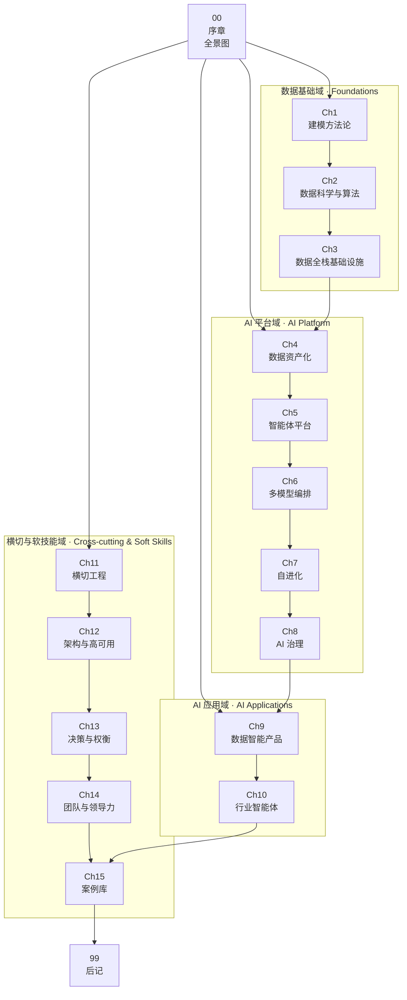

# data-travel · AI 时代数据架构师的开源书

> **AI 时代的数据架构师 / 智能体平台架构师** —— 从数据科学、建模方法、数据基础设施，到 AI 智能体平台、多模型编排、AI 资产治理、数据智能产品的全景图。

## 项目定位

`data-travel` 是一本围绕「**AI 智能体平台架构师**」画像展开的开源书（纯 Markdown，无构建步骤），用 **4 能力域 + 4 横线** 串起 15 章主体 + 序章 + 后记。每一章既独立成篇，又承接上一章的能力跃迁；读者可以从任意一章切入，按角色路径跳读。

## 目标画像

本书所有内容都围绕以下画像展开（来自「Agent 架构师（高级）」招聘要求提炼）。完整 6 大职责 + 8 大要求 + 加分项见 [spec §2](docs/superpowers/specs/2026-10-08-data-architect-restructure.md#2-目标画像核心约束)。

### 6 大核心职责

1. **AI 智能体平台整体架构**：私有化部署、企业级 AI 基础设施 0→1、安全可控 / 可编排 / 自进化
2. **企业私有数据资产化与智能检索**：多源异构数据统一清洗、结构化、语义化编码；构建向量索引与 RAG 检索体系
3. **多模型编排与工具链调度**：多模型统一接入层、标准化工具调用框架、按需路由、灵活组合
4. **AI 资产沉淀与自进化系统**：全生命周期管理，使用→沉淀→复用→优化闭环
5. **行业情报智能体与精准分发**：7×24h 自动化情报采集 / 清洗 / 语义分类 / AI 摘要 / 个性化推送
6. **AI 资产分级保密与防泄露体系**：黑盒化封装、细粒度权限管控、全链路审计、输出端防泄露

### 8 大任职要求（浓缩）

1. 本科以上、27-40 岁、**5 年以上**数据科学 / 算法 / 数据架构经验
2. 数据挖掘与机器学习（分类 / 聚类 / 回归 / 推荐），扎实特征工程与算法工程化落地
3. **精通数据建模**：数据仓库 + **知识图谱 + 本体建模 + 图数据推理**
4. **深刻理解数据全栈协同**：采集 / 集成、数据流转、样本库、评估、反馈闭环
5. 数据智能类产品认知：智能标签、智能 BI、精细化运营、预测决策
6. 极强的落地能力、创新精神、跨团队协同、结果导向
7. 可验证的过往业绩：大型数据算法类产品设计与落地
8. 国内外头部游戏 / 基金 / 数据智能产品 / 大型互联网企业工作经验

### 加分项

- 智能体框架（**LangChain、AutoGPT、OpenClaw**）二次开发或核心贡献
- 行业 AI 智能体（**代码智能助手、自动化办公平台** 等）
- 合规：国产化适配、**等保 2.0 / 3.0** 项目经验
- 工程能力：**Python / Go / Java + 微服务 + 分布式**、**TB 级大数据量**、高并发 / 高可用
- 团队管理：**5 人以上**技术团队管理经验

> **画像 = 能力约束**：后续每章的「画像映射」小节都会明确本章对应画像里的哪项能力（见 [spec §6](docs/superpowers/specs/2026-10-08-data-architect-restructure.md#6-readme-提纲)）。

## 目录速览

| 序号 | 章节 | 核心问题 | 难度 |
| --- | --- | --- | :---: |
| 00 | [序章 · AI 时代数据架构师的全景图](00-introduction/) | 能力地图是什么？该如何按角色读这本书？ | ★★☆☆☆ |
| 01 | [Ch1 · 建模方法论](01-modeling/) | 数仓 + 本体 + 知识图谱 + 图数据推理，数据架构师的第一道分水岭 | ★★★☆☆ |
| 02 | [Ch2 · 数据科学与算法](02-data-science/) | 分类 / 聚类 / 回归 / 推荐四大类，特征工程、模型选型、效果评估 | ★★★☆☆ |
| 03 | [Ch3 · 数据全栈基础设施](03-data-stack/) | 采集 / 集成 / 流转 / 样本库 / 评估 / 反馈全链路 | ★★★☆☆ |
| 04 | [Ch4 · 数据资产化与智能检索](04-data-assetization/) | 把企业私有数据转化为 AI 可消费的知识（RAG / 向量 / 语义） | ★★★★☆ |
| 05 | [Ch5 · AI 智能体平台架构](05-agent-platform/) | 企业级私有化 AI 智能体平台从 0 到 1 的整体架构 | ★★★★★ |
| 06 | [Ch6 · 多模型编排与工具调用](06-multi-model/) | 统一接入 GPT / Claude / 文心 / 通义，按需路由与工具链调度 | ★★★★☆ |
| 07 | [Ch7 · AI 资产沉淀与自进化](07-agent-evolution/) | 使用→沉淀→复用→优化闭环，让 AI 越用越聪明 | ★★★★☆ |
| 08 | [Ch8 · AI 治理与安全](08-ai-governance/) | 分级保密、细粒度权限、全链路审计、输出端防泄露 | ★★★★☆ |
| 09 | [Ch9 · 数据智能产品](09-data-intelligence-product/) | 智能标签 / 智能 BI / 精细化运营 / 预测决策的产品形态 | ★★★★☆ |
| 10 | [Ch10 · 行业智能体](10-industry-agent/) | 行业情报 / 代码智能助手 / 自动化办公的垂直落地 | ★★★★☆ |
| 11 | [Ch11 · 横切工程](11-cross-cutting/) | 数据质量、安全、成本、可观测、血缘——资深架构师的硬功夫 | ★★★★☆ |
| 12 | [Ch12 · 架构与高可用](12-architecture/) | 单元化 / 多活 / 大促保障 / 容量规划 / 混沌工程 | ★★★★★ |
| 13 | [Ch13 · 决策与权衡](13-decision/) | ADR / 选型决策 / 技术战略——准资深架构师的软分水岭 | ★★★★☆ |
| 14 | [Ch14 · 团队管理与领导力](14-leadership/) | 5 人以上技术团队管理、带人、做事、影响组织 | ★★★★☆ |
| 15 | [Ch15 · 案例库](15-case-studies/) | 阿里 / 字节 / 华为 / OpenAI / Anthropic 的工业级 AI 智能体平台演进 | ★★★☆☆ |
| 99 | [后记 · 趋势与思考](99-outro/) | AI 智能体架构师正在向何处去？给准资深架构师的几句话 | ★★☆☆☆ |

> **难度说明**：★ 数综合反映「领域宽度 × 工程深度 × 经验要求」三维度。Ch5（智能体平台）与 Ch12（架构与高可用）是公认的高难度分水岭。详细推荐角色与前置章节见 [序章 · 难度梯度表](00-introduction/README.md#难度梯度表)。

## 阅读路径

本书为以下 **4 类读者** 分别设计了推荐路径。**核心目标读者是「AI 智能体平台架构师」**（路径 A）。

### 路径 A：AI 智能体平台架构师（核心目标读者）

> 你正在或即将主导企业级私有化 AI 智能体平台 0→1，需要补齐从数据基础到 AI 应用的全栈能力。

- **必读**：00 → Ch1 → Ch4 → Ch5 → Ch6 → Ch7 → Ch8 → Ch11 → Ch13 → Ch15
- **选读**：Ch2（按需补算法）、Ch9（数据智能产品形态）、Ch10（行业落地）、Ch12（大促稳定性）、Ch14（团队管理）
- **可跳读**：Ch3 内部实现细节（关注 API 边界即可）

### 路径 B：数据科学家 / 算法工程师

> 你擅长模型与算法，但希望理解数据资产化、智能体平台与 AI 治理如何让算法落地为业务价值。

- **必读**：00 → Ch1 → Ch2 → Ch4 → Ch5 → Ch7 → Ch9 → Ch10
- **选读**：Ch6（多模型路由策略）、Ch8（算法上线合规）、Ch11（数据漂移 / 特征穿越治理）
- **可跳读**：Ch3 采集层细节、Ch12 高可用细节、Ch13 选型决策细节、Ch14 团队管理

### 路径 C：数据全栈架构师

> 你已有数仓 / 数据平台经验，希望横向扩展到 AI 平台与 AI 应用领域。

- **必读**：00 → Ch1 → Ch3 → Ch4 → Ch5 → Ch6 → Ch11 → Ch12
- **选读**：Ch2（算法原理）、Ch8（AI 治理与等保）、Ch13（决策）、Ch15（工业级案例）
- **可跳读**：Ch7 自进化实现细节、Ch10 行业知识细节、Ch14 团队管理

### 路径 D：团队负责人 / 准资深架构师

> 你正从资深工程师 / 架构师向准资深架构师跃迁，技术深度已具备，亟需补决策、组织与战略能力。

- **必读**：00 → Ch1 → Ch13 → Ch14 → Ch15
- **选读**：Ch3（数据全栈心智）、Ch8（AI 合规）、Ch11（横切工程）、Ch12（架构与高可用）
- **可跳读**：Ch2 算法实现、Ch4–Ch7 的内部实现细节（关注架构图与决策点即可）

> **特别说明**：标粗的「AI 智能体平台架构师」是本书的核心目标读者。技术深度可由其他章节补齐，但 **「让企业私有数据变成 AI 可消费的知识 + 多模型编排 + 智能体平台 0→1 + AI 资产自进化 + AI 治理」** 这五项能力才是 AI 时代数据架构师的真正分水岭。

## 章节导图

> **主轴**：4 个能力域（数据基础 → AI 平台 → AI 应用 → 横切与软技能）。
> **横线**：4 条横切主题（可治理 / 可观测 / 可计量 / 可演进）以「横切关注点」形式贯穿所有章节，详见下节。

## 横切主题索引

| 横切主题 | 主要承载章节 | 横切出现位置 |
| --- | --- | --- |
| **可治理** | [Ch8 · AI 治理与安全](08-ai-governance/) | Ch1（建模规范、Owner 制度）、Ch3（数据血缘、分类分级）、Ch5（平台权限）、Ch7（资产沉淀审计）、Ch11（治理体系） |
| **可观测** | [Ch11 · 横切工程](11-cross-cutting/) | Ch5（Agent 可观测）、Ch6（多模型调用追踪）、Ch7（自进化指标）、Ch12（架构可观测、SLO） |
| **可计量** | [Ch11 · 横切工程](11-cross-cutting/) | Ch3（存储 / 计算成本）、Ch6（Token 成本）、Ch9（决策效果指标）、Ch13（技术债成本） |
| **可演进** | [Ch13 · 决策与权衡](13-decision/) | Ch1（模型演进）、Ch4（向量库 / RAG 演进）、Ch5（Agent 框架演进）、Ch7（自进化机制）、Ch12（架构演进） |

> **横线视角**：4 条横线不属于任何一章，而是以「横切关注点」的形式贯穿 4 个能力域。本书 Ch8（治理）、Ch11（横切工程）、Ch13（决策）会展开论述。

## 辅助资源

- [docs/career/](docs/career/) — P7→P8→资深架构师 成长路径与能力模型（按新画像改写中）
- [docs/interview/](docs/interview/) — 资深架构师 / 智能体架构师面试题库（系统设计、选型决策、案例分析）
- [docs/superpowers/specs/](docs/superpowers/specs/) — 项目设计文档
  - [2026-10-08-data-architect-restructure.md](docs/superpowers/specs/2026-10-08-data-architect-restructure.md) — 本次目录重组的现行规格（CURRENT）
  - [2026-09-30-data-services-book-design.md](docs/superpowers/specs/2026-09-30-data-services-book-design.md) — 上一版本「6 章技术演进时间线」（SUPERSEDED）
- [docs/superpowers/plans/](docs/superpowers/plans/) — 历史与当前的实施计划

## 术语表

为方便跨章节跳读，本书在 [序章 · 术语表](00-introduction/README.md#术语表) 中维护统一的术语对照表。新出现的关键术语都会在这里登记，重点扩充 AI 时代相关术语（智能体 / RAG / 向量数据库 / MCP / 等保 等）。

## 写作约定

- **章节目录命名**：`NN-<slug>/`，两位数字 + 短横 + 英文 slug（如 `01-modeling` / `05-agent-platform`）
- **每章必含一份 `README.md`**，作为该章导读页，含一句话定位、画像映射、难度、推荐角色、子主题列表、前置章节
- **文件命名**：小写、连字符；中文内容不放在文件名里；常用建议：`principles.md` / `architecture.md` / `hands-on.md` / `tuning.md` / `summary.md` / `refs.md`
- **图片**：放在各章 `images/` 子目录；优先 SVG / Mermaid
- **代码**：放在各章 `code/` 子目录；引用使用相对路径
- **跨章相对路径**：从 `00-introduction/README.md` 出发时，主章节用 `../0X-<slug>/`；从子目录出发时按层级递推
- **标题层级**：`##` 起步，避免嵌套超过 3 层
- **Markdown Lint**：建议遵循 markdownlint 规则
- **提交规范**：沿用 Conventional Commits（`feat:` / `fix:` / `docs:` / `chore:` / `refactor:` / `test:` / `perf:` / `ci`）

## 贡献指南

- **新增章节**：在合适的位置插入新的 `NN-<slug>/` 目录，并在根 README 的「目录速览」与「章节导图」中同步登记；同步在 [spec §4](docs/superpowers/specs/2026-10-08-data-architect-restructure.md#4-目录骨架最终) 中更新目录骨架
- **补全某章正文**：在该章目录下新增子文件（如 `principles.md`），并在章节 `README.md` 的「子主题列表」中链接过去
- **勘误**：直接提 PR，commit message 写明「修正位置 + 原因」
- 鼓励但不强求：单章以一个 PR 提交，便于 review
- **案例贡献**：欢迎提供去敏后的真实案例，参考 [Ch15 · 案例库](15-case-studies/) 的结构
- **画像对齐**：所有内容须明确「对应画像里的哪项能力」（见每章 README 的「画像映射」小节）

## 许可

本仓库采用 [Apache License 2.0](LICENSE)。

## 作者与联系方式

- 作者：[QuanhongDing](https://github.com/QuanhongDing)
- 仓库：[github.com/QuanhongDing/data-travel](https://github.com/QuanhongDing/data-travel)
- 反馈：欢迎提 Issue / PR
