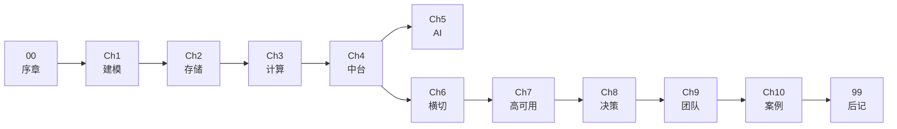

# 数据服务的方方面面（对标 P9）

> 一本关于「如何构建数据服务」的书籍型开源文章集——按 **P9 数据架构师能力分层**梳理全景，从建模方法论到团队管理。

## 项目定位

`data-travel` 不是一本「代码手册」，而是一份**面向 P9 数据架构师成长的全景地图**。它试图回答一个问题：

> 一个能扛住双 11 流量、能带 50 人团队、能在 AI 时代做对技术决策的 P9 数据架构师，**到底需要怎样的能力栈、怎样的方法论、怎样的工程实践？**

我们用「**建模 → 引擎 → 服务化 → AI → 工程 → 架构 → 决策 → 团队 → 案例**」的能力主线串起十个章节，再以「可治理 / 可观测 / 可计量 / 可演进」四条横线穿插其中。读者可以从任意章节切入，按需跳读。

## 目录速览

| 序号 | 章节 | 核心问题 | 难度 | 推荐角色 |
| --- | --- | --- | :---: | --- |
| 00 | [序章 · P9 数据架构师的全景图](00-introduction/) | P9 数据架构师的能力地图是什么？该如何按角色读这本书？ | ★★☆☆☆ | 全员 |
| 01 | [Ch1 · 建模方法论](01-modeling/) | 从业务过程到数据模型，P9 的第一道分水岭 | ★★★☆☆ | 数据架构师、数仓开发 |
| 02 | [Ch2 · 存储范式](02-storage/) | 从数仓到 AI 原生数据库，理解每一代存储引擎的设计取舍 | ★★★☆☆ | 数据工程师、平台架构师 |
| 03 | [Ch3 · 计算范式](03-compute/) | 离线 / 实时 / OLAP / AI 计算引擎的统一视角 | ★★★☆☆ | 数据工程师 |
| 04 | [Ch4 · 数据中台与服务化](04-data-mesh-and-middleware/) | 阿里 OneData / OneID / OneService 方法论与工程落地 | ★★★★☆ | 平台架构师 |
| 05 | [Ch5 · AI 原生数据栈](05-ai-native-data-stack/) | Feature Store、RAG、DataAgent、决策智能 | ★★★★☆ | AI 应用工程师、架构师 |
| 06 | [Ch6 · 横切工程](06-cross-cutting-engineering/) | 数据质量、安全、成本、可观测——横切工程能力 | ★★★★☆ | 平台架构师、治理 |
| 07 | [Ch7 · 架构与高可用](07-architecture-and-reliability/) | 单元化、多活、大促保障、容量规划——P9 的硬功夫 | ★★★★★ | 资深架构师 |
| 08 | [Ch8 · 决策与权衡](08-decision-and-tradeoff/) | ADR、选型决策、技术战略——P9 的软分水岭 | ★★★★☆ | 资深工程师、架构师 |
| 09 | [Ch9 · 团队管理与领导力](09-team-and-leadership/) | 带人、做事、影响组织——P9 的硬功夫 | ★★★★☆ | 团队负责人、准 P9 |
| 10 | [Ch10 · 案例库](10-case-studies/) | 阿里中台演进、双 11 稳定性、字节数据架构、Netflix | ★★★☆☆ | 全员 |
| 99 | [后记 · 趋势与思考](99-outro/) | 数据架构正在向何处去？给准 P9 工程师的几句话 | ★★☆☆☆ | 全员 |

## 阅读路径

不同角色推荐从不同章节切入，按需跳读。

### 🧑‍💻 数据工程师 / 数仓开发（初中级）

> 必读：00 → 01 → 02 → 03 → 04
> 选读：06（横切工程）、08（决策方法）
> 可跳读：05、07、09 的细节

### 🏗️ 数据架构师 / 资深工程师

> 必读：00 → 01 → 04 → 06 → 07 → 08
> 选读：02、03、10
> 跳读：—

### 🤖 AI 应用工程师

> 必读：00 → 02 → 04 → 05
> 选读：03、06、10
> 可跳读：01 的建模细节

### 🛡️ 平台与治理同学

> 必读：00 → 04 → 06 → 09
> 选读：01、07、10
> 可跳读：03、05

### 🎯 团队负责人 / 准 P9（本书核心目标读者）

> 必读：00 → 01 → 08 → **09**
> 选读：02-Ch7、10
> 跳读：—

> **特别说明**：技术深度可由其他章节补齐，但**决策能力**与**团队管理能力**才是 P8 → P9 的真正分水岭。

## 章节导图

> 主线：「**建模 → 引擎 → 服务化 → AI → 工程 → 架构 → 决策 → 团队 → 案例**」。
> 横线：「可治理 / 可观测 / 可计量 / 可演进」。

## 横切主题索引

| 横切主题 | 主要承载章节 | 横切出现位置 |
| --- | --- | --- |
| 可治理 | Ch4（数据中台） | Ch1（建模规范）、Ch5（AI 治理）、Ch6（治理体系） |
| 可观测 | Ch6（横切工程） | Ch7（架构可观测）、Ch9（故障复盘） |
| 可计量 | Ch6（成本 FinOps） | Ch2（存储成本）、Ch3（计算成本） |
| 可演进 | Ch8（决策） | Ch1（模型演进）、Ch5（AI 演进）、Ch7（架构演进） |

## 辅助资源

- [docs/interview/](docs/interview/) — P9 面试题库（系统设计、选型决策、案例分析）
- [docs/career/](docs/career/) — P7→P8→P9 成长路径与能力模型
- [docs/superpowers/specs/](docs/superpowers/specs/) — 项目设计文档（10 章 P9 能力分层结构规格）
- [docs/superpowers/plans/](docs/superpowers/plans/) — 历史实施计划（含已 superseded 的初版脚手架）

## 术语表

为方便跨章节跳读，本书在 [序章 · 术语表](00-introduction/README.md#术语表) 中维护统一的术语对照表。新出现的关键术语都会在这里登记。

## 写作约定

- 章节目录命名：`NN-<slug>/`，两位数字 + 短横 + 英文 slug（如 `01-modeling`）
- 每章必含一份 `README.md`，作为该章导读页（含一句话定位、难度、推荐角色、子主题列表、前置章节）
- 子节文件名由作者自由决定，常用建议：`principles.md` / `architecture.md` / `hands-on.md` / `tuning.md` / `summary.md` / `refs.md`
- 图片放各章 `images/`，优先 SVG / Mermaid
- 代码片段放各章 `code/`，引用使用相对路径
- 标题层级：`##` 起步，避免嵌套超过 3 层
- 提交规范：Conventional Commits（`feat:` / `fix:` / `docs:` / `chore:` / `refactor:`）

## 贡献指南

- **新增章节**：在合适的位置插入新的 `NN-<slug>/` 目录，并在根 README 的「目录速览」与「章节导图」中同步登记
- **补全某章正文**：在该章目录下新增子文件（如 `principles.md`），并在章节 `README.md` 的「子主题列表」中链接过去
- **勘误**：直接提 PR，commit message 写明「修正位置 + 原因」
- 鼓励但不强求：单章以一个 PR 提交，便于 review
- **案例贡献**：欢迎提供去敏后的真实案例，参考 [Ch10 · 案例库](10-case-studies/) 的结构

## 许可

本仓库采用 [Apache License 2.0](LICENSE)。

## 作者与联系方式

- 作者：[QuanhongDing](https://github.com/QuanhongDing)
- 仓库：[github.com/QuanhongDing/data-travel](https://github.com/QuanhongDing/data-travel)
- 反馈：欢迎提 Issue / PR
