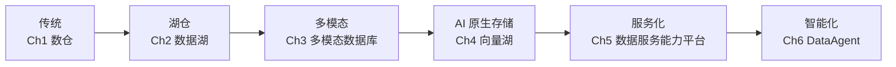
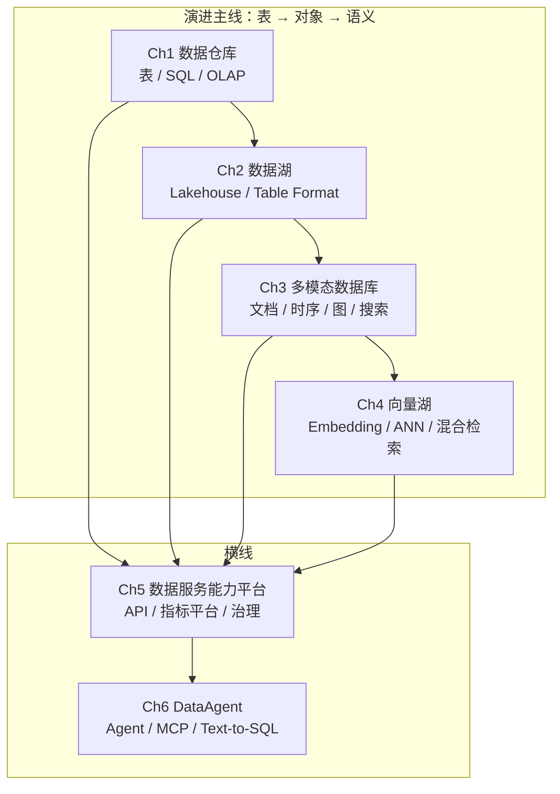

# Book Scaffolding Implementation Plan

> ## ⚠️ 本文档已 SUPERSEDED ⚠️
>
> 本计划是 **2026-09-30 初版脚手架**的实施方案（针对 6 章「技术演进时间线」结构：数仓 / 数据湖 / 多模态 / 向量湖 / 数据服务平台 / DataAgent），**已于 2026-10-08 被重构取代**（commit `f1aa559`：`refactor!: restructure to P9-aligned 10-chapter layout with team management`）。
>
> **当前项目结构**已改为 **10 章 P9 能力分层**：
>
> | 章节 | 主题 |
> | --- | --- |
> | 01-modeling | 建模方法论 |
> | 02-storage | 存储范式 |
> | 03-compute | 计算范式 |
> | 04-data-mesh-and-middleware | 数据中台与服务化 |
> | 05-ai-native-data-stack | AI 原生数据栈 |
> | 06-cross-cutting-engineering | 横切工程 |
> | 07-architecture-and-reliability | 架构与高可用 |
> | 08-decision-and-tradeoff | 决策与权衡 |
> | 09-team-and-leadership | 团队管理与领导力 |
> | 10-case-studies | 案例库 |
>
> **当前真相**请查阅：
>
> - 项目门面：[README.md](../../../README.md)
> - 设计规格（已同步更新到 10 章结构）：[2026-09-30-data-services-book-design.md](../specs/2026-09-30-data-services-book-design.md)
> - 章节导读：`0X-<slug>/README.md`
>
> 本计划作为**历史实施记录**保留，**不再被执行**。
>
> ---

> **For agentic workers:** REQUIRED SUB-SKILL: Use superpowers:subagent-driven-development (recommended) or superpowers:executing-plans to implement this plan task-by-task. Steps use checkbox (`- [ ]`) syntax for tracking.

**Goal:** 在 `data-travel` 仓库中建立「数据服务的方方面面」书籍型文章的目录骨架与 README 文件，使仓库具备可发布、可阅读、可贡献的初始形态。

**Architecture:** 纯 Markdown 仓库，无构建步骤。采用「总论 + 6 章主体 + 后记」的书式目录，每章以 `README.md` 作为导读页（含一句话定位、难度、推荐角色、子主题、前置章节）。根 README 是门面，承担目录速览、阅读路径、导图、写作约定与贡献指南。

**Tech Stack:** Markdown、Git、Mermaid（仅用于 README 中的流程图）。不引入构建/CI。

## Global Constraints

- 章节目录命名：两位数字 + 短横 + 英文 slug（`01-data-warehouse` 等），已在 spec §6 中定义
- 文件名：小写、连字符；中文内容不放在文件名里
- 每章 `README.md` 是该章导读页，**必须**包含「一句话定位 / 难度与推荐角色 / 子主题列表 / 前置章节」四项
- 章节子节文件名不在本计划范围；本计划只产出每章 `README.md`
- 不修改既有 `LICENSE`、`README.md`（根 README 本身就是产物之一）、`.gitignore`（按 surgical 原则不动）
- 提交规范：Conventional Commits（`docs:` / `feat:` / `chore:`）
- Co-author 签名：`Co-Authored-By: Claude Code <noreply@anthropic.com>`

## File Structure

```
data-travel/
├── README.md                          ← Task 2（覆盖原 # data-travel）
├── 00-introduction/
│   └── README.md                      ← Task 3
├── 01-data-warehouse/
│   └── README.md                      ← Task 4
├── 02-data-lake/
│   └── README.md                      ← Task 5
├── 03-multimodal-db/
│   └── README.md                      ← Task 6
├── 04-vector-lake/
│   └── README.md                      ← Task 7
├── 05-data-service-platform/
│   └── README.md                      ← Task 8
├── 06-dataagent/
│   └── README.md                      ← Task 9
└── 99-outro/
    └── README.md                      ← Task 10
```

每个任务产出一份有意义的 README；任务之间互不依赖，可并行实现（但需按顺序执行以保证 git 历史清晰）。

---

## Task 1: 创建章节目录骨架

**Files:**
- Create: `00-introduction/`
- Create: `01-data-warehouse/`
- Create: `02-data-lake/`
- Create: `03-multimodal-db/`
- Create: `04-vector-lake/`
- Create: `05-data-service-platform/`
- Create: `06-dataagent/`
- Create: `99-outro/`

**Interfaces:**
- Consumes: 无（起始任务）
- Produces: 8 个空目录，供 Task 3-10 写入 `README.md`

- [ ] **Step 1: 创建所有章节目录**

```bash
mkdir -p \
  00-introduction \
  01-data-warehouse \
  02-data-lake \
  03-multimodal-db \
  04-vector-lake \
  05-data-service-platform \
  06-dataagent \
  99-outro
```

- [ ] **Step 2: 验证目录已创建**

```bash
ls -d 0?-*/
```

预期：列出 8 行，分别为 `00-introduction/`、`01-data-warehouse/`、`02-data-lake/`、`03-multimodal-db/`、`04-vector-lake/`、`05-data-service-platform/`、`06-dataagent/`、`99-outro/`。

- [ ] **Step 3: 暂存空目录占位**

为使 git 追踪空目录，添加 `.gitkeep` 占位（后续 Task 写入 `README.md` 后再删除这些占位）。

```bash
for d in 00-introduction 01-data-warehouse 02-data-lake 03-multimodal-db 04-vector-lake 05-data-service-platform 06-dataagent 99-outro; do
  touch "$d/.gitkeep"
done
```

- [ ] **Step 4: 提交**

```bash
git add .
git commit -m "chore: scaffold chapter directories

- Create 00-introduction (序章/总论)
- Create 01-data-warehouse .. 06-dataagent (主体章节)
- Create 99-outro (后记)
- Add .gitkeep so empty dirs are tracked

Co-Authored-By: Claude Code <noreply@anthropic.com>"
```

---

## Task 2: 写根 README.md（门面）

**Files:**
- Modify: `README.md`（原文件只有 `# data-travel` 一行；本任务完整重写）

**Interfaces:**
- Consumes: spec §5 中的 README 提纲（10 项）
- Produces: 一份面向多角色读者的根 README，作为整个仓库的门面

> 内容要点（来自 spec §5，本任务必须完整覆盖）：
> 1. 项目定位
> 2. 目录速览（含 8 行的章节表：序号 / 章节名 / 核心问题 / 难度 / 推荐角色）
> 3. 阅读路径（数据工程师 / AI 应用工程师 / 架构师三档）
> 4. 章节导图（Mermaid 横向时间线 / 全景图）
> 5. 术语表链接（指向 `00-introduction/README.md#术语表`）
> 6. 写作约定
> 7. 贡献指南
> 8. 许可
> 9. 作者与联系方式

- [ ] **Step 1: 用 Read 读取现有 README.md 的内容**

```bash
# 仅查看，不会修改
cat README.md
```

预期：仅一行 `# data-travel`。

- [ ] **Step 2: 用 Write 重写 README.md**

完整内容（直接写入，不要省略）：

```markdown
# 数据服务的方方面面

> 一本关于「如何构建数据服务」的书籍型开源文章集——从传统数仓到 AI 原生数据栈，按**技术演进时间线**梳理全景。

## 项目定位

`data-travel` 不是一本「按代码本」，而是一份**以 Markdown 组织的技术全景地图**。它试图回答一个问题：

> 一个现代数据系统，从底层的存储范式到对外的服务化与智能化，**到底由哪些模块构成，它们如何演进，又如何被组合在一起？**

我们用「**表 → 对象 → 语义**」的演进主线串起六个章节，再以「服务化」与「智能化」两条横线穿插其中。读者可以从任意章节切入，按需跳读。

## 目录速览

| 序号 | 章节 | 核心问题 | 难度 | 推荐角色 |
| --- | --- | --- | :---: | --- |
| 00 | [序章 · 全景图](00-introduction/) | 数据服务的全貌是什么？该如何按角色读这本书？ | ★★☆☆☆ | 全员 |
| 01 | [Ch1 · 数据仓库](01-data-warehouse/) | 如何搭建一个稳定支撑 BI 与离线分析的数仓？ | ★★☆☆☆ | 数据工程师、数仓开发 |
| 02 | [Ch2 · 数据湖](02-data-lake/) | 从「库」到「湖」，如何处理半结构化 / 非结构化数据并兼顾事务？ | ★★★☆☆ | 数据工程师、平台架构师 |
| 03 | [Ch3 · 多模态数据库](03-multimodal-db/) | 文档、时序、图、宽表、KV、搜索——如何选型与协同？ | ★★★☆☆ | 全栈工程师、架构师 |
| 04 | [Ch4 · 向量湖](04-vector-lake/) | 如何为 AI 应用提供大规模、低延迟、可治理的向量检索基础设施？ | ★★★★☆ | AI 应用工程师、平台架构师 |
| 05 | [Ch5 · 数据服务能力平台](05-data-service-platform/) | 如何把数据能力封装为可治理、可观测、可计量的「数据服务」？ | ★★★★☆ | 平台架构师、数据治理 |
| 06 | [Ch6 · DataAgent](06-dataagent/) | 如何让 AI Agent 安全、可控、可审计地操作数据？ | ★★★★★ | AI 应用工程师、架构师 |
| 99 | [后记 · 趋势与思考](99-outro/) | 数据架构正在向何处去？ | ★★☆☆☆ | 全员 |

## 阅读路径

不同角色推荐从不同章节切入，按需跳读。

### 🧑‍💻 数据工程师 / 数仓开发（初中级）

> 必读：00 → 01 → 02 → 03
> 选读：05（指标平台与服务化）
> 可跳读：04（先建立基础再关心向量检索）

### 🏗️ 数据架构师 / 资深工程师

> 必读：00 → 02 → 03 → 05
> 选读：01（回顾传统数仓）、04（向量湖是新前沿）
> 可跳读：06 的实现细节（关注架构边界与安全即可）

### 🤖 数据人员 / AI 应用工程师

> 必读：00 → 03 → 04 → 06
> 选读：05（理解指标平台如何成为 Agent 的工具）
> 可跳读：01、02 的 OLAP / 调度细节

### 🛡️ 平台与治理同学

> 必读：00 → 02 → 05 → 06
> 选读：03、04 中的元数据 / 血缘 / 权限相关内容

## 章节导图



> 演进主线：「**表 → 对象 → 语义**」。横线是「服务化」与「智能化」。

## 术语表

为方便跨章节跳读，本书在 [序章 · 术语表](00-introduction/README.md#术语表) 中维护统一的术语对照表。新出现的关键术语都会在这里登记。

## 写作约定

- 章节目录命名：`NN-<slug>/`，两位数字 + 短横 + 英文 slug（如 `01-data-warehouse`）
- 每章必含一份 `README.md`，作为该章导读页（含一句话定位、难度、推荐角色、子主题列表、前置章节）
- 子节文件名由作者自由决定，常用建议：`principles.md` / `architecture.md` / `hands-on.md` / `tuning.md` / `summary.md` / `refs.md`
- 图片放各章 `images/`，优先 SVG / Mermaid
- 代码片段放各章 `code/`，引用使用相对路径
- 标题层级：`##` 起步，避免嵌套超过 3 层
- 提交规范：Conventional Commits（`feat:` / `fix:` / `docs:` / `chore:` / `refactor:`）

## 贡献指南

- **新增章节**：在合适的位置插入新的 `NN-<slug>/` 目录，并在根 README 的「目录速览」与「章节导图」中同步登记
- **补全某章正文**：在该章目录下新增子文件（如 `principles.md`），并在章节 `README.md` 的「子主题列表」中链接过去
- **勘误**：直接提 PR，commit message 写明「修正位置 + 原因」
- 鼓励但不强求：单章以一个 PR 提交，便于 review

## 许可

本仓库采用 [MIT 协议](LICENSE)。

## 作者与联系方式

- 作者：[QuanhongDing](https://github.com/QuanhongDing)
- 仓库：[github.com/QuanhongDing/data-travel](https://github.com/QuanhongDing/data-travel)
- 反馈：欢迎提 Issue / PR
```

- [ ] **Step 3: 本地渲染校验**

```bash
# 在 GitHub 上 PR 时会渲染；本地可用任意 Markdown 预览器查看
# 这里仅校验文件存在且非空
test -s README.md && wc -l README.md
```

预期：文件存在，行数 ≥ 80。

- [ ] **Step 4: 删除 Task 1 在各章节加的 `.gitkeep` 占位（仅当后续 Task 2 之前未提交 README 时）**

> 注意：本任务只产出根 README；章节目录下仍是 `.gitkeep`，这些占位将在 Task 3-10 写入 `README.md` 后逐个删除。

本步骤无需操作，跳过。

- [ ] **Step 5: 提交**

```bash
git add README.md
git commit -m "docs: rewrite root README as book landing page

- Project positioning (one-line + goal)
- Chapter table (序号 / 章节 / 核心问题 / 难度 / 推荐角色)
- Reading paths for 4 roles (数据工程师 / 架构师 / AI 应用工程师 / 治理)
- Mermaid chapter roadmap (table -> object -> semantics)
- Terminology link, writing conventions, contribution guide, license

Co-Authored-By: Claude Code <noreply@anthropic.com>"
```

---

## Task 3: 写 00-introduction/README.md（总论）

**Files:**
- Create: `00-introduction/README.md`
- Delete: `00-introduction/.gitkeep`

**Interfaces:**
- Consumes: spec §4 中「00 序章」的内容清单；根 README 中的术语表链接锚点
- Produces: 一份含「全景图 / 为什么按这个顺序读 / 难度梯度表 / 角色推荐路径 / 术语表」的总论 README

- [ ] **Step 1: 写入 00-introduction/README.md**

```markdown
# 序章 · 数据服务的全景图

> **本章定位**：在进入任何技术细节之前，先建立一张「数据服务」的完整地图，并说明本书为何按**技术演进时间线**组织。

## 为什么按这个顺序读

数据存储与处理范式在过去三十年里不断演进：

1. **表（结构化）**：以关系型数仓为代表，强调强一致、维度建模与 SQL 分析
2. **对象（多模态）**：以文档 / 时序 / 图 / 搜索为代表，强调多样数据的原生表达
3. **语义（AI 原生）**：以向量检索 + 大模型为代表，强调「语义级」理解与生成

贯穿在演进之上的，是两条横线：

- **服务化**：把分散的数据能力封装为可治理、可观测、可计量的「数据服务」（Ch5）
- **智能化**：让 AI Agent 安全、可控、可审计地操作数据（Ch6）

按这条主线读下来，每一章既可以独立学习，也可以承接上一章的范式演进。

## 全景图



## 难度梯度表

| 章节 | 难度 | 推荐角色 | 是否需要前序章节 |
| --- | :---: | --- | :---: |
| Ch1 数据仓库 | ★★☆☆☆ | 数据工程师、数仓开发 | 无 |
| Ch2 数据湖 | ★★★☆☆ | 数据工程师、平台架构师 | 建议 Ch1 |
| Ch3 多模态数据库 | ★★★☆☆ | 全栈工程师、架构师 | 建议 Ch1、Ch2 |
| Ch4 向量湖 | ★★★★☆ | AI 应用工程师、平台架构师 | 建议 Ch3 |
| Ch5 数据服务能力平台 | ★★★★☆ | 平台架构师、数据治理 | 建议 Ch1-Ch4 任一 |
| Ch6 DataAgent | ★★★★★ | AI 应用工程师、架构师 | 建议 Ch5 |

## 角色推荐路径

| 角色 | 必读 | 选读 | 可跳读 |
| --- | --- | --- | --- |
| 数据工程师 / 数仓开发 | 00 → 01 → 02 → 03 | 05 | 04（先打基础） |
| 数据架构师 / 资深工程师 | 00 → 02 → 03 → 05 | 01、04 | 06 实现细节 |
| 数据人员 / AI 应用工程师 | 00 → 03 → 04 → 06 | 05 | 01、02 的 OLAP/调度细节 |
| 平台与治理同学 | 00 → 02 → 05 → 06 | 03、04 中的元数据部分 | — |

## 术语表

> 本术语表由各章维护者共同维护。新出现的关键术语以「中文（英文 / 缩写）」格式登记。

| 术语 | 英文 | 简述 | 首次出现章节 |
| --- | --- | --- | --- |
| 数据仓库 | Data Warehouse (DW) | 面向分析的、整合的、相对稳定的数据集合 | Ch1 |
| 数据湖 | Data Lake | 存储原始数据的系统化存储池 | Ch2 |
| Lakehouse | Lakehouse | 兼具数仓的 ACID 与数据湖的灵活性的混合架构 | Ch2 |
| 维度建模 | Dimensional Modeling | Kimball 提出的分析型建模方法 | Ch1 |
| OLAP | Online Analytical Processing | 联机分析处理，区别于 OLTP | Ch1 |
| 多模态数据库 | Multi-Modal Database | 同时支持多种数据模型的数据库 | Ch3 |
| HTAP | Hybrid Transaction/Analytical Processing | 混合事务与分析处理 | Ch3 |
| 向量湖 | Vector Lake | 面向 AI 检索的大规模向量基础设施 | Ch4 |
| ANN | Approximate Nearest Neighbor | 近似最近邻检索 | Ch4 |
| HNSW | Hierarchical Navigable Small World | 一种图索引算法 | Ch4 |
| 指标平台 | Metric Platform / Headless BI | 统一管理业务指标与定义的平台 | Ch5 |
| 数据网格 | Data Mesh | 一种去中心化的数据架构理念 | Ch5 |
| DataAgent | Data Agent | 由 AI Agent 驱动的数据访问与洞察能力 | Ch6 |
| MCP | Model Context Protocol | 标准化 LLM 与外部工具的协议 | Ch6 |
| Text-to-SQL | Text-to-SQL | 将自然语言转换为 SQL 查询 | Ch6 |

> 后续新术语持续在本表追加。

## 本章小结

- 本书按**技术演进时间线**组织（表 → 对象 → 语义），以「服务化」「智能化」为横线
- 难度从 ★★ 到 ★★★★★ 阶梯分布；不同角色有不同推荐路径
- 统一术语表由各章共同维护，方便跨章节跳读

## 下一步

从 [Ch1 · 数据仓库](../01-data-warehouse/) 开始阅读，或回到 [根目录](../README.md) 选择你的角色路径。
```

- [ ] **Step 2: 删除占位文件**

```bash
rm 00-introduction/.gitkeep
```

- [ ] **Step 3: 提交**

```bash
git add 00-introduction/README.md
git commit -m "docs: add introduction (总论) — panorama, difficulty table, glossary

- Panoramic mermaid diagram (演进主线 + 横线)
- Difficulty gradient table with 6 chapters
- Reading paths for 4 roles (必读/选读/可跳读)
- Cross-chapter glossary (16 core terms)
- Link to next chapter (Ch1)

Co-Authored-By: Claude Code <noreply@anthropic.com>"
```

---

## Task 4: 写 01-data-warehouse/README.md（数据仓库）

**Files:**
- Create: `01-data-warehouse/README.md`
- Delete: `01-data-warehouse/.gitkeep`

**Interfaces:**
- Consumes: spec §4 中 Ch1 的内容要点
- Produces: 一份数据仓库章导读页（定位 / 难度 / 推荐角色 / 子主题列表 / 前置章节 / 子文件占位）

- [ ] **Step 1: 写入 01-data-warehouse/README.md**

```markdown
# Ch1 · 数据仓库

> **一句话定位**：如何搭建一个能稳定支撑 BI 与离线分析的数仓。

## 基本信息

- **难度**：★★☆☆☆
- **推荐角色**：数据工程师、数仓开发
- **前置章节**：无（建议先读 [序章](../00-introduction/)）
- **后续章节**：[Ch2 · 数据湖](../02-data-lake/)

## 本章要回答的核心问题

1. 一个「能用」的数仓到底由哪些模块组成？
2. ODS / DWD / DWS / ADS 分层的边界与价值是什么？
3. 维度建模（Kimball）该怎么落地，又有哪些常见误用？
4. OLAP 引擎与调度系统怎么选型（Doris / StarRocks / ClickHouse / Airflow / DolphinScheduler …）？

## 子主题（占位）

> 以下为本章计划覆盖的子主题。当前章节正文尚未写作，子文件由作者按需创建。

- [ ] **原理与概念**：维度建模、数仓分层、ETL vs ELT、OLAP 引擎原理
- [ ] **架构决策**：Hive / Spark / Flink 选型；OLAP 引擎选型；调度系统选型
- [ ] **实战搭建**：用 Docker Compose 起一个最小数仓（Doris + DolphinScheduler）；分层建模示例
- [ ] **调优与踩坑**：分区、bucket、物化视图、查询改写
- [ ] **参考架构与小结**：典型架构图、适用与不适用场景

> 文件命名建议（不强制）：`principles.md` / `architecture.md` / `hands-on.md` / `tuning.md` / `summary.md` / `refs.md`。作者可按需合并、拆分或重命名。

## 推荐资料

> 本节在章正文写作时补充。

## 下一步

- 回到 [根目录](../README.md) 选择其他角色路径
- 进入 [Ch2 · 数据湖](../02-data-lake/) 继续阅读
```

- [ ] **Step 2: 删除占位文件**

```bash
rm 01-data-warehouse/.gitkeep
```

- [ ] **Step 3: 提交**

```bash
git add 01-data-warehouse/README.md
git commit -m "docs(Ch1): add data warehouse chapter landing page

- One-line positioning (stable BI + offline analysis)
- Difficulty (★★☆☆☆) + roles + prerequisites
- Core questions + sub-topic checklist (placeholder)
- Naming conventions reminder (semantic filenames)

Co-Authored-By: Claude Code <noreply@anthropic.com>"
```

---

## Task 5: 写 02-data-lake/README.md（数据湖）

**Files:**
- Create: `02-data-lake/README.md`
- Delete: `02-data-lake/.gitkeep`

**Interfaces:**
- Consumes: spec §4 中 Ch2 的内容要点
- Produces: 一份数据湖章导读页

- [ ] **Step 1: 写入 02-data-lake/README.md**

```markdown
# Ch2 · 数据湖

> **一句话定位**：从「库」到「湖」，如何处理半结构化 / 非结构化数据并兼顾事务。

## 基本信息

- **难度**：★★★☆☆
- **推荐角色**：数据工程师、平台架构师
- **前置章节**：[Ch1 · 数据仓库](../01-data-warehouse/)（建议）
- **后续章节**：[Ch3 · 多模态数据库](../03-multimodal-db/)

## 本章要回答的核心问题

1. 湖与仓的本质区别是什么？什么是 Lakehouse？
2. Iceberg / Hudi / Paimon / Delta 这些 Table Format 解决了什么问题？
3. Schema Evolution、Hidden Partitioning、Time Travel 是怎么实现的？
4. 存算分离 vs 存算一体该怎么选？

## 子主题（占位）

- [ ] **原理与概念**：Lakehouse、Table Format、Schema Evolution、对象存储
- [ ] **架构决策**：存储格式（Parquet / ORC / Avro）、计算引擎（Spark / Flink / Trino）、存算分离 vs 存算一体
- [ ] **实战搭建**：用 MinIO + Iceberg + Trino 搭本地湖仓；流式写入 Hudi MOR 表
- [ ] **调优与踩坑**：小文件、Compaction、Z-Order、查询计划
- [ ] **参考架构与小结**：湖 vs 仓 vs 湖仓一体

> 文件命名建议：`principles.md` / `architecture.md` / `hands-on.md` / `tuning.md` / `summary.md` / `refs.md`。作者可按需调整。

## 推荐资料

> 本节在章正文写作时补充。

## 下一步

- 回到 [根目录](../README.md) 选择其他角色路径
- 进入 [Ch3 · 多模态数据库](../03-multimodal-db/) 继续阅读
```

- [ ] **Step 2: 删除占位文件**

```bash
rm 02-data-lake/.gitkeep
```

- [ ] **Step 3: 提交**

```bash
git add 02-data-lake/README.md
git commit -m "docs(Ch2): add data lake chapter landing page

- Positioning (lake vs warehouse, schema evolution, transactions)
- Difficulty (★★★☆☆) + roles + prerequisites (Ch1)
- Core questions + sub-topic checklist (placeholder)

Co-Authored-By: Claude Code <noreply@anthropic.com>"
```

---

## Task 6: 写 03-multimodal-db/README.md（多模态数据库）

**Files:**
- Create: `03-multimodal-db/README.md`
- Delete: `03-multimodal-db/.gitkeep`

- [ ] **Step 1: 写入 03-multimodal-db/README.md**

```markdown
# Ch3 · 多模态数据库

> **一句话定位**：文档、时序、图、宽表、KV、搜索——如何选型与协同。

## 基本信息

- **难度**：★★★☆☆
- **推荐角色**：全栈工程师、架构师
- **前置章节**：[Ch1 · 数据仓库](../01-data-warehouse/)、[Ch2 · 数据湖](../02-data-lake/)（建议）
- **后续章节**：[Ch4 · 向量湖](../04-vector-lake/)

## 本章要回答的核心问题

1. 不同形态的数据应该用什么样的存储引擎？
2. NoSQL 分类（文档 / 时序 / 图 / KV / 搜索）的本质区别是什么？
3. HTAP、时序压缩、倒排索引、图存储背后的原理是什么？
4. 多模态数据如何在一个架构里协同？

## 子主题（占位）

- [ ] **原理与概念**：NoSQL 分类、CAP、HTAP、时序压缩（TSM）、倒排索引、属性图 vs RDF
- [ ] **架构决策**：MongoDB（文档）/ InfluxDB & TimescaleDB（时序）/ Neo4j & NebulaGraph（图）/ Elasticsearch & OpenSearch（搜索）/ TiDB & CockroachDB（HTAP）/ Redis（KV）
- [ ] **实战搭建**：用 docker-compose 起一个「文档 + 时序 + 搜索 + 图」四件套；多模态联合查询
- [ ] **调优与踩坑**：索引设计、分片策略、冷热分层
- [ ] **参考架构与小结**：多模态融合架构

> 文件命名建议：`principles.md` / `architecture.md` / `hands-on.md` / `tuning.md` / `summary.md` / `refs.md`。

## 推荐资料

> 本节在章正文写作时补充。

## 下一步

- 回到 [根目录](../README.md) 选择其他角色路径
- 进入 [Ch4 · 向量湖](../04-vector-lake/) 继续阅读
```

- [ ] **Step 2: 删除占位文件**

```bash
rm 03-multimodal-db/.gitkeep
```

- [ ] **Step 3: 提交**

```bash
git add 03-multimodal-db/README.md
git commit -m "docs(Ch3): add multi-modal database chapter landing page

- Positioning (document/timeseries/graph/search/KV selection)
- Difficulty (★★★☆☆) + roles + prerequisites (Ch1, Ch2)
- Core questions + sub-topic checklist (placeholder)

Co-Authored-By: Claude Code <noreply@anthropic.com>"
```

---

## Task 7: 写 04-vector-lake/README.md（向量湖）

**Files:**
- Create: `04-vector-lake/README.md`
- Delete: `04-vector-lake/.gitkeep`

- [ ] **Step 1: 写入 04-vector-lake/README.md**

```markdown
# Ch4 · 向量湖

> **一句话定位**：如何为 AI 应用提供大规模、低延迟、可治理的向量检索基础设施。

## 基本信息

- **难度**：★★★★☆
- **推荐角色**：AI 应用工程师、平台架构师
- **前置章节**：[Ch3 · 多模态数据库](../03-multimodal-db/)（建议）
- **后续章节**：[Ch5 · 数据服务能力平台](../05-data-service-platform/)

## 本章要回答的核心问题

1. Embedding 模型与向量索引（HNSW / IVF / ScaNN）的原理是什么？
2. Milvus / Qdrant / Weaviate / pgvector / Elasticsearch dense_vector 该怎么选？
3. 什么是「向量湖」，它和「向量库」的本质区别是什么？
4. 混合检索（向量 + BM25 + 标量过滤）与 Reranker 该怎么设计？

## 子主题（占位）

- [ ] **原理与概念**：Embedding 模型、HNSW / IVF / ScaNN、量化（PQ / SQ）、召回与精排、混合检索
- [ ] **架构决策**：向量引擎选型、自托管 vs 托管服务、向量库 vs 向量湖
- [ ] **实战搭建**：用 Milvus + Spark + OSS 搭端到端 RAG 检索层；混合检索 + 元数据过滤
- [ ] **调优与踩坑**：索引参数、Recall@K、Embedding 选型、Reranker
- [ ] **参考架构与小结**：向量湖架构与多租户 / 元数据治理

> 文件命名建议：`principles.md` / `architecture.md` / `hands-on.md` / `tuning.md` / `summary.md` / `refs.md`。

## 推荐资料

> 本节在章正文写作时补充。

## 下一步

- 回到 [根目录](../README.md) 选择其他角色路径
- 进入 [Ch5 · 数据服务能力平台](../05-data-service-platform/) 继续阅读
```

- [ ] **Step 2: 删除占位文件**

```bash
rm 04-vector-lake/.gitkeep
```

- [ ] **Step 3: 提交**

```bash
git add 04-vector-lake/README.md
git commit -m "docs(Ch4): add vector lake chapter landing page

- Positioning (large-scale, low-latency, governed ANN infra)
- Difficulty (★★★★☆) + roles + prerequisites (Ch3)
- Core questions + sub-topic checklist (placeholder)

Co-Authored-By: Claude Code <noreply@anthropic.com>"
```

---

## Task 8: 写 05-data-service-platform/README.md（数据服务能力平台）

**Files:**
- Create: `05-data-service-platform/README.md`
- Delete: `05-data-service-platform/.gitkeep`

- [ ] **Step 1: 写入 05-data-service-platform/README.md**

```markdown
# Ch5 · 数据服务能力平台

> **一句话定位**：如何把散落在各系统中的数据能力封装为可治理、可观测、可计量的「数据服务」。

## 基本信息

- **难度**：★★★★☆
- **推荐角色**：平台架构师、数据治理
- **前置章节**：建议先读 [Ch1](../01-data-warehouse/)–[Ch4](../04-vector-lake/) 任一
- **后续章节**：[Ch6 · DataAgent](../06-dataagent/)

## 本章要回答的核心问题

1. 什么是「数据服务」？它和「数据 API」的区别是什么？
2. 指标平台 / Headless BI 的核心理念与价值是什么？
3. Data Mesh 在国内落地有哪些可行路径？
4. 元数据 / 血缘 / 权限如何构成可治理的底座？

## 子主题（占位）

- [ ] **原理与概念**：Data API、指标平台 / Headless BI、Data Mesh、查询引擎（Trino / Presto）、Data Catalog、血缘（DataHub / OpenMetadata / Atlas）、行级安全
- [ ] **架构决策**：指标平台 vs Data API Gateway vs 统一查询网关；元数据 vs 血缘 vs 资产
- [ ] **实战搭建**：用 Trino + DataHub + OpenFGA 搭最小数据服务平台；指标注册 / 数据 API / 血缘采集
- [ ] **调优与踩坑**：查询路由、缓存（Redis / Alluxio）、限流、降级、计费埋点
- [ ] **参考架构与小结**：数据服务的 SLA / 可观测 / 治理全景

> 文件命名建议：`principles.md` / `architecture.md` / `hands-on.md` / `tuning.md` / `summary.md` / `refs.md`。

## 推荐资料

> 本节在章正文写作时补充。

## 下一步

- 回到 [根目录](../README.md) 选择其他角色路径
- 进入 [Ch6 · DataAgent](../06-dataagent/) 继续阅读
```

- [ ] **Step 2: 删除占位文件**

```bash
rm 05-data-service-platform/.gitkeep
```

- [ ] **Step 3: 提交**

```bash
git add 05-data-service-platform/README.md
git commit -m "docs(Ch5): add data service platform chapter landing page

- Positioning (governed, observable, billable data services)
- Difficulty (★★★★☆) + roles + prerequisites
- Core questions + sub-topic checklist (placeholder)

Co-Authored-By: Claude Code <noreply@anthropic.com>"
```

---

## Task 9: 写 06-dataagent/README.md（DataAgent）

**Files:**
- Create: `06-dataagent/README.md`
- Delete: `06-dataagent/.gitkeep`

- [ ] **Step 1: 写入 06-dataagent/README.md**

```markdown
# Ch6 · DataAgent

> **一句话定位**：如何让 AI Agent 安全、可控、可审计地操作数据。

## 基本信息

- **难度**：★★★★★
- **推荐角色**：AI 应用工程师、架构师
- **前置章节**：[Ch5 · 数据服务能力平台](../05-data-service-platform/)（建议）
- **后续章节**：[后记 · 趋势与思考](../99-outro/)

## 本章要回答的核心问题

1. DataAgent 的边界在哪里？它和「直接让 LLM 跑 SQL」有什么区别？
2. 单 Agent vs Multi-Agent、MCP vs Function Calling 该怎么选？
3. Text-to-SQL 的常见陷阱与防御策略是什么？
4. 如何把「指标平台」作为 Agent 的工具，而不是「万能 SQL 工具」？

## 子主题（占位）

- [ ] **原理与概念**：Agent 架构（Plan-Execute-Observe-Reflect）、Tool Calling / MCP、Text-to-SQL、Query Agent / Insight Agent / Metric Agent、Human-in-the-Loop、Guardrails
- [ ] **架构决策**：单 Agent vs Multi-Agent；MCP vs Function Calling；SQL 生成 vs 语义层指标
- [ ] **实战搭建**：基于 MCP + 查询网关搭一个「业务问数 Agent」；含权限 / SQL 校验 / 结果解释
- [ ] **调优与踩坑**：Prompt Engineering、Self-Correction、错误恢复、可观测
- [ ] **参考架构与小结**：DataAgent 的安全边界与落地路径

> 文件命名建议：`principles.md` / `architecture.md` / `hands-on.md` / `tuning.md` / `summary.md` / `refs.md`。

## 推荐资料

> 本节在章正文写作时补充。

## 下一步

- 进入 [后记 · 趋势与思考](../99-outro/)
```

- [ ] **Step 2: 删除占位文件**

```bash
rm 06-dataagent/.gitkeep
```

- [ ] **Step 3: 提交**

```bash
git add 06-dataagent/README.md
git commit -m "docs(Ch6): add DataAgent chapter landing page

- Positioning (safe, controllable, auditable AI agents on data)
- Difficulty (★★★★★) + roles + prerequisites (Ch5)
- Core questions + sub-topic checklist (placeholder)

Co-Authored-By: Claude Code <noreply@anthropic.com>"
```

---

## Task 10: 写 99-outro/README.md（后记）

**Files:**
- Create: `99-outro/README.md`
- Delete: `99-outro/.gitkeep`

- [ ] **Step 1: 写入 99-outro/README.md**

```markdown
# 后记 · 趋势与思考

> **本章定位**：在六个章节主体之外，对「数据服务正在向何处去」做一次宏观收尾。

## 基本信息

- **难度**：★★☆☆☆
- **推荐角色**：全员
- **建议**：读完主体章节后阅读

## 几个值得关注的趋势

### 1. 自治数据库与自优化系统

- Self-driving Database：参数自动调优、索引推荐、查询改写
- 代表方向：Oracle Autonomous、Microsoft SQL Server 的 IQP、OpenGauss / PolarDB 的自治能力

### 2. AI 原生数据栈

- 从「LLM 调 SQL」到「AI 原生数据库」（如 PG + pgvector 一体）
- 向量检索成为一等公民，而非外挂能力
- 推理与查询融合：例如 AI Function 在 SQL 中直接调用

### 3. 语义层（Semantic Layer）的崛起

- 指标平台从「内部工具」走向「Agent 工具」
- Headless BI 不再只是 BI 团队的语义层，而是 AI 系统的「事实来源」
- 与 DataAgent 形成强耦合：语义层降低 Agent 出错概率

### 4. Data Mesh 在中国落地

- 去中心化所有权（Federated Ownership）
- 自服务数据平台（Self-serve Platform）
- 计算治理联邦（Computational Governance）
- 国内实践往往演化为「统一指标平台 + 联邦查询」的混合形态

### 5. 可观测 × 治理 × 安全 一体化

- 血缘从「事后追溯」走向「实时阻断」
- 行级安全 + 列权限 + Agent 权限成为标配
- 数据可观测（Data Observability）补齐应用可观测的最后一公里

## 写给读者的话

- **不要追求一步到位**：现代数据栈非常复杂，建议从一个垂直场景（BI / 检索 / 问数）切入
- **把数据当产品，而不是项目**：指标平台、向量湖、DataAgent 都是产品，需要持续运营
- **拥抱「语义层」**：让 Agent 不再直接面对底层表
- **关注可治理性**：没有治理的 AI 系统，只会把数据混乱放大 10 倍

## 后续更新计划

本书将持续更新，作者计划：

- 每年对各章做一次较大版本更新，跟进主要技术演进
- 新增案例章节（按需），覆盖典型行业实践
- 在 [序章 · 术语表](../00-introduction/README.md#术语表) 中持续追加新术语

## 反馈与贡献

- 仓库：[github.com/QuanhongDing/data-travel](https://github.com/QuanhongDing/data-travel)
- 欢迎提 Issue / PR

—— 祝你在数据的海洋里「travel」愉快。
```

- [ ] **Step 2: 删除占位文件**

```bash
rm 99-outro/.gitkeep
```

- [ ] **Step 3: 提交**

```bash
git add 99-outro/README.md
git commit -m "docs(outro): add 后记 (trends and reflections)

- 5 trend areas (autonomous DB, AI-native stack, semantic layer,
  Data Mesh in China, observability/governance/security)
- Closing notes for readers (start small, treat data as product,
  embrace semantic layer, focus on governance)
- Update plan + contribution links

Co-Authored-By: Claude Code <noreply@anthropic.com>"
```

---

## Task 11: 全链路校验

**Files:**
- Verify only（不改任何文件）

**Interfaces:**
- Consumes: Task 1-10 的所有产物
- Produces: 一份「可发布」的仓库状态

- [ ] **Step 1: 校验目录与文件齐备**

```bash
ls -d 0?*/
echo "---"
ls 0?*/README.md
echo "---"
ls README.md
```

预期：
- `ls -d 0?*/` 输出 8 行
- `ls 0?*/README.md` 输出 8 行（每章 README.md 都存在）
- `ls README.md` 输出根 README

- [ ] **Step 2: 校验无残留 `.gitkeep`**

```bash
find . -name '.gitkeep' -not -path './.git/*'
```

预期：无输出（说明所有占位文件已被删除）。

- [ ] **Step 3: 校验 README 间链接指向真实存在**

```bash
# 简单 grep 校验根 README 与章节 README 中的相对路径链接
grep -hoE '\]\(\.\./[0-9a-z-]+/?[0-9a-z-]*\)' README.md 0?*/README.md | sort -u
```

预期：列出的每个 `../<chapter>` 路径都能在仓库中找到对应的 `README.md`（手工对照 8 个章节目录即可）。

- [ ] **Step 4: 校验 git 工作区干净**

```bash
git status
```

预期：`nothing to commit, working tree clean`。

- [ ] **Step 5: 校验提交历史清晰**

```bash
git log --oneline | head -20
```

预期：包含本计划的 11 个提交，每个 commit message 遵循 Conventional Commits。

- [ ] **Step 6: 推送（可选）**

```bash
git push origin main
```

> 若用户尚未准备好推送，可跳过此步，提交留在本地即可。

---

## 自审记录（Plan Self-Review）

执行完计划撰写后逐项核查：

1. **Spec 覆盖**：
   - spec §1 项目定位 → Task 2（根 README）
   - spec §2 主线 → Task 2（章节导图）+ Task 3（全景图）
   - spec §3 目录骨架 → Task 1（创建目录）+ Task 4-10（每章 README）
   - spec §4 各章主题 → Task 4-10 的「核心问题 / 子主题」段落
   - spec §5 README 提纲 → Task 2（9 项全覆盖）
   - spec §6 命名与写作约定 → Task 2「写作约定」+ 每章 README 中的「文件命名建议」
   - spec §7 交付范围 → 全部 11 个 Task 覆盖
   - spec §8 风险 → 已落到根 README 的「贡献指南」与「写作约定」

2. **占位扫描**：无 TBD / TODO / "implement later" / "add validation" / "similar to Task N"。

3. **类型与命名一致性**：
   - 章节目录 slug：`00-introduction`、`01-data-warehouse`、`02-data-lake`、`03-multimodal-db`、`04-vector-lake`、`05-data-service-platform`、`06-dataagent`、`99-outro` — 在 Task 1 / Task 2 / Task 3 / Task 4-10 全部保持一致
   - 推荐角色名称（数据工程师 / 数据架构师 / 数据人员 / 平台与治理）在根 README 与 00 章保持一致
   - 难度评级（★ 数）在根 README、00 章、每章 README 中保持一致
   - 跨章链接路径：每章 README 中的 `../<other-chapter>/` 在所有 Task 中写法一致